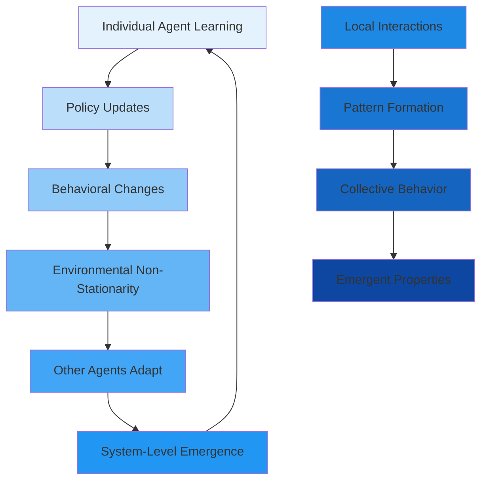

# S-3: Advanced Decision-Making in Intelligent Systems

# C-1: Fundamentals of Multi-Agent Reinforcement Learning (MARL)

1. Introduction to Multi-Agent Systems

    - Definition and Scope
    - Comparison with Single-Agent Reinforcement Learning
    - Key Characteristics of Multi-Agent Environments
    - Types of Agent Interactions

2. Theoretical Foundations

    - Joint Action Spaces
    - Partial Observability
    - Non-Stationarity Problem
    - Emergent Behaviors
    - Scalability Challenges

3. Game Theory Connections
    - Zero-Sum Games
    - Cooperative vs. Competitive Settings
    - Nash Equilibrium in MARL
    - Strategic Interactions

---

#### 1. Introduction to Multi-Agent Systems

Multi-Agent Reinforcement Learning represents a fundamental paradigm shift from single-agent learning, introducing the
profound complexity that emerges when multiple autonomous decision-makers interact within shared environments. This
domain explores how rational agents can learn optimal behaviors while simultaneously adapting to the evolving strategies
of other learning agents.

The field addresses one of the most challenging problems in artificial intelligence: how to create systems where
multiple intelligent entities can effectively coordinate, compete, or coexist while each pursuing their individual
objectives. This challenge mirrors many real-world scenarios, from economic markets and transportation systems to robot
swarms and distributed computing networks.

##### Definition and Scope

Multi-Agent Reinforcement Learning encompasses the mathematical framework and algorithmic approaches for systems where
multiple autonomous agents learn through environmental interaction while being influenced by the presence and actions of
other learning agents.

**Mathematical Formulation**: A multi-agent system can be formally defined as a tuple:
$$\large \langle N, S, {\mathcal{A}*i}*{i \in N}, {R_i}_{i \in N}, T, \gamma \rangle$$

where:

- $N = {1, 2, \ldots, n}$ represents the set of agents
- $S$ denotes the global state space
- $\mathcal{A}_i$ is the action space for agent $i$
- $R_i: S \times \mathcal{A}_1 \times \cdots \times \mathcal{A}_n \times S \rightarrow \mathbb{R}$ defines agent $i$'s
  reward function
- $T: S \times \mathcal{A}_1 \times \cdots \times \mathcal{A}_n \rightarrow \Delta(S)$ characterizes state transitions
- $\gamma \in [0, 1)$ is the discount factor

**Scope and Applications**: MARL spans diverse domains requiring coordination and strategic interaction:

**Autonomous Systems**: Self-driving vehicles coordinating at intersections, where each vehicle must predict and respond
to others' intentions while pursuing individual routing objectives.

**Robotics**: Swarm robotics applications where multiple robots collaborate for tasks like search and rescue,
environmental monitoring, or construction projects.

**Economic Systems**: Algorithmic trading platforms where multiple agents compete in financial markets, each adapting to
others' strategies while pursuing profit maximization.

**Game-Theoretic Applications**: Strategic interaction in poker, negotiation systems, and auction mechanisms where
agents must balance exploitation of current knowledge with adaptation to opponents' evolving strategies.

**Distributed Computing**: Load balancing in cloud computing where multiple agents must allocate resources while
considering system-wide efficiency and individual performance metrics.

**Fundamental Challenges**: The core complexity in MARL stems from the interdependence of agent decisions. Unlike
single-agent RL where the environment provides stationary dynamics, multi-agent environments are inherently
non-stationary from each agent's perspective. As agent $i$ learns and updates its policy $\pi_i$, the effective
environment dynamics for all other agents change, creating a complex adaptive system.

This interdependence manifests in several critical ways:

- **Observation Dependencies**: What one agent observes may depend on other agents' actions
- **Reward Dependencies**: Individual rewards often depend on joint actions of multiple agents
- **Transition Dependencies**: State evolution depends on the collective behavior of all agents

##### Comparison with Single-Agent Reinforcement Learning

The transition from single-agent to multi-agent reinforcement learning introduces fundamental differences that reshape
every aspect of the learning problem, from problem formulation to algorithm design and convergence analysis.

**Markov Property Violations**: In single-agent RL, the Markov property ensures that:
$$P(s_{t+1}|s_t, a_t, s_{t-1}, a_{t-1}, \ldots) = P(s_{t+1}|s_t, a_t)$$

However, in MARL, this property frequently breaks down. From agent $i$'s perspective, the transition probability
becomes: $$P(s_{t+1}|s_t, a_i^t, h_t) \neq P(s_{t+1}|s_t, a_i^t)$$

where $h_t$ represents the history of interactions that influences other agents' current policies. This violation occurs
because other agents' actions affect transitions, and these actions depend on learned policies that evolve over time.

**Environmental Stationarity**: Single-agent RL assumes environmental stationarity:
$$P(s'|s,a) \text{ and } R(s,a) \text{ remain constant over time}$$

MARL environments appear non-stationary to individual agents:
$$P_i(s'|s,a_i,t) = \sum_{\mathbf{a}*{-i}} P(s'|s,a_i,\mathbf{a}*{-i}) \prod_{j \neq i} \pi_j^t(a_j|s)$$

As other agents' policies $\pi_j^t$ evolve during learning, the effective transition dynamics for agent $i$ continuously
change.

**Sample Complexity Comparison**:

| Aspect                | Single-Agent       | Multi-Agent                      |
| --------------------- | ------------------ | -------------------------------- |
| **State Space**       | $O(                | S                                |
| **Action Space**      | $O(                | A                                |
| **Sample Complexity** | $O(\epsilon^{-2})$ | $O(n^2 \epsilon^{-2})$ (typical) |
| **Convergence**       | Well-established   | Often no guarantees              |
| **Exploration**       | Stationary target  | Moving target                    |

**Credit Assignment Complexity**: Single-agent RL has direct causal relationships:
$$\text{Agent Action} \rightarrow \text{Environment Response} \rightarrow \text{Reward Signal}$$

Multi-agent credit assignment becomes significantly more complex:
$$\text{Joint Actions} \rightarrow \text{Environment Response} \rightarrow \text{Individual Rewards}$$

The challenge lies in determining which specific actions from which agents contributed to observed outcomes,
particularly when rewards are delayed or when agents have interdependent effects on the environment.

**Example: Traffic Intersection Control**: Consider a traffic control scenario to illustrate these differences:

**Single-Agent Version**: One intelligent traffic light optimizing traffic flow

- State: Current traffic density and patterns
- Action: Light timing adjustments
- Reward: Reduction in average wait time
- Environment: Stationary traffic patterns

**Multi-Agent Version**: Multiple intelligent traffic lights in a network

- State: Global traffic conditions across the network
- Actions: Coordinated timing decisions by multiple lights
- Rewards: Individual intersection performance plus network-wide metrics
- Environment: Non-stationary due to other lights' changing strategies

In the multi-agent version, each traffic light must predict how neighboring lights will behave, creating a much more
complex optimization landscape.

##### Key Characteristics of Multi-Agent Environments

Multi-agent environments exhibit distinctive properties that fundamentally distinguish them from single-agent settings
and create unique algorithmic challenges.

**Non-Stationarity from Individual Perspectives**: Each agent experiences the environment as non-stationary because
other agents continuously update their policies during learning. This creates a moving target problem where:

$$\large \pi_i^{t+1} = \arg\max_{\pi_i} \mathbb{E}*{\pi*{-i}^t}[V^{\pi_i, \pi_{-i}^t}]$$

However, $\pi_{-i}^t$ (other agents' policies) change simultaneously, making the optimization target itself dynamic.

**Partial Observability and Information Asymmetry**: Most realistic multi-agent scenarios involve partial observability
where agents receive incomplete information about the global state:

$$o_i^t = Z_i(s^t, \mathbf{a}^{t-1})$$

where $Z_i$ is agent $i$'s observation function. This partial observability creates several complications:

**Information Asymmetry**: Different agents may have access to different aspects of the environment state, creating
strategic advantages and disadvantages.

**Hidden State Dependencies**: Agents must infer unobserved state components from limited observations and other agents'
behaviors.

**Communication Decisions**: Agents must decide what information to share (if communication is possible) and what to
keep private.

**Heterogeneity Among Agents**: Real-world multi-agent systems often involve heterogeneous agents differing in:

**Capability Heterogeneity**:

- Different action spaces: $|\mathcal{A}_i| \neq |\mathcal{A}_j|$ for $i \neq j$
- Different observation capabilities: $Z_i \neq Z_j$
- Different computational resources or learning capacities

**Objective Heterogeneity**:

- Individual reward functions: $R_i \neq R_j$
- Different time horizons or discount factors: $\gamma_i \neq \gamma_j$
- Conflicting or aligned objectives

**Behavioral Heterogeneity**:

- Different learning algorithms or update frequencies
- Different risk preferences or exploration strategies
- Varying levels of rationality or bounded rationality

**Scalability Challenges**: As the number of agents increases, several computational and coordination challenges emerge:

**Exponential Growth in Complexity**:

- Joint action space: $|\mathcal{A}*{\text{joint}}| = \prod*{i=1}^n |\mathcal{A}_i|$
- Joint policy space: exponentially large
- Communication overhead: potentially $O(n^2)$ for full connectivity

**Coordination Difficulty**:

- Synchronization of learning updates
- Emergence of consistent conventions
- Avoiding sub-optimal equilibria

**Emergent Behaviors and System-Level Properties**: Multi-agent systems exhibit emergent phenomena that arise from local
interactions but manifest at the system level:

**Self-Organization**: Agents spontaneously organize into structured patterns without centralized control.

**Collective Intelligence**: The system as a whole exhibits intelligent behavior that exceeds individual agent
capabilities.

**Phase Transitions**: System behavior may undergo qualitative changes as parameters (number of agents, interaction
strength) vary.

**Bifurcations**: Small changes in agent behavior or environment parameters can lead to dramatically different
system-level outcomes.

##### Types of Agent Interactions

Agent interactions in multi-agent systems can be categorized along multiple dimensions, creating a rich taxonomy that
helps determine appropriate algorithmic approaches and solution concepts.

**Cooperation vs. Competition Spectrum**:

**Fully Cooperative Settings**: All agents share identical reward functions:
$$R_1(s, \mathbf{a}) = R_2(s, \mathbf{a}) = \cdots = R_n(s, \mathbf{a}) = R_{\text{team}}(s, \mathbf{a})$$

This creates a pure coordination problem where agents must align their actions to optimize a shared objective.
Challenges include:

- **Role Specialization**: Determining optimal division of labor
- **Coordination Protocols**: Establishing communication and synchronization mechanisms
- **Credit Assignment**: Fairly attributing team success to individual contributions

**Fully Competitive Settings**: Agents have directly opposing objectives, often formalized as zero-sum games:
$$\sum_{i=1}^n R_i(s, \mathbf{a}) = 0$$

This creates pure conflict scenarios where one agent's gain necessarily implies another's loss. Examples include:

- Two-player board games (chess, Go)
- Security scenarios (attacker vs. defender)
- Resource allocation with fixed total resources

**Mixed-Motive (General-Sum) Settings**: Most realistic scenarios involve partially aligned interests:
$$R_i(s, \mathbf{a}) \neq R_j(s, \mathbf{a}) \text{ and } \sum_{i=1}^n R_i(s, \mathbf{a}) \neq 0$$

These environments create complex strategic interactions including:

- **Coopetition**: Simultaneous cooperation and competition
- **Coalition Formation**: Agents forming temporary alliances
- **Trust and Reciprocity**: Building relationships for mutual benefit

**Interaction Patterns**:

**Direct vs. Indirect Interactions**:

**Direct Interactions**: Agents explicitly affect each other's states, observations, or rewards

- Physical contact in robotics applications
- Direct resource transfers in economic systems
- Explicit communication or information sharing

**Indirect Interactions**: Agents influence each other through environmental modifications

- Stigmergy (communication through environment changes)
- Resource consumption affecting availability for others
- Spatial positioning affecting others' observation or action possibilities

**Temporal Interaction Patterns**:

**Simultaneous Interactions**: All agents act concurrently at each time step
$$\mathbf{a}^t = (a_1^t, a_2^t, \ldots, a_n^t)$$

**Sequential Interactions**: Agents take turns, creating extensive-form game structures
$$a_i^t \text{ depends on } {a_j^{t'} : j < i, t' \leq t}$$

**Asynchronous Interactions**: Agents act at different frequencies or time intervals

**Information Structure Classifications**:

**Perfect Information**: All agents observe the complete state and action history **Imperfect Information**: Agents have
partial observability of state or action history **Private Information**: Some agents possess information unavailable to
others **Common Knowledge**: Information that all agents know, know that others know, etc.

**Communication Modalities**:

**No Communication**: Agents can only observe others' actions and their effects **Cheap Talk**: Costless communication
that doesn't directly affect the environment **Costly Communication**: Information sharing that consumes resources or
affects utility **Emergent Communication**: Communication protocols that develop through learning

**Numerical Example: Market Making Scenario**: Consider a financial market with three types of agents:

**Agent Types**:

1. **Market Maker**: Provides liquidity, profits from bid-ask spreads
2. **Informed Trader**: Has private information, seeks to profit from it
3. **Noise Trader**: Trades for non-strategic reasons

**Interaction Analysis**:

- **Market Maker vs. Informed Trader**: Competitive (zero-sum in information asymmetry)
- **Market Maker vs. Noise Trader**: Cooperative (mutually beneficial trades)
- **Informed Trader vs. Noise Trader**: Exploitative (informed trader benefits from noise trader's mistakes)

**Strategic Considerations**:

- Market makers must learn to identify informed vs. noise traders
- Informed traders must balance profit-taking with information preservation
- The system exhibits complex dynamics as each type adapts to others' behaviors

This example illustrates how real-world multi-agent systems often involve multiple interaction types simultaneously,
requiring sophisticated analytical frameworks to understand and design effective learning algorithms.

#### 2. Theoretical Foundations

The theoretical foundations of Multi-Agent Reinforcement Learning draw from diverse mathematical disciplines, creating a
rich analytical framework that must address the fundamental challenges posed by multiple learning agents interacting in
shared environments.

##### Joint Action Spaces

The concept of joint action spaces lies at the heart of multi-agent systems, representing the collective action
possibilities available to all agents simultaneously. This mathematical structure creates both opportunities for
coordination and computational challenges that scale exponentially with system size.

**Mathematical Structure of Joint Action Spaces**: For a system with $n$ agents, the joint action space is defined as
the Cartesian product: $$\large \mathcal{A} = \mathcal{A}_1 \times \mathcal{A}_2 \times \cdots \times \mathcal{A}_n$$

Each element $\mathbf{a} = (a_1, a_2, \ldots, a_n) \in \mathcal{A}$ represents a joint action where agent $i$ selects
action $a_i \in \mathcal{A}_i$.

**Dimensionality Analysis**: The cardinality of the joint action space grows as:
$$|\mathcal{A}| = \prod_{i=1}^n |\mathcal{A}_i|$$

This exponential growth creates the "curse of dimensionality" in multi-agent systems:

| Agents | Actions per Agent | Joint Action Space |
| ------ | ----------------- | ------------------ |
| 2      | 5                 | 25                 |
| 5      | 5                 | 3,125              |
| 10     | 5                 | 9,765,625          |
| 20     | 5                 | ~95 billion        |

**Implications for Learning**: This exponential explosion affects multiple aspects of multi-agent learning:

**Exploration Complexity**: Thoroughly exploring the joint action space becomes computationally intractable as the
number of agents increases. The sample complexity for adequate exploration scales exponentially with the number of
agents.

**Function Approximation**: Representing value functions or policies over joint action spaces requires sophisticated
approximation methods. Traditional tabular approaches become impossible, necessitating function approximation
techniques.

**Coordination Overhead**: Finding optimal joint actions requires solving optimization problems over exponentially large
spaces, making centralized coordination computationally prohibitive.

**Factorization and Decomposition Approaches**:

**Independent Action Learning**: The simplest approach treats each agent independently:
$$Q_i(s, a_i) \approx Q(s, \mathbf{a})$$

This reduces computational complexity to linear in the number of agents but loses important coordination information.

**Structured Factorization**: Exploits interaction structure to decompose the joint value function:
$$\large Q(s, \mathbf{a}) = \sum_{c \in \mathcal{C}} Q_c(s, \mathbf{a}_c)$$

where $\mathcal{C}$ represents coordination clusters and $\mathbf{a}_c$ are the actions of agents in cluster $c$.

**Value Function Factorization**: Methods like QMIX represent joint action-values as combinations of individual
action-values: $$\large Q_{\text{tot}}(s, \mathbf{a}) = f_{\text{mix}}(Q_1(s_1, a_1), \ldots, Q_n(s_n, a_n); s)$$

where $f_{\text{mix}}$ is a monotonic mixing function that ensures joint optimality aligns with individual optimality.

**Coordination Graphs**: Model agent interactions through graph structures:
$$\large Q(s, \mathbf{a}) = \sum_{i \in V} Q_i(s, a_i) + \sum_{(i,j) \in E} Q_{ij}(s, a_i, a_j)$$

where $V$ represents individual agents and $E$ represents pairwise interactions.

**Example: Distributed Resource Allocation**: Consider a scenario with 4 agents allocating computational resources:

**Individual Action Spaces**: Each agent can allocate $a_i \in {0, 1, 2, 3, 4}$ units of resources **Joint Action
Space**: $|\mathcal{A}| = 5^4 = 625$ possible allocations **Constraint**: Total allocation cannot exceed system capacity

**Factorization Approach**: Instead of learning over all 625 joint actions, decompose as:

- Individual utility: $U_i(s, a_i)$ for each agent's allocation
- Pairwise interactions: $U_{ij}(s, a_i, a_j)$ for resource conflicts
- Global constraint: $C(\sum_{i} a_i)$ for capacity limitations

This reduces the learning problem from 625-dimensional to manageable individual and pairwise components.

##### Partial Observability

Partial observability in multi-agent systems creates profound challenges for learning and coordination, as agents must
make decisions based on incomplete information while reasoning about what other agents might know or believe.

**Decentralized Partially Observable Markov Decision Processes (Dec-POMDPs)**: The formal framework for multi-agent
partial observability is the Dec-POMDP, defined as:
$$\large \langle N, S, {\mathcal{A}_i}, T, {R_i}, {\mathcal{O}_i}, {Z_i}, \gamma \rangle$$

where:

- $\mathcal{O}_i$ is the observation space for agent $i$
- $Z_i: S \times \mathcal{A} \rightarrow \Delta(\mathcal{O}_i)$ is the observation function for agent $i$

**Observation Dependencies**: Agent observations may depend on joint actions:
$$\large P(o_i^t | s^t, \mathbf{a}^{t-1}) = Z_i(s^t, \mathbf{a}^{t-1})$$

This creates complex dependencies where one agent's actions affect what others can observe, leading to strategic
considerations about information revelation.

**Belief State Evolution**: Under partial observability, agents must maintain belief states over possible world states:
$$\large b_i^t(s) = P(s^t | \tau_i^t)$$

where $\tau_i^t = (o_i^1, a_i^1, \ldots, o_i^t)$ is agent $i$'s observation-action history.

**Belief Update Mechanism**: Beliefs evolve according to Bayes' rule:
$$\large b_i^{t+1}(s') = \frac{Z_i(s', \mathbf{a}^t) \sum_{s} T(s, \mathbf{a}^t, s') b_i^t(s)}{\sum_{s'} Z_i(s', \mathbf{a}^t) \sum_{s} T(s, \mathbf{a}^t, s') b_i^t(s)}$$

However, this update requires knowledge of other agents' actions $\mathbf{a}^t$, which may not be observable.

**Information Asymmetry and Strategic Implications**:

**Hidden Information Games**: Agents possess private information that affects optimal strategies:

- **Adverse Selection**: Agents with superior information may exploit those with inferior information
- **Moral Hazard**: Agents may take hidden actions that affect others
- **Signaling**: Actions may convey information beyond their direct effects

**Common Knowledge vs. Private Knowledge**:

- **Common Knowledge**: Information that all agents know, know that others know, etc.
- **Private Knowledge**: Information possessed by only some agents
- **Shared Knowledge**: Information known by multiple agents but not necessarily common knowledge

**Example: Multi-Robot Search and Rescue**: Consider 3 robots searching for survivors in a disaster area:

**Partial Observability Structure**:

- Each robot observes only its local environment (limited sensor range)
- Robots cannot directly observe each other's locations or findings
- Communication is limited and potentially unreliable

**Information Asymmetry**:

- Robot A discovers survivor location but communication fails
- Robot B observes Robot A's movement patterns
- Robot C operates in different area with no information about A or B

**Strategic Considerations**:

- How should Robot A signal its discovery through its movement?
- Should Robot B follow Robot A or continue independent search?
- How do robots coordinate without explicit communication?

**Centralized Training with Decentralized Execution (CTDE)**: A popular paradigm addressing partial observability:

**Training Phase**: Agents have access to global state information
$$\pi_i^* = \arg\max_{\pi_i} \mathbb{E}[V^{\pi_i, \pi_{-i}}(s) | \text{global information}]$$

**Execution Phase**: Agents act based solely on local observations $$a_i^t = \pi_i^*(o_i^t)$$

This approach leverages centralized learning to handle coordination while maintaining realistic execution constraints.

##### Non-Stationarity Problem

The non-stationarity problem represents one of the most fundamental challenges in MARL, arising from the fact that
multiple agents simultaneously learn and adapt their policies, causing the environment to appear non-stationary from
each agent's perspective.

**Mathematical Characterization of Non-Stationarity**: From agent $i$'s perspective, the effective environment dynamics
become time-dependent:
$$\large P_i(s', r | s, a_i, t) = \sum_{\mathbf{a}*{-i}} P(s', r | s, a_i, \mathbf{a}*{-i}) \prod_{j \neq i} \pi_j^t(a_j | s)$$

As other agents update their policies $\pi_j^t$, the transition and reward functions experienced by agent $i$
continuously change.

**Sources of Non-Stationarity**:

**Policy Evolution**: As agents learn, their policies evolve:
$$\pi_j^{t+1} \neq \pi_j^t \Rightarrow P_i^{t+1}(\cdot | s, a_i) \neq P_i^t(\cdot | s, a_i)$$

**Learning Rate Differences**: Agents may learn at different rates, creating asynchronous policy changes.

**Exploration Strategies**: Different exploration strategies lead to different rates of behavioral change.

**Meta-Learning**: Some agents may adapt their learning strategies based on other agents' behaviors.

**Consequences for Single-Agent Algorithms**: Traditional RL algorithms assume environmental stationarity, leading to
several problems in multi-agent settings:

**Convergence Failures**: Standard convergence proofs break down when the environment changes during learning.

**Catastrophic Forgetting**: Knowledge about optimal responses to previous policies may be overwritten as agents adapt
to new policies.

**Exploration-Exploitation Imbalance**: The exploration-exploitation trade-off becomes more complex when the environment
is non-stationary.

**Approaches to Address Non-Stationarity**:

**Opponent Modeling**: Explicitly track and predict other agents' policy changes:
$$\large \hat{\pi}*{-i}^{t+1} = f(\hat{\pi}*{-i}^t, \text{observations}^t)$$

Agent $i$ maintains models of other agents and updates its own policy considering predicted opponent behaviors.

**Hysteretic Learning**: Use asymmetric learning rates for positive and negative updates:
$$\large Q_i(s,a) \leftarrow Q_i(s,a) + \alpha^+ \delta \text{ if } \delta > 0$$
$$\large Q_i(s,a) \leftarrow Q_i(s,a) + \alpha^- \delta \text{ if } \delta \leq 0$$

where $\alpha^+ > \alpha^-$, making agents more conservative about reducing value estimates.

**Multi-Agent Memory**: Maintain experience replay buffers that account for the non-stationary nature:
$$\large \mathcal{D}*i = {(s, a_i, r_i, s', \pi*{-i}^{\text{snapshot}})_k}$$

Store snapshots of other agents' policies along with transitions.

**Adaptive Learning Rates**: Modify learning rates based on detected non-stationarity:
$$\large \alpha_i^t = f(\text{stability\_measure}^t, \alpha_{\text{base}})$$

**Policy Fingerprints**: Learn compact representations of other agents' policies:
$$\large \phi_{-i}^t = g(\text{behavioral\_observations}^t)$$

Condition own policy on these fingerprints to adapt to different opponent types.

**Numerical Example: Two-Agent Learning Dynamics**: Consider two Q-learning agents in a coordination game:

**Initial Policies**: Both agents start with random policies **Learning Dynamics**:

- Agent 1 updates: $Q_1^{t+1} \leftarrow Q_1^t + \alpha_1 \delta_1^t$
- Agent 2 updates: $Q_2^{t+1} \leftarrow Q_2^t + \alpha_2 \delta_2^t$

**Non-Stationarity Manifestation**:

- At time $t$: Agent 1 learns optimal response to Agent 2's policy $\pi_2^t$
- At time $t+1$: Agent 2's policy changes to $\pi_2^{t+1}$
- Agent 1's learned knowledge about $\pi_2^t$ becomes obsolete

**Convergence Analysis**: Without addressing non-stationarity, the system may:

- Oscillate between different strategy profiles
- Converge to suboptimal equilibria
- Fail to converge entirely

##### Emergent Behaviors

Emergent behaviors represent one of the most fascinating aspects of multi-agent systems, where complex system-level
patterns arise from simple local interactions between individual agents. These phenomena often exhibit properties that
cannot be predicted from understanding individual agent behaviors alone.

**Mathematical Foundations of Emergence**:

**System State Evolution**: The global system state evolves according to:
$$\large \mathbf{S}^{t+1} = F(\mathbf{S}^t, \mathbf{A}^t, \epsilon^t)$$

where $\mathbf{S}^t$ represents the joint state, $\mathbf{A}^t$ the joint action, and $\epsilon^t$ environmental noise.

**Emergent Properties**: Properties $P$ are emergent if: $$\large P(\mathbf{S}^t) \neq \sum_{i=1}^n P_i(S_i^t)$$

The system-level property cannot be decomposed into a simple sum of individual-level properties.

**Mechanisms of Emergence**:

**Self-Organization**: Agents spontaneously organize into structured patterns without centralized control. This occurs
through local interactions governed by simple rules that lead to global order.

**Positive Feedback Loops**: Successful behaviors or strategies get reinforced and spread through the population:
$$\large \text{Success}*i^t \rightarrow \text{Adoption}*{j \neq i}^{t+1} \rightarrow \text{Enhanced Success}_i^{t+1}$$

**Nonlinear Dynamics**: Small changes in individual behaviors can lead to large-scale system changes due to nonlinear
interaction effects.

**Critical Mass Effects**: Certain emergent behaviors only appear when the number of participating agents exceeds a
critical threshold.

**Examples of Emergent Behaviors**:

**Division of Labor**: Agents spontaneously specialize in different roles to optimize collective performance, even when
initially identical.

**Flocking and Swarming**: Coordinated group movement emerges from simple local rules:

- Separation: Avoid crowding neighbors
- Alignment: Match velocity of nearby agents
- Cohesion: Move toward average position of neighbors

**Communication Protocols**: Agents develop signaling systems to coordinate behavior:
$$\large \pi_i(a_i | s, m_{-i}) \text{ where } m_{-i} \text{ are messages from other agents}$$

**Social Norms**: Behavioral conventions emerge to resolve coordination problems without explicit programming.

**Market Phenomena**: Price formation, bubbles, and crashes in multi-agent economic systems.

**Mathematical Models of Emergence**:

**Dynamical Systems Approach**: Model the system as a dynamical system:
$$\large \frac{d\mathbf{x}}{dt} = f(\mathbf{x}, \boldsymbol{\theta})$$

where $\mathbf{x}$ represents system state and $\boldsymbol{\theta}$ parameters governing agent interactions.

**Phase Transitions**: System behavior may undergo qualitative changes as parameters vary:
$$\large \text{Order Parameter} = \langle \mathbf{v}_i \cdot \mathbf{v}_j \rangle$$

In flocking, this measures alignment between agent velocities.

**Information-Theoretic Measures**: Quantify emergence using information transfer:
$$\large T_{Y \rightarrow X} = \sum_{x_t, x_{t-1}, y_{t-\tau}} p(x_t, x_{t-1}, y_{t-\tau}) \log \frac{p(x_t | x_{t-1}, y_{t-\tau})}{p(x_t | x_{t-1})}$$

This measures how much information transfer from agent $Y$ to agent $X$ exceeds what could be predicted from $X$'s
history alone.

**Network Theory**: Analyze interaction patterns using graph theory:
$$\large \mathcal{G} = (V, E) \text{ where } V \text{ are agents and } E \text{ are interactions}$$

Network topology affects emergence patterns

**Complexity Measures**: Emergence can be quantified through various complexity metrics:

- Network clustering coefficients
- Small-world properties
- Scale-free degree distributions
- Community detection algorithms

**Example: Traffic Flow Emergence**: Consider autonomous vehicles learning to navigate:

**Individual Agent Rules**:

- Maintain safe following distance
- Optimize individual travel time
- Respond to local traffic conditions

**Emergent System Properties**:

- **Traffic Waves**: Spontaneous formation of stop-and-go patterns
- **Lane Formation**: Self-organization into traffic lanes without explicit lane markings
- **Throughput Optimization**: System-wide traffic flow optimization emerges from individual optimization
- **Route Selection**: Emergence of preferred pathways based on collective learning

**Mathematical Description**: Individual vehicle dynamics: $v_i^{t+1} = f(v_i^t, d_i^t, v_{i-1}^t)$ System-level flow:
$\Phi = \langle \rho \cdot \bar{v} \rangle$ where $\rho$ is density and $\bar{v}$ is average velocity

The emergent traffic patterns exhibit properties not present in individual vehicle behaviors, such as
backward-propagating congestion waves and optimal density-flow relationships.

##### Scalability Challenges

The scalability of multi-agent reinforcement learning algorithms represents one of the most significant practical
limitations, as computational and coordination requirements often grow exponentially with the number of agents.

**Computational Complexity Analysis**:

**State Space Explosion**: In the worst case, the joint state space grows as:
$$\large |S_{\text{joint}}| = |S_1| \times |S_2| \times \cdots \times |S_n|$$

For $n$ agents each with state space of size $|S|$, this yields $|S|^n$ joint states.

**Action Space Complexity**: Similarly, joint action spaces grow as:
$$\large |\mathcal{A}*{\text{joint}}| = \prod*{i=1}^n |\mathcal{A}_i|$$

**Policy Space Growth**: The space of joint policies grows even more dramatically:
$$\large |\Pi_{\text{joint}}| = \prod_{i=1}^n |\mathcal{A}_i|^{|S_i|}$$

**Memory Requirements**: Storing value functions or policies requires memory proportional to these exponentially growing
spaces.

**Communication Overhead**:

**Full Connectivity**: If all agents must communicate with all others:

- Message complexity: $O(n^2)$ per time step
- Bandwidth requirements: Scale quadratically with agent count
- Synchronization overhead: Increases with network size

**Centralized Coordination**: When using centralized controllers:

- Bottleneck at central node
- Single point of failure
- Communication latency grows with distance from coordinator

**Information Processing**: Central entities must process information from all agents, creating computational
bottlenecks.

**Credit Assignment Complexity**:

**Global Reward Attribution**: Determining individual contributions to team rewards becomes increasingly difficult:
$$\large \frac{\partial R_{\text{team}}}{\partial a_i} \text{ becomes harder to estimate with more agents}$$

**Temporal Credit Assignment**: With more agents, the delay between actions and consequences increases, making learning
more difficult.

**Interaction Effects**: With $n$ agents, there are potentially $2^n$ possible interaction patterns to consider.

**Approaches to Address Scalability**:

**Mean Field Approximations**: Replace interactions with population averages:
$$\large Q_i(s, a_i, \bar{a}*{-i}) \text{ where } \bar{a}*{-i} = \frac{1}{n-1}\sum_{j \neq i} a_j$$

This reduces computational complexity from exponential to linear in the number of agents.

**Hierarchical Organization**: Structure agents into hierarchies:

- **High-level coordinators**: Make strategic decisions
- **Low-level executors**: Implement tactical actions
- **Recursive structure**: Hierarchies can be nested

**Locality Constraints**: Limit interactions to local neighborhoods:
$$\large R_i(s, \mathbf{a}) = R_i(s_{\text{local}}, \mathbf{a}_{\text{local}})$$

where "local" refers to a bounded neighborhood around agent $i$.

**Factorization Methods**: Decompose the joint problem:
$$\large Q_{\text{total}}(s, \mathbf{a}) = \sum_{c \in \mathcal{C}} Q_c(s_c, \mathbf{a}_c)$$

where $\mathcal{C}$ represents clusters or factors and the sum preserves optimality properties.

**Numerical Example: Scalability Comparison**:

| Agents | Individual Action Space | Joint Action Space | Memory (MB) | Training Time |
| ------ | ----------------------- | ------------------ | ----------- | ------------- |
| 2      | 10                      | 100                | 1           | 1 hour        |
| 5      | 10                      | 100,000            | 100         | 1 day         |
| 10     | 10                      | 10^10              | 10,000      | 1 month       |
| 20     | 10                      | 10^20              | 10^15       | Intractable   |

This demonstrates the exponential scaling challenge that motivates factorization and approximation approaches.

#### 3. Game Theory Connections

Game theory provides essential mathematical foundations for analyzing strategic interactions in multi-agent
reinforcement learning. The connection between these fields is profound, with game theory offering solution concepts and
analytical tools that help understand equilibrium behavior, while MARL provides learning algorithms that can discover
these equilibria through experience.

##### Zero-Sum Games

Zero-sum games represent strategic scenarios where agents have completely opposing interests, creating pure conflict
situations where one agent's gain exactly equals another's loss.

**Mathematical Formulation**: In an $n$-player zero-sum game, the sum of all rewards equals zero:
$$\large \sum_{i=1}^n R_i(s, \mathbf{a}) = 0 \quad \forall s \in S, \mathbf{a} \in \mathcal{A}$$

For the common two-player case: $$\large R_1(s, a_1, a_2) = -R_2(s, a_1, a_2)$$

**Minimax Theorem and Solution Concepts**: Von Neumann's minimax theorem establishes that for finite two-player zero-sum
games: $$\large \max_{\pi_1} \min_{\pi_2} V^{\pi_1, \pi_2}*1 = \min*{\pi_2} \max_{\pi_1} V^{\pi_1, \pi_2}_1 = v^*$$

This value $v^*$ represents the game's value, achievable through optimal mixed strategies.

**Optimal Strategy Characterization**: The optimal strategy for player 1 solves:
$$\large \pi_1^* = \arg\max_{\pi_1} \min_{a_2} \sum_{a_1} \pi_1(a_1) R_1(s, a_1, a_2)$$

This leads to the linear programming formulation:
$$\begin{align} \max \quad & v \ \text{subject to} \quad & \sum_{a_1} \pi_1(a_1) R_1(s, a_1, a_2) \geq v \quad \forall a_2 \ & \sum_{a_1} \pi_1(a_1) = 1 \ & \pi_1(a_1) \geq 0 \quad \forall a_1 \end{align}$$

**Learning in Zero-Sum Games**:

**Self-Play Training**: Agents train against copies of themselves at different stages of learning:
$$\large \pi^{t+1} = \text{Update}(\pi^t, \text{Experience}(\pi^t \text{ vs. } \pi^{\tau}))$$

where $\tau \leq t$ represents previous versions of the policy.

**Fictitious Play**: Agents maintain beliefs about opponent strategies based on empirical frequencies:
$$\large \hat{\pi}*{-i}^t(a) = \frac{\sum*{s=1}^{t-1} \mathbf{1}[a_{-i}^s = a]}{t-1}$$

**Regret Minimization**: Algorithms that minimize regret converge to minimax equilibria:
$$\large \text{Regret}^T = \max_{\pi'} \sum_{t=1}^T [R(\pi', \pi_{-i}^t) - R(\pi^t, \pi_{-i}^t)]$$

**Applications and Examples**:

**Security Games**: Defender vs. attacker scenarios where security resources must be allocated optimally:

- **Defender's objective**: Minimize expected damage
- **Attacker's objective**: Maximize expected damage
- **Solution**: Mixed strategies over security protocols

**Poker and Imperfect Information Games**: Strategic card games where:

- **Information asymmetry**: Players have private cards
- **Bluffing strategies**: Optimal play requires deception
- **Counterfactual reasoning**: Reasoning about unobserved game states

**Adversarial Machine Learning**: Training robust models against adversarial attacks:

- **Model**: Maximize accuracy against worst-case perturbations
- **Adversary**: Find perturbations that maximize error
- **Equilibrium**: Robust model that performs well against optimal attacks

**Numerical Example: Simple Security Game**: Consider a 2×2 security game:

|              | Patrol Route A | Patrol Route B |
| ------------ | -------------- | -------------- |
| **Attack A** | (-10, 10)      | (5, -5)        |
| **Attack B** | (3, -3)        | (-8, 8)        |

**Solution Analysis**: Defender's maximin strategy: $\pi_D^* = (0.6, 0.4)$ (patrol A with 60% probability) Attacker's
minimax strategy: $\pi_A^* = (0.7, 0.3)$ (attack A with 70% probability) Game value: $v^* = -1.4$ (expected defender
payoff)

This mixed strategy equilibrium prevents either player from being exploited by deterministic strategies.

##### Cooperative vs. Competitive Settings

The spectrum from fully cooperative to fully competitive scenarios creates diverse strategic environments that require
different analytical approaches and learning algorithms.

**Fully Cooperative Settings**:

**Mathematical Structure**: All agents share identical objectives:
$$\large R_1(s, \mathbf{a}) = R_2(s, \mathbf{a}) = \cdots = R_n(s, \mathbf{a}) = R_{\text{team}}(s, \mathbf{a})$$

This transforms the multi-agent problem into a team decision problem where coordination is the primary challenge.

**Coordination Challenges**:

**Role Assignment**: Determining optimal division of labor among team members:
$$\large \text{Role}*i^\* = \arg\max*{\text{roles}} R_{\text{team}}(\text{role}_1, \ldots, \text{role}_n)$$

**Communication Protocols**: Establishing efficient information sharing:
$$\large \mathbf{m}^* = \arg\max_{\mathbf{m}} \mathbb{E}[R_{\text{team}} | \text{communication protocol } \mathbf{m}]$$

**Synchronization**: Coordinating timing of actions across team members.

**Solution Approaches for Cooperative Settings**:

**Value Decomposition Networks (VDN)**: Assume additive decomposition:
$$\large Q_{\text{tot}}(s, \mathbf{a}) = \sum_{i=1}^n Q_i(s_i, a_i)$$

**QMIX**: Use monotonic mixing functions:
$$\large Q_{\text{tot}}(s, \mathbf{a}) = f_{\text{mix}}(Q_1(s_1, a_1), \ldots, Q_n(s_n, a_n); s)$$

where $\frac{\partial f_{\text{mix}}}{\partial Q_i} \geq 0$ ensures global and local optima align.

**Fully Competitive Settings**:

**Pure Conflict Structure**: Agents have diametrically opposed objectives:
$$\large R_i(s, \mathbf{a}) = -R_j(s, \mathbf{a}) \quad \forall i \neq j$$

**Strategic Considerations**:

**Opponent Modeling**: Predicting adversary strategies:
$$\large \hat{\pi}*{-i}^{t+1} = \text{Model}(\text{observations}^t, \hat{\pi}*{-i}^t)$$

**Exploitability**: Measuring strategy vulnerabilities:
$$\large \text{Exploitability}(\pi) = \max_{\pi'} [V(\pi', \pi) - V(\pi^{\text{Nash}}, \pi)]$$

**Robustness**: Developing strategies that perform well against various opponents.

**Mixed-Motive (General-Sum) Settings**:

**Complex Incentive Structures**: Agents have partially aligned interests:
$$\large \sum_{i=1}^n R_i(s, \mathbf{a}) \neq 0 \text{ and } R_i \neq R_j$$

**Social Dilemmas**: Situations where individual rationality leads to collectively suboptimal outcomes:

**Prisoner's Dilemma Structure**:

|               | Cooperate | Defect |
| ------------- | --------- | ------ |
| **Cooperate** | (3, 3)    | (0, 5) |
| **Defect**    | (5, 0)    | (1, 1) |

Individual rationality suggests defection, but mutual cooperation yields higher payoffs.

**Public Goods Games**: Agents decide how much to contribute to a shared resource:
$$\large \text{Individual Payoff}_i = \text{private benefit}_i + \text{share of public good}$$

**Coalition Formation**: Agents may form temporary alliances:
$$\large \text{Coalition Value}(C) = \max_{\text{joint strategy}} \sum_{i \in C} R_i$$

**Learning in Mixed-Motive Settings**:

**Social Learning**: Agents learn not just optimal actions but also social norms and conventions.

**Reputation Systems**: Past behavior affects future treatment: $$\large \pi_i(\cdot | s, \text{reputation}_{-i})$$

**Reciprocity Mechanisms**: Strategies that reward cooperation and punish defection:
$$\large \text{Tit-for-Tat}: \begin{cases} \text{Cooperate} & \text{if opponent cooperated last round} \ \text{Defect} & \text{if opponent defected last round} \end{cases}$$

##### Nash Equilibrium in MARL

Nash equilibrium provides the fundamental solution concept for multi-agent strategic interactions, representing stable
strategy profiles where no agent can unilaterally improve their payoff.

**Formal Definition**: A joint policy $\boldsymbol{\pi}^* = (\pi_1^*, \ldots, \pi_n^*)$ constitutes a Nash equilibrium
if:
$$\large V_i(\pi_i^*, \boldsymbol{\pi}_{-i}^*) \geq V_i(\pi_i, \boldsymbol{\pi}_{-i}^*) \quad \forall \pi_i \in \Pi_i, \forall i$$

where $\boldsymbol{\pi}_{-i}^*$ represents the joint policy of all agents except $i$.

**Types of Nash Equilibria**:

**Pure Strategy Nash Equilibrium**: Each agent uses a deterministic policy.

**Mixed Strategy Nash Equilibrium**: Agents randomize over multiple actions according to fixed probabilities:
$$\large \pi_i^*(a_i | s) \in [0, 1] \text{ with } \sum_{a_i} \pi_i^*(a_i | s) = 1$$

**$\varepsilon$-Nash Equilibrium**: A relaxed concept allowing small deviations:
$$\large V_i(\pi_i^*, \boldsymbol{\pi}_{-i}^*) \geq V_i(\pi_i, \boldsymbol{\pi}_{-i}^*) - \varepsilon$$

**Correlated Equilibrium**: Agents coordinate using external correlation device:
$$\large \sum_{a_i'} \mu(a_i', \mathbf{a}*{-i}) [R_i(a_i', \mathbf{a}*{-i}) - R_i(a_i, \mathbf{a}_{-i})] \geq 0$$

**Existence and Uniqueness Properties**:

**Existence**: Nash's theorem guarantees that every finite game has at least one Nash equilibrium (possibly mixed).

**Multiplicity**: Most games have multiple equilibria, creating coordination problems:
$$\large {\boldsymbol{\pi}^{(1)}, \boldsymbol{\pi}^{(2)}, \ldots} \text{ all Nash equilibria}$$

**Efficiency**: Nash equilibria are not necessarily Pareto optimal:
$$\large \exists \boldsymbol{\pi}' : V_i(\boldsymbol{\pi}') \geq V_i(\boldsymbol{\pi}^*) \quad \forall i, \text{ with strict inequality for some } i$$

**Learning Algorithms for Nash Equilibria**:

**Nash Q-Learning**: Extends Q-learning to general-sum games by computing Nash equilibria at each state:
$$\large Q_i^{t+1}(s,\mathbf{a}) = Q_i^t(s,\mathbf{a}) + \alpha[r_i + \gamma V_i^{\text{Nash}}(s') - Q_i^t(s,\mathbf{a})]$$

where $V_i^{\text{Nash}}(s')$ is the Nash equilibrium value for agent $i$ in state $s'$.

**Policy Hill-Climbing (PHC)**: Gradient-based policy updates toward best responses:
$$\large \pi_i^{t+1} = \pi_i^t + \alpha \nabla_{\pi_i} V_i(\pi_i, \boldsymbol{\pi}_{-i}^t)$$

**WoLF-PHC (Win or Learn Fast)**: Adaptive learning rates based on performance:
$$\large \alpha_i^t = \begin{cases} \alpha_{\text{win}} & \text{if } V_i(\pi_i^t, \boldsymbol{\pi}*{-i}^t) > V_i(\bar{\pi}\*i^t, \boldsymbol{\pi}\*{-i}^t) \ \alpha*{\text{lose}} & \text{otherwise} \end{cases}$$

where $\alpha_{\text{lose}} > \alpha_{\text{win}}$ encourages faster adaptation when losing.

**Fictitious Play**: Learn against empirical frequency of opponents' past play:
$$\large \hat{\pi}*{-i}^t(a) = \frac{1}{t} \sum*{s=1}^t \mathbf{1}[a_{-i}^s = a]$$

**Convergence Analysis**:

**Convergence Conditions**: Nash Q-learning converges if:

- Learning rates satisfy standard conditions
- Nash equilibria can be computed exactly
- Exploration ensures sufficient state-action coverage

**Rate of Convergence**: For linear-quadratic games: $$\large |\boldsymbol{\pi}^t - \boldsymbol{\pi}^*| \leq C \rho^t$$

where $\rho < 1$ depends on problem structure.

**Non-Convergence Examples**: Some learning dynamics never converge to Nash equilibria, instead exhibiting:

- Periodic orbits
- Chaotic behavior
- Convergence to non-Nash points

##### Strategic Interactions

Beyond formal equilibrium concepts, multi-agent systems exhibit rich patterns of strategic interaction that capture the
psychological and social dimensions of intelligent agents reasoning about each other.

**Theory of Mind and Recursive Reasoning**:

**Level-k Thinking**: Models of bounded rationality where agents reason to limited depths:

**Level-0**: Choose actions randomly or according to simple heuristics **Level-1**: Best respond to level-0 players
**Level-k**: Best respond to level-(k-1) players

Mathematically:
$$\large \pi_i^{(k)}(a_i | s) = \arg\max_{a_i} \mathbb{E}*{\boldsymbol{\pi}*{-i}^{(k-1)}}[R_i(s, a_i, \mathbf{a}_{-i})]$$

**Belief Hierarchies**: Agents maintain beliefs about other agents' beliefs:
$$\large b_i^{(1)} = \text{beliefs about others' strategies}$$
$$\large b_i^{(2)} = \text{beliefs about others' beliefs about strategies}$$
$$\large b_i^{(k)} = \text{beliefs about others' } b_{-i}^{(k-1)}$$

**Commitment and Credibility**:

**Strategic Commitment**: Agents may benefit from credibly limiting their future options:
$$\large \pi_i^{\text{committed}} = \arg\max_{\pi_i} V_i(\pi_i, \text{BR}_{-i}(\pi_i))$$

where $\text{BR}_{-i}(\pi_i)$ represents others' best responses to $\pi_i$.

**Reputation Building**: Agents invest in establishing reputation for future advantage:
$$\large \text{Reputation}_i^t = f(\text{history of actions}, \text{observed outcomes})$$

**Signaling and Communication**:

**Cheap Talk**: Costless communication that may or may not be truthful:
$$\large m_i \in \mathcal{M}_i, \quad \text{cost}(m_i) = 0$$

**Costly Signaling**: Actions that credibly reveal private information:
$$\large \text{cost}(a_i | \text{type}_i) \text{ varies with agent type}$$

**Information Cascades**: Agents may ignore private information to follow others:
$$\large \pi_i(\text{follow} | \text{private signal}, \text{others' actions})$$

**Learning in Strategic Interactions**:

**Opponent Modeling**: Maintaining explicit models of other agents:
$$\large \hat{\pi}*{-i}^{t+1} = \text{Update}(\hat{\pi}*{-i}^t, \text{observations}^t)$$

**Meta-Game Reasoning**: Learning about the learning process itself:
$$\large \text{Learn}(\text{how others learn}) \rightarrow \text{Predict}(\text{future behaviors})$$

**Social Learning**: Learning conventions and norms through observation:
$$\large \text{Convention}^{t+1} = \text{Evolve}(\text{Convention}^t, \text{population behavior}^t)$$

**Numerical Example: Iterated Prisoner's Dilemma**: Consider repeated interaction with the following stage game:

|               | Cooperate | Defect |
| ------------- | --------- | ------ |
| **Cooperate** | (3, 3)    | (0, 5) |
| **Defect**    | (5, 0)    | (1, 1) |

**Strategic Evolution**:

- **Round 1**: Both agents might defect (Nash equilibrium of stage game)
- **Learning Phase**: Agents discover mutual cooperation yields higher payoffs
- **Equilibrium**: Trigger strategies emerge (cooperate unless opponent defected)

**Reputation Effects**: Agents with reputation for cooperation receive more cooperation from others, creating incentives
for reputation building.

**Long-term Dynamics**: The system may converge to efficient cooperative equilibria through repeated interaction and
reputation mechanisms.

This example illustrates how strategic considerations beyond simple optimization create complex learning dynamics that
shape multi-agent system behavior over time.

The theoretical foundations of MARL demonstrate the profound complexity that emerges when multiple learning agents
interact. From the exponential scaling of joint action spaces to the sophisticated strategic reasoning required for
equilibrium analysis, these foundations provide both the mathematical rigor and conceptual framework necessary for
developing effective multi-agent learning algorithms. Understanding these fundamentals is essential for researchers and
practitioners working to create intelligent systems capable of effective coordination, competition, and coexistence in
complex multi-agent environments.
