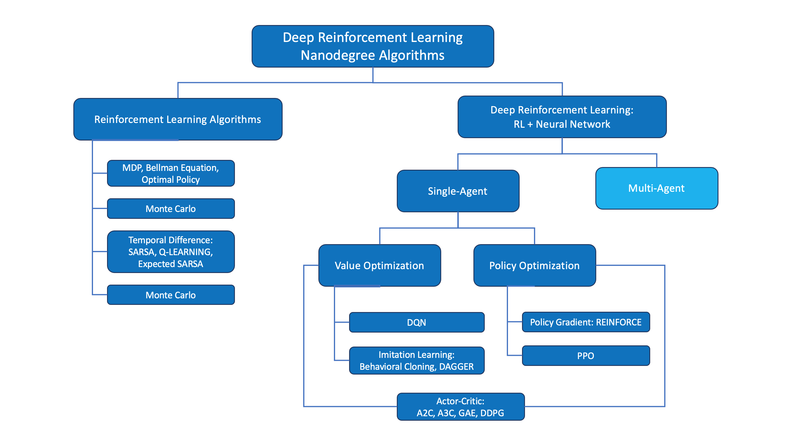

# S-3: Advanced Decision-Making in Intelligent Systems

# C-1: Fundamentals of Multi-Agent Reinforcement Learning (MARL)

1. Introduction to Multi-Agent Systems

    - Definition and Scope
    - Comparison with Single-Agent Reinforcement Learning
    - Key Characteristics of Multi-Agent Environments
    - Types of Agent Interactions

2. Theoretical Foundations

    - Joint Action Spaces
    - Partial Observability
    - Non-Stationarity Problem
    - Emergent Behaviors
    - Scalability Challenges

3. Game Theory Connections
    - Zero-Sum Games
    - Cooperative vs. Competitive Settings
    - Nash Equilibrium in MARL
    - Strategic Interactions

#### Introduction to Multi-Agent Systems

Multi-Agent Reinforcement Learning (MARL) represents a significant extension of traditional reinforcement learning
paradigms, wherein multiple autonomous entities—agents—must simultaneously interact with both their environment and each
other. This domain transcends the complexity of single-agent settings by introducing interactive dynamics that
fundamentally alter the learning process.

The defining characteristic of MARL lies in its distributed nature. Unlike classical reinforcement learning where a
singular agent navigates an environment with fixed transition dynamics, MARL presents an inherently non-stationary
landscape. Each agent must develop optimal policies while accounting for the evolving strategies of other agents,
creating a recursive dependency that significantly complicates the learning process.

From an epistemological perspective, MARL can be conceptualized as an extension of the Markov Decision Process (MDP)
framework into multi-agent territories. While single-agent reinforcement learning operates within the paradigm of an
MDP—characterized by states, actions, transition probabilities, and rewards—MARL extends this to stochastic games or
Markov games, where multiple decision-makers simultaneously influence environmental transitions.

  
Figure: MARL framework showing multiple agents interacting
 

The comparison between single-agent and multi-agent reinforcement learning reveals several fundamental distinctions:

1. In single-agent RL, the environment's response to actions follows stationary probability distributions. In contrast,
   MARL environments exhibit non-stationarity as the policies of other agents evolve concurrently.
2. The objective function in single-agent RL typically maximizes cumulative rewards for a solitary entity. MARL
   objectives can be vastly more complex, potentially incorporating notions of collective welfare, competitive
   advantage, or Nash equilibria.
3. Single-agent RL permits centralized decision-making and learning. MARL often necessitates decentralized execution,
   though it may allow for centralized training paradigms (centralized training with decentralized execution, or CTDE).

The types of agent interactions in MARL can be taxonomized along several dimensions:

- **Cooperative**: Agents share identical reward functions and collaborate to maximize collective utility
- **Competitive**: Agents have opposing objectives, often formalized as zero-sum games
- **Mixed**: Some agent subsets collaborate while others compete, creating complex incentive structures
- **General-sum**: Reward distributions follow no specific pattern, allowing for both partially aligned and conflicting
  interests

#### Theoretical Foundations

The theoretical underpinnings of MARL extend beyond traditional reinforcement learning into game theory, statistical
mechanics, and complex systems theory. A fundamental concept in MARL is the joint action space, which grows
exponentially with the number of agents. For $n$ agents, each with an action space of cardinality $|A|$, the joint
action space has cardinality $|A|^n$, leading to the well-documented "curse of dimensionality."

Formally, for agents $i \in {1, 2, ..., n}$, each with individual action space $A_i$, the joint action space $A$ is
defined as:

$$A = A_1 \times A_2 \times ... \times A_n$$

This exponential growth in action space complexity significantly impacts both learning efficiency and convergence
properties.

Partial observability presents another theoretical challenge. While single-agent systems may operate with limited
information through partially observable MDPs (POMDPs), multi-agent systems introduce a more complex variant:
Decentralized POMDPs (Dec-POMDPs). In these frameworks, each agent receives private observations that provide incomplete
information about the global state. The global state function $S$ maps to local observations $O_i$ for each agent
through observation functions:

$$O_i = Z_i(S)$$

where $Z_i$ represents agent $i$'s observation function.

The non-stationarity problem represents perhaps the most significant theoretical obstacle in MARL. As agents
concurrently update their policies, the environment effectively changes from each agent's perspective, violating the
Markov property that underpins much of reinforcement learning theory. For any agent $i$, the state transition
probability becomes dependent not only on the current state $s$ and action $a_i$, but also on the time-varying policies
of other agents $\pi_{-i}(t)$:

$$P(s' | s, a_i, \pi_{-i}(t))$$

This dependency creates a moving target for learning algorithms and can destabilize convergence.

Emergent behaviors in MARL represent complex system-level patterns that arise from relatively simple individual agent
policies. These emergent phenomena often transcend the programmed capabilities of individual agents, manifesting as
sophisticated coordination strategies, specialization of roles, or adaptive collective responses to environmental
changes. From a complexity theory perspective, such emergence illustrates how local interactions governed by simple
rules can generate global patterns of remarkable intricacy—reminiscent of phenomena observed in natural systems like ant
colonies or flocking birds.

Scalability presents a critical challenge as the number of agents increases. Beyond the exponential growth in joint
action spaces mentioned earlier, communication overhead, credit assignment complexity, and computational requirements
all scale non-linearly with agent population. Recent theoretical advances have focused on mean-field approximations,
where individual agents interact with a distribution over the population rather than with each specific agent, and
locality of interaction assumptions, where agents only interact with nearby neighbors in some metric space.

#### Game Theory Connections

MARL intersects profoundly with game theory, particularly in competitive and mixed-motive settings. Zero-sum games
represent a fundamental paradigm where agents have directly opposing interests, formalized as:

$$\sum_{i=1}^{n} R_i(s, \vec{a}) = 0 \quad \forall s \in S, \vec{a} \in A$$

where $R_i$ represents the reward function for agent $i$, $s$ denotes the state, and $\vec{a}$ is the joint action
vector.

In zero-sum games, any gain by one agent necessitates an equivalent loss by others. These settings promote inherently
adversarial learning dynamics, where optimal strategies often involve minimax principles—minimizing the maximum possible
loss against optimal opponent play. Chess, poker, and competitive resource allocation problems exemplify this category.

The cooperative-competitive spectrum offers a taxonomic framework for classifying multi-agent interactions. Fully
cooperative games feature identical reward functions across all agents, while fully competitive games place agents in
direct opposition. Between these extremes lie mixed-motive games, where partial alignment of interests creates nuanced
strategic considerations.

The concept of Nash equilibrium provides a pivotal solution concept in MARL. A Nash equilibrium represents a joint
policy where no agent can improve its expected return by unilaterally changing its policy while other agents maintain
theirs. Formally, a joint policy $\pi^* = (\pi_1^*, \pi_2^*, ..., \pi_n^*)$ constitutes a Nash equilibrium if:

$$V_i(\pi_i^*, \pi_{-i}^*) \geq V_i(\pi_i, \pi_{-i}^*) \quad \forall \pi_i \in \Pi_i, \forall i \in {1, 2, ..., n}$$

where $V_i$ denotes the value function for agent $i$, $\pi_{-i}^*$ represents the joint policy of all agents except $i$,
and $\Pi_i$ is the set of all possible policies for agent $i$.

Strategic interactions in MARL often exhibit complex dynamics not captured by simple equilibrium concepts. These
include:

- **Belief modeling**: Agents form and update beliefs about other agents' policies
- **Commitment strategies**: Agents commit to actions to influence others' responses
- **Reputation mechanisms**: Historical behavior influences future interactions
- **Signaling**: Actions convey information beyond their immediate effects

These strategic considerations highlight how MARL extends beyond traditional reinforcement learning into the realm of
strategic reasoning about other intelligent actors' decision processes.
