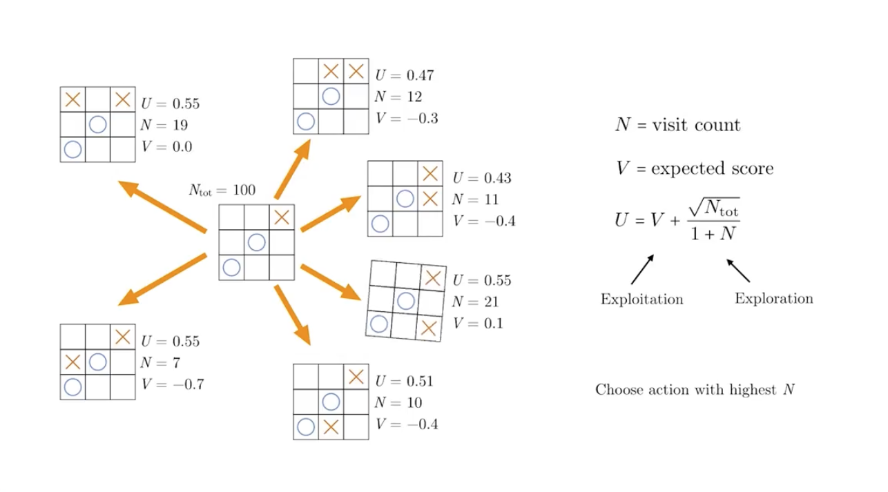
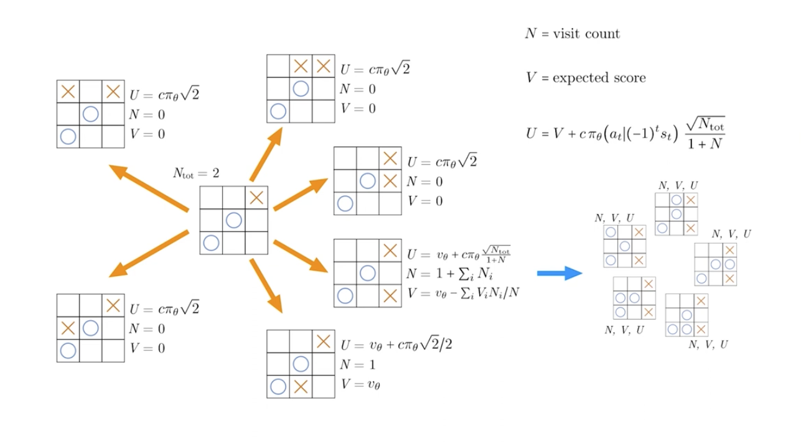
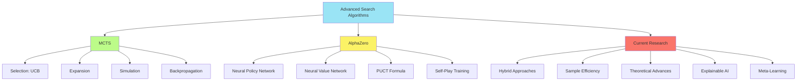

# C-2: Advanced Search Algorithms for Decision Making

1. Monte Carlo Tree Search (MCTS)

    - Core Principles and Algorithm Structure
    - The Four Phases: Selection, Expansion, Simulation, Backpropagation
    - UCB1 Formula and Exploration-Exploitation Balance
    - Applications and Advantages

2. AlphaZero's Enhanced MCTS

    - Neural Network Integration
    - Policy and Value Networks
    - Modified Selection Formula
    - Parallel Simulation Architecture
    - Comparison with Traditional MCTS

3. Implementation Considerations
    - Computational Efficiency
    - Hyperparameter Tuning
    - Adaptation to Different Domains
    - Current Research Directions

# S-3: Advanced Decision-Making in Intelligent Systems

# C-2: Advanced Search Algorithms for Decision Making

#### 1. Monte Carlo Tree Search (MCTS)

Monte Carlo Tree Search represents a groundbreaking approach to decision-making in complex domains characterized by
large state spaces and long-horizon planning problems. Unlike traditional search algorithms that rely heavily on
domain-specific heuristics, MCTS combines the precision of tree search with the flexibility of statistical sampling to
create a remarkably adaptive decision framework.

##### Core Principles and Algorithm Structure

At its conceptual foundation, MCTS embodies four key principles that distinguish it from earlier search methodologies:

1. **Selective Tree Growth**: Rather than exhaustively expanding all possible states, MCTS selectively builds its search
   tree, focusing computational resources on the most promising regions of the state space.
2. **Statistical Sampling**: MCTS uses random simulations (Monte Carlo sampling) to estimate the value of states without
   requiring explicit evaluation functions.
3. **Balance of Exploration and Exploitation**: The algorithm systematically balances exploring new, potentially
   valuable states with exploiting known good paths.
4. **Anytime Operation**: MCTS provides valid action recommendations at any point during its operation, with solution
   quality improving as computation time increases.

The elegance of MCTS lies in its modular structure, which can be understood as an iterative process that alternates
between tree traversal (guided by accumulated statistics) and stochastic sampling. Each iteration refines the search
tree and improves value estimates, gradually converging toward optimal decision paths.

Formally, MCTS operates on a decision tree where:

- Nodes represent states
- Edges represent actions
- Statistics at each node track visit counts and empirical reward estimates

The algorithm's convergence properties are supported by the law of large numbers, which guarantees that with sufficient
samples, the empirical mean of rewards will approach the true expected value.

##### The Four Phases: Selection, Expansion, Simulation, Backpropagation

The MCTS algorithm proceeds through four distinct phases during each iteration:

###### Selection

Starting from the root node (current state), the algorithm recursively selects child nodes according to a selection
policy until reaching a node that has unexpanded children (actions not yet represented in the tree). The canonical
selection policy is Upper Confidence Bounds for Trees (UCT), which applies the UCB1 formula:

$$UCB1(s,a) = \bar{X}*{s,a} + C\sqrt{\frac{\ln(N_s)}{n*{s,a}}}$$

Where:

- $\bar{X}_{s,a}$ is the average reward obtained after taking action $a$ in state $s$
- $N_s$ is the number of times state $s$ has been visited
- $n_{s,a}$ is the number of times action $a$ has been selected from state $s$
- $C$ is an exploration parameter (typically $\sqrt{2}$ for theoretical guarantees)

This formula elegantly balances exploitation (first term) with exploration (second term). As visits to a particular node
increase, the exploration bonus decreases, naturally transitioning from exploration to exploitation.

###### Expansion

After the selection phase reaches a node with unexpanded children, the algorithm expands the tree by adding a child node
representing a previously unexplored action. This incremental tree growth ensures memory efficiency and focused
computation.

The expansion strategy can vary:

- Single expansion: Add exactly one child per iteration
- Full expansion: Add all possible children when a node is first visited
- Progressive widening: Gradually add children as the parent node's visit count increases

###### Simulation

From the newly added node, MCTS performs a simulation (also called a rollout or playout) by following a default policy
until reaching a terminal state or a predetermined depth. The simplest implementation uses a random policy:

$$\pi_{default}(a|s) = \frac{1}{|A(s)|}$$

Where $A(s)$ is the set of legal actions in state $s$.

More sophisticated default policies can incorporate lightweight domain knowledge to improve simulation quality without
sacrificing computational efficiency. The key insight is that these simulations provide noisy but unbiased estimates of
state values.

###### Backpropagation

After completing the simulation, the algorithm updates statistics for all nodes traversed during selection and
expansion:

- Increment visit counts: $N_s \leftarrow N_s + 1$ and $n_{s,a} \leftarrow n_{s,a} + 1$
- Update value estimates: $\bar{X}*{s,a} \leftarrow \bar{X}*{s,a} + \frac{\Delta - \bar{X}*{s,a}}{n*{s,a}}$

Where $\Delta$ represents the simulation outcome (e.g., win=1, loss=0, or a more general reward).

This backpropagation ensures that statistics throughout the tree reflect the latest information, guiding future
iterations toward promising paths.

<div align="center">  <p style="color: #555;">Figure: MCTS algorithm phases illustration</p> </div>

The complete MCTS algorithm can be expressed pseudocode:

```python
def monte_carlo_tree_search(root_state, computational_budget):
    # Create root node with the current game state
    root = Node(state=root_state, parent=None)

    # Run iterations until computational budget is exhausted
    for _ in range(computational_budget):
        # Phase 1: Selection - Find a node to expand using UCB1
        node = select_node(root)

        # Phase 2: Expansion - Add one new child node
        if not node.is_terminal():
            node = expand(node)

        # Phase 3: Simulation - Random playout from the new node
        reward = simulate(node.state)

        # Phase 4: Backpropagation - Update statistics up the tree
        backpropagate(node, reward)

    # Return the best action from the root
    return best_child(root).action

def select_node(node):
    while not node.is_fully_expanded() and not node.is_terminal():
        if not node.is_fully_expanded():
            return node
        node = select_best_child(node, c=exploration_constant)
    return node

def expand(node):
    # Choose an unexplored action
    action = node.get_unexplored_action()
    # Create a new state by applying the action
    new_state = node.state.apply(action)
    # Create and return a new child node
    child = Node(state=new_state, parent=node, action=action)
    node.add_child(child)
    return child

def simulate(state):
    while not state.is_terminal():
        action = random.choice(state.get_legal_actions())
        state = state.apply(action)
    return state.get_reward()

def backpropagate(node, reward):
    while node is not None:
        node.visits += 1
        node.value += (reward - node.value) / node.visits
        node = node.parent

def best_child(node):
    return max(node.children, key=lambda c: c.visits)
```

##### UCB1 Formula and Exploration-Exploitation Balance

The UCB1 formula represents a theoretically grounded solution to the exploration-exploitation dilemma in MCTS. This
formula derives from the multi-armed bandit literature and provides asymptotic guarantees of logarithmic regret.

$$UCB1(s,a) = \bar{X}*{s,a} + C\sqrt{\frac{\ln(N_s)}{n*{s,a}}}$$

The formula consists of two critical components:

1. **Exploitation Term** ($\bar{X}_{s,a}$): Favors actions with high empirical rewards, exploiting accumulated
   knowledge.
2. **Exploration Term** ($C\sqrt{\frac{\ln(N_s)}{n_{s,a}}}$): Encourages trying actions with few visits, ensuring
   comprehensive exploration.

The exploration constant $C$ controls the balance between these competing objectives:

- Higher $C$ values prioritize exploration
- Lower $C$ values emphasize exploitation

The theoretical optimal value $C = \sqrt{2}$ assumes rewards are bounded in $[0,1]$, but practical implementations often
tune this parameter empirically based on domain characteristics.

The UCB1 formula exhibits several important properties:

1. **Adaptive Exploration**: As the total visit count increases, the exploration bonus decreases for frequently visited
   actions but increases for rarely visited ones.
2. **Asymptotic Consistency**: With infinite samples, MCTS using UCB1 converges to the optimal policy.
3. **Diminishing Uncertainty**: The exploration term captures the uncertainty in value estimates, which naturally
   decreases with more visits.
4. **Logarithmic Scaling**: The $\ln(N_s)$ term ensures that exploration pressure grows slowly with the total number of
   visits, allowing exploitation to eventually dominate.

In practical implementations, several variants of the UCB1 formula exist:

1. **UCB1-Tuned**: Incorporates reward variance to adapt exploration:
   $$UCB1\text{-}Tuned(s,a) = \bar{X}*{s,a} + \sqrt{\frac{\ln(N_s)}{n*{s,a}} \min\left(0.25, V_{s,a} + \sqrt{\frac{2\ln(N_s)}{n_{s,a}}}\right)}$$
   Where $V_{s,a}$ is the empirical variance of rewards.
2. **UCB-V**: Explicitly balances mean rewards and their variance:
   $$UCB\text{-}V(s,a) = \bar{X}*{s,a} + \sqrt{\frac{2V*{s,a}\ln(N_s)}{n_{s,a}}} + c\frac{3\ln(N_s)}{n_{s,a}}$$
3. **UCT**: The standard adaptation of UCB1 for tree search contexts.

##### Applications and Advantages

MCTS has demonstrated remarkable success across a diverse range of domains, revolutionizing the state-of-the-art in many
complex decision problems:

###### Board Games

The most celebrated application of MCTS occurred in the domain of Go, where programs like MoGo and Crazy Stone achieved
unprecedented performance before the integration of neural networks. MCTS has also excelled in:

- Chess
- Shogi
- Hex
- Amazons
- General game playing systems

###### Planning Problems

MCTS provides an effective approach to planning in domains with large state spaces:

- Robotics motion planning
- Task scheduling
- Production planning
- Autonomous vehicle navigation

###### Optimization Problems

The algorithm's adaptability extends to optimization scenarios:

- Portfolio optimization
- Traveling salesman problem variants
- Resource allocation
- Constraint satisfaction problems

###### Real-time Decision Making

MCTS's anytime property makes it suitable for time-critical applications:

- Real-time strategy games
- Emergency response coordination
- Online algorithm configuration
- Autonomous system control

The key advantages that have driven MCTS's widespread adoption include:

1. **Minimal Domain Knowledge**: MCTS requires only a simulator or model of the environment, not complex evaluation
   functions or elaborate heuristics.
2. **Asymmetric Tree Expansion**: The algorithm automatically allocates computational resources to promising regions of
   the search space.
3. **Graceful Scaling with Compute**: Performance improves smoothly with additional computational resources.
4. **Theoretical Guarantees**: Under appropriate conditions, MCTS converges to optimal policies.
5. **Handling Uncertainty**: The algorithm naturally manages stochastic environments and partial observability.
6. **Adaptability**: MCTS readily accommodates domain-specific enhancements without compromising its core functionality.

These advantages have established MCTS as a cornerstone algorithm in artificial intelligence, bridging the gap between
theoretical optimality and practical efficiency in complex decision-making scenarios.

#### 2. AlphaZero's Enhanced MCTS

AlphaZero represents a revolutionary leap in artificial intelligence that fundamentally transformed the landscape of
strategic decision-making. By integrating deep neural networks with Monte Carlo Tree Search, DeepMind's AlphaZero system
achieved unprecedented performance in chess, shogi, and Go without relying on human domain knowledge, opening new
frontiers in machine learning and artificial intelligence.

##### Neural Network Integration

The cornerstone of AlphaZero's innovation lies in replacing traditional MCTS components with learned neural
representations. This integration represents a fundamental shift from hand-crafted knowledge to learned pattern
recognition.

###### Architectural Overview

AlphaZero employs a deep neural network architecture with two key components:

1. **Shared Representation**: Convolutional layers extract meaningful patterns from the game state, learning relevant
   features automatically.
2. **Dual Output Heads**:
    - Policy head: predicts move probabilities
    - Value head: estimates expected outcome

This architecture can be formalized as:

$$f_\theta(s) = (p_\theta(s), v_\theta(s))$$

Where:

- $f_\theta$ is the neural network with parameters $\theta$
- $s$ represents the current state
- $p_\theta(s)$ is the policy output (probability distribution over actions)
- $v_\theta(s)$ is the value output (scalar estimate of expected outcome)

The shared representation enables powerful knowledge transfer between policy and value functions, as the same learned
features inform both action selection and position evaluation.

###### Input Representation

AlphaZero encodes board states using a stack of binary feature planes that capture:

- Piece positions and types
- Move legality
- Repetition counters
- Turn information
- Game-specific features (e.g., castling rights in chess)

This spatial representation preserves the topological structure of the game board, allowing convolutional networks to
identify meaningful patterns across the board.

###### Network Architecture

The typical architecture includes:

- Initial convolutional layer with batch normalization
- Multiple residual blocks with skip connections
- Policy head: convolutional layer followed by fully connected layer to action probabilities
- Value head: convolutional layer, fully connected layer, tanh activation to output a scalar in [-1,1]

This deep residual architecture enables the network to learn complex hierarchical features relevant to strategic
evaluation.

##### Policy and Value Networks

AlphaZero's dual-headed neural network serves two distinct but complementary functions in guiding the search process.

###### Policy Network

The policy network $p_\theta(a|s)$ outputs a probability distribution over legal actions in a given state, effectively
providing informed priors for tree search. This neural "intuition" guides exploration toward promising moves,
dramatically improving search efficiency.

During training, the policy network learns to predict the improved policy derived from MCTS:

$$p_\theta(a|s) \approx \pi_{MCTS}(a|s) = \frac{N(s,a)^{1/\tau}}{\sum_b N(s,b)^{1/\tau}}$$

Where:

- $N(s,a)$ is the visit count for action $a$ in state $s$
- $\tau$ is a temperature parameter controlling exploration

This creates a virtuous cycle where:

1. Neural policy guides search toward promising moves
2. Search improves upon neural policy through lookahead
3. Improved policy trains the neural network
4. Enhanced neural network guides more effective search

###### Value Network

The value network $v_\theta(s)$ estimates the expected outcome from a given position, ranging from -1 (certain loss) to
+1 (certain win). This function replaces the random rollouts of traditional MCTS with learned evaluation.

The value network is trained to predict the actual game outcomes from self-play:

$$v_\theta(s) \approx \mathbb{E}[z|s]$$

Where $z \in {-1, +1}$ represents the game outcome from the current player's perspective.

This learned evaluation offers several advantages:

1. Captures subtle positional factors beyond tactical calculations
2. Provides consistent evaluations without simulation variance
3. Requires significantly less computation than random playouts
4. Generalizes knowledge across similar positions

###### Combined Loss Function

Both network components are trained simultaneously using a combined loss function:

$$L(\theta) = (z - v_\theta(s))^2 - \pi_{MCTS}^T \log p_\theta(s) + c|\theta|^2$$

This loss function includes:

- Mean squared error for value predictions
- Cross-entropy loss for policy predictions
- L2 regularization to prevent overfitting

<div align="center">  <p style="color: #555;">Figure: AlphaZero's neural network guided search</p> </div>

##### Modified Selection Formula

AlphaZero introduces a significant modification to the MCTS selection formula, incorporating neural network outputs to
guide the search process more effectively.

###### PUCT Formula

The Predictor + UCT (PUCT) formula used by AlphaZero is:

$$U(s,a) = Q(s,a) + c_{puct} \cdot p_\theta(a|s) \cdot \frac{\sqrt{\sum_b N(s,b)}}{1 + N(s,a)}$$

Where:

- $Q(s,a)$ is the mean action value (exploitation term)
- $p_\theta(a|s)$ is the policy network's prior probability for action $a$
- $\sqrt{\sum_b N(s,b)}$ represents the parent node's total visit count
- $N(s,a)$ is the visit count for the specific action
- $c_{puct}$ is an exploration constant (typically 1-5 in practice)

###### Key Differences from UCB1

This formula differs from traditional UCB1 in several important ways:

1. **Policy Prior Integration**: The exploration term is weighted by the policy network's probability $p_\theta(a|s)$,
   directing exploration toward promising actions identified by the neural network.
2. **Exploration Scaling**: The exploration bonus scales with $\sqrt{\sum_b N(s,b)}$ rather than $\log(\sum_b N(s,b))$,
   creating a different exploration profile.
3. **Denominator Form**: The $1 + N(s,a)$ denominator ensures that as visits increase, the exploration bonus decreases,
   eventually focusing on exploitation.
4. **Prior-Guided Exploration**: Actions with higher policy priors receive proportionally larger exploration bonuses,
   creating an informed exploration strategy rather than uniform uncertainty sampling.

###### Mathematical Behavior

The PUCT formula creates several desirable behaviors:

1. **Early Exploration Based on Policy**: Initially, when $N(s,a) = 0$ for all actions, selection is governed primarily
   by the policy network, focusing exploration on moves deemed promising by the neural network.
2. **Gradual Transition to Empirical Values**: As visit counts increase, the $Q(s,a)$ term gains more influence,
   transitioning from neural "intuition" to concrete search results.
3. **Automatic Allocation of Computation**: The formula naturally allocates more computation to promising variations,
   creating an efficiently asymmetric search tree.
4. **Rapid Convergence**: By focusing exploration on a priori promising actions, the algorithm converges more quickly to
   strong lines of play.

The effectiveness of this selection strategy depends critically on the quality of the policy network. As the neural
network improves through training, the search becomes increasingly efficient.

##### Parallel Simulation Architecture

AlphaZero implements a highly parallelized architecture that dramatically accelerates the search process, enabling it to
evaluate thousands of positions per second.

###### Virtual Loss Mechanism

To enable parallel tree traversal without duplicate exploration, AlphaZero employs virtual losses:

1. When a thread selects a node for expansion, it temporarily applies a pessimistic "virtual loss" to that node
2. This virtual loss discourages other threads from simultaneously exploring the same path
3. Once the thread completes its simulation and backpropagation, it removes the virtual loss

This mechanism can be implemented by modifying the selection formula:

$$U(s,a) = \frac{W(s,a) - n_{virtual}(s,a)}{N(s,a) + n_{virtual}(s,a)} + c_{puct} \cdot p_\theta(a|s) \cdot \frac{\sqrt{\sum_b N(s,b)}}{1 + N(s,a) + n_{virtual}(s,a)}$$

Where $n_{virtual}(s,a)$ represents the number of threads currently exploring that edge.

###### Batch Processing

AlphaZero leverages modern GPU architectures through batch processing:

1. Multiple MCTS simulations are collected until reaching leaf nodes
2. States from these leaf nodes are batched together
3. The neural network evaluates this batch in a single forward pass
4. Results are distributed back to the respective MCTS simulations

This approach maximizes GPU utilization and throughput, allowing for efficient parallel processing:

```python
def batch_mcts(root_nodes, model, num_simulations, batch_size):
    # Run multiple simulations in parallel with batched neural network evaluation
    for _ in range(num_simulations // batch_size):
        # Selection and expansion phases for batch_size simulations
        leaf_nodes = []
        for i in range(batch_size):
            # Select a leaf node according to PUCT formula
            leaf = select_leaf(root_nodes[i % len(root_nodes)])
            leaf_nodes.append(leaf)

        # Batch evaluate leaf nodes with neural network
        states = [node.state for node in leaf_nodes]
        policy_probs, values = model.predict_batch(states)

        # Backpropagate results
        for i, leaf in enumerate(leaf_nodes):
            backpropagate(leaf, values[i], policy_probs[i])
```

###### Distributed Training

AlphaZero's training process is distributed across multiple components:

1. **Self-play workers**: Generate games using the latest neural network and MCTS
2. **Training workers**: Update neural network parameters using sampled positions from recent games
3. **Evaluation workers**: Compare network versions to determine whether to update the self-play network

This distributed architecture enables efficient scaling across hundreds of GPUs and thousands of CPU cores, dramatically
accelerating the self-improvement cycle.

##### Comparison with Traditional MCTS

AlphaZero's enhanced MCTS differs from traditional implementations in several fundamental ways, each contributing to its
remarkable performance.

###### Value Estimation Approach

**Traditional MCTS**:

- Uses random playouts to estimate position values
- Provides unbiased but high-variance estimates
- Requires many simulations to reduce statistical noise
- Often misses subtle strategic considerations

**AlphaZero**:

- Replaces playouts with neural value function evaluations
- Provides learned estimates that capture positional understanding
- Delivers consistent evaluations without simulation variance
- Recognizes complex patterns and long-term implications

###### Prior Knowledge Integration

**Traditional MCTS**:

- Begins with uniform action priors
- Explores actions equally at first
- Requires many simulations to identify promising moves
- Often wastes computation on clearly suboptimal actions

**AlphaZero**:

- Incorporates learned policy priors from neural network
- Focuses initial exploration on promising actions
- Quickly identifies candidate moves worth exploring
- Dramatically improves search efficiency

###### Learning Mechanism

**Traditional MCTS**:

- Generally a static algorithm without learning capabilities
- Knowledge doesn't transfer between positions or games
- Cannot improve from experience
- Relies on hand-crafted enhancements

**AlphaZero**:

- Continuously improves through self-play
- Generalizes knowledge across similar positions
- Learns domain-specific patterns and principles
- Develops understanding without human knowledge

###### Performance Characteristics

**Traditional MCTS**:

- Scaled primarily with number of simulations
- Required significant domain knowledge for state-of-the-art performance
- Struggled with strategic evaluation in complex games like Go
- Usually combined with hand-crafted heuristics

**AlphaZero**:

- Achieves superior performance with fewer simulations
- Requires no domain knowledge beyond game rules
- Excels at strategic evaluation across diverse games
- Learns its own heuristics through self-play

###### Computational Profile

**Traditional MCTS**:

- Computation dominated by random playouts
- Relatively shallow trees with many simulations
- Memory-efficient node representation
- Primarily CPU-bound

**AlphaZero**:

- Computation dominated by neural network evaluation
- Deeper, more focused trees with fewer branches
- Higher memory requirements for neural activations
- Primarily GPU-bound

This comparison highlights how AlphaZero represents not merely an incremental improvement but a fundamental reimagining
of MCTS that leverages the strengths of deep learning to overcome traditional limitations.

#### 3. Implementation Considerations

The practical implementation of advanced search algorithms like MCTS and AlphaZero involves numerous engineering
challenges and optimization opportunities. Understanding these considerations is crucial for developing efficient and
effective systems.

##### Computational Efficiency

Maximizing computational efficiency is essential for practical applications of advanced search algorithms, particularly
when operating under real-time constraints or with limited resources.

###### Node Representation

Efficient node representation significantly impacts memory usage and cache performance:

```python
class MCTSNode:
    """Memory-efficient node representation for MCTS."""

    __slots__ = ('state', 'parent', 'children', 'action', 'visits', 'value', 'prior')

    def __init__(self, state, parent=None, action=None, prior=1.0):
        self.state = state          # Game state (can be stored as a reference or hash)
        self.parent = parent        # Parent node
        self.children = {}          # Map from actions to child nodes
        self.action = action        # Action that led to this state
        self.visits = 0             # Visit count
        self.value = 0.0            # Accumulated value
        self.prior = prior          # Prior probability from policy network
```

Using techniques like `__slots__` in Python can reduce memory overhead by 30-50% compared to standard dictionary-based
objects. For large-scale applications, compressed state representations using bitboards or similar techniques can
further reduce memory requirements.

###### Tree Reuse

In sequential decision-making scenarios, reusing portions of the search tree between steps dramatically improves
efficiency:

```python
def reuse_subtree(old_root, new_state):
    """Reuse relevant parts of the previous search tree."""
    # Find the child node corresponding to the actual action taken
    for action, child in old_root.children.items():
        if child.state == new_state:
            # Reuse this subtree as the new root
            child.parent = None  # Disconnect from old tree
            return child

    # If the exact state isn't found (e.g., due to stochasticity),
    # create a new root node
    return MCTSNode(new_state)
```

Tree reuse preserves valuable information from previous searches, effectively amortizing computation across sequential
decisions.

###### Parallelization Strategies

Different parallelization approaches offer unique trade-offs:

1. **Leaf Parallelization**:

    - Multiple simulations are performed in parallel from leaf nodes
    - Simple to implement with minimal synchronization
    - Ideal for batch processing with neural networks

    ```python
    def leaf_parallel_mcts(root, num_threads, simulations_per_thread):
        # Create thread pool
        with ThreadPoolExecutor(max_workers=num_threads) as executor:
            # Submit simulation tasks
            futures = [executor.submit(run_simulations, root, simulations_per_thread)
                      for _ in range(num_threads)]
            # Wait for all simulations to complete
            wait(futures)

        # Return best action from root
        return max(root.children.items(), key=lambda x: x[1].visits)[0]
    ```

2. **Root Parallelization**:

    - Independent search trees are built in parallel
    - Results are combined after completion
    - Minimal synchronization requirements but potential redundancy

    ```python
    def root_parallel_mcts(state, num_trees, simulations_per_tree):
        # Create independent root nodes
        roots = [MCTSNode(state) for _ in range(num_trees)]

        # Run independent searches
        with ThreadPoolExecutor(max_workers=num_trees) as executor:
            futures = [executor.submit(run_mcts, root, simulations_per_tree)
                      for root in roots]
            wait(futures)

        # Aggregate statistics across trees
        action_stats = defaultdict(lambda: [0, 0])  # [visits, value]
        for root in roots:
            for action, child in root.children.items():
                action_stats[action][0] += child.visits
                action_stats[action][1] += child.value

        # Return action with highest combined visit count
        return max(action_stats.items(), key=lambda x: x[1][0])[0]
    ```

3. **Tree Parallelization**:

    - Single shared tree with mutex locks
    - Requires careful synchronization
    - Most efficient use of information but potential thread contention

    ```python
    def tree_parallel_mcts(root, num_threads, total_simulations):
        # Shared tree with lock protection
        locks = {root: threading.RLock()}

        def get_lock(node):
            if node not in locks:
                locks[node] = threading.RLock()
            return locks[node]

        # Thread worker function
        def worker(worker_id, simulations_per_worker):
            for _ in range(simulations_per_worker):
                # Selection phase with locks
                node = root
                path = [node]

                while node.children and not node.is_terminal():
                    with get_lock(node):
                        node = select_child(node)
                    path.append(node)

                # Expansion and simulation phases
                with get_lock(node):
                    if not node.is_terminal() and node.visits > 0:
                        node = expand(node)
                        path.append(node)

                # Simulation
                value = simulate(node.state)

                # Backpropagation with locks
                for n in reversed(path):
                    with get_lock(n):
                        n.visits += 1
                        n.value += (value - n.value) / n.visits

        # Launch threads
        simulations_per_worker = total_simulations // num_threads
        threads = []
        for i in range(num_threads):
            thread = threading.Thread(target=worker, args=(i, simulations_per_worker))
            threads.append(thread)
            thread.start()

        # Wait for completion
        for thread in threads:
            thread.join()

        return max(root.children.items(), key=lambda x: x[1].visits)[0]
    ```

###### Vectorized Operations

Modern hardware accelerators like GPUs and TPUs excel at parallel matrix operations. Vectorizing neural network
evaluations dramatically improves throughput:

```python
def batch_evaluate_positions(model, states, batch_size=128):
    """Evaluate multiple positions in batches for optimal GPU utilization."""
    results = []

    # Process in batches to avoid GPU memory limitations
    for i in range(0, len(states), batch_size):
        batch_states = states[i:i+batch_size]
        # Convert states to appropriate tensor format
        batch_tensor = convert_states_to_tensor(batch_states)
        # Single forward pass for entire batch
        with torch.no_grad():  # Disable gradient computation for inference
            batch_policies, batch_values = model(batch_tensor)

        # Convert to numpy for easier handling
        policies = batch_policies.cpu().numpy()
        values = batch_values.cpu().numpy()

        # Store results
        for j in range(len(batch_states)):
            results.append((policies[j], values[j]))

    return results
```

This batched processing can yield 10-100x speedups compared to sequential evaluation, particularly for GPU-based neural
network inference.

##### Hyperparameter Tuning

The performance of advanced search algorithms depends critically on hyperparameter settings. Systematic tuning
approaches help identify optimal configurations.

###### Exploration Constants

The exploration constant in MCTS (whether UCB1's $C$ or PUCT's $c_{puct}$) dramatically influences search behavior:

- **Too Low**: Search becomes overly greedy, potentially missing optimal solutions
- **Too High**: Search wastes computation on clearly suboptimal actions
- **Optimal Setting**: Depends on reward scale, game characteristics, and computational budget

Empirical tuning methods include:

1. Grid search across plausible values
2. Self-play tournaments between different parameter settings
3. Adaptive tuning based on observed performance

###### Simulation Budget

The number of simulations directly impacts decision quality but faces diminishing returns:

- **Distributing Budget**: For sequential decisions, allocating more simulations to critical positions can improve
  overall performance
- **Adaptive Termination**: Stopping search early when confident or continuing longer when uncertain
- **Time Management**: In time-constrained scenarios, dynamically adjusting simulation counts based on remaining time

```python
def adaptive_simulation_budget(state, base_simulations, remaining_time, total_time):
    """Adjust simulation count based on position complexity and time constraints."""
    # Allocate more simulations for early/critical positions
    game_progress = estimate_game_progress(state)
    position_complexity = estimate_position_complexity(state)

    # Base adjustment on game phase
    if game_progress < 0.3:  # Opening phase
        phase_factor = 1.2  # Spend more time in opening
    elif game_progress > 0.7:  # Endgame
        phase_factor = 1.3  # Spend more time in critical endgame
    else:  # Middlegame
      phase_factor = 1.0


    # Adjust for position complexity
    complexity_factor = 0.8 + (position_complexity * 0.4)  # Range from 0.8 to 1.2

    # Time management factor
    time_factor = (remaining_time / total_time) * 1.5  # Use more time early, conserve later

    # Combine factors with base simulation count
    adjusted_simulations = int(base_simulations * phase_factor * complexity_factor * time_factor)

    # Ensure minimum and maximum simulation counts
    return max(min(adjusted_simulations, base_simulations * 2), base_simulations // 2)
```

###### Virtual Loss

In parallel MCTS implementations, virtual loss magnitude affects exploration diversity:

- **Too Small**: Threads concentrate on similar paths, reducing parallel efficiency
- **Too Large**: Excessive penalty creates artificial avoidance of promising paths
- **Typical Settings**: 1-3 virtual losses per thread visiting a node

###### Temperature Parameter

The temperature parameter τ controls exploration during action selection from the root:

$$\pi(a|s) = \large \frac{N(s,a)^{1/\tau}}{\sum_b N(s,b)^{1/\tau}}$$

- **High Temperature** (τ > 1): More uniform action selection, encouraging exploration
- **Low Temperature** (τ < 1): More deterministic selection of the highest-visited actions
- **Temperature Scheduling**: Many implementations use higher temperatures early in games or training, then anneal to
  lower temperatures:

```python
def temperature_schedule(game_step, training_stage):
    """Adaptive temperature based on game progress and training stage."""
    if training_stage == "early":
        # Encourage exploration during early training
        base_temp = 1.0
    elif training_stage == "middle":
        base_temp = 0.8
    else:  # "final" training stage
        base_temp = 0.5

    # Anneal temperature as game progresses
    game_progress_factor = max(0.2, 1.0 - (game_step / 30))

    return base_temp * game_progress_factor
```

##### Adaptation to Different Domains

While MCTS and AlphaZero were originally developed for perfect information board games, they can be adapted to various
domains with appropriate modifications.

###### Handling Imperfect Information

For games with hidden information or partial observability:

1. **Information Set MCTS**: Search over beliefs about possible game states

    ```python
    def information_set_mcts(belief_state, num_simulations):
        """MCTS adaptation for imperfect information games."""
        # Sample possible determinizations from belief state
        determinizations = sample_determinizations(belief_state, num_samples=10)

        # Run MCTS on each determinization
        results = {}
        for det in determinizations:
            root = MCTSNode(det)
            for _ in range(num_simulations // len(determinizations)):
                run_simulation(root)

            # Collect statistics across determinizations
            for action, child in root.children.items():
                if action not in results:
                    results[action] = [0, 0]  # [visits, value]
                results[action][0] += child.visits
                results[action][1] += child.value

        # Select action with highest average value across determinizations
        return max(results.items(), key=lambda x: x[1][1] / max(1, x[1][0]))[0]
    ```

2. **Counterfactual Regret Minimization (CFR)**: In games like poker, combining MCTS with CFR can lead to more robust
   strategies

###### Continuous Action Spaces

For domains with continuous actions (e.g., robotics, control systems):

1. **Progressive Widening**: Gradually increase action branching based on visit count

    ```python
    def progressive_widening(node, k=1.0, alpha=0.5):
        """Add new actions gradually as node visits increase."""
        max_children = int(k * node.visits ** alpha) + 1

        if len(node.children) < max_children:
            # Sample a new action from continuous space
            new_action = sample_continuous_action(node.state)

            # Create child node for this action
            new_state = apply_action(node.state, new_action)
            new_child = MCTSNode(new_state, parent=node, action=new_action)
            node.children[new_action] = new_child

            return new_child
        else:
            # Select among existing children using UCB
            return select_child_ucb(node)
    ```

2. **Local Action Optimization**: Refine continuous actions through gradient-based methods

###### Stochastic Environments

For environments with random outcomes:

1. **Double Progressive Widening**: Progressive widening at both action and outcome levels

    ```python
    def double_progressive_widening(node, k_a=1.0, alpha_a=0.5, k_o=1.0, alpha_o=0.5):
        """Progressive widening for both actions and stochastic outcomes."""
        if not node.children:
            # Initialize empty dictionaries for outcomes if node has no children
            node.outcomes = {}
            node.outcome_counts = {}

        # Progressive widening for actions
        max_actions = int(k_a * node.visits ** alpha_a) + 1

        if len(node.children) < max_actions:
            # Sample a new action
            new_action = sample_action(node.state)
            node.children[new_action] = {}
            node.outcomes[new_action] = []
            node.outcome_counts[new_action] = 0
            return expand_outcome(node, new_action)
        else:
            # Select existing action using UCB
            action = select_action_ucb(node)

            # Progressive widening for outcomes
            max_outcomes = int(k_o * node.outcome_counts[action] ** alpha_o) + 1

            if len(node.outcomes[action]) < max_outcomes:
                # Generate a new outcome
                return expand_outcome(node, action)
            else:
                # Select existing outcome
                outcome_idx = select_outcome(node, action)
                child = node.children[action][outcome_idx]
                return child
    ```

2. **Expected MCTS**: Use expected values over stochastic transitions rather than sampling

###### Multi-Objective Problems

For problems with multiple competing objectives:

1. **Vector-valued rewards**: Maintain vector-valued statistics in the tree
2. **Pareto MCTS**: Track the Pareto frontier of non-dominated solutions
3. **Scalarization techniques**: Convert multi-objective problems to scalar objectives with preference weights

###### Long Horizons

For problems with long planning horizons:

1. **Macro-actions**: Use temporally extended actions to reduce effective horizon
2. **Option frameworks**: Incorporate pre-learned skills or options
3. **Hierarchical MCTS**: Use multiple levels of planning at different temporal scales

##### Current Research Directions

Advanced search algorithms continue to evolve through active research across several frontier areas.

###### Hybrid Approaches

Combining MCTS with other search techniques:

1. **MCTS + Minimax**: Using shallow alpha-beta searches within MCTS

    ```python
    def hybrid_evaluation(state, depth=3):
        """Combine neural evaluation with shallow minimax search."""
        if is_tactical_position(state):
            # Use minimax for tactical positions
            return alpha_beta_search(state, depth)
        else:
            # Use neural network for strategic positions
            return value_network.predict(state)
    ```

2. **MCTS + Evolutionary Algorithms**: Using evolution to optimize neural network parameters

3. **MCTS + Predictive Models**: Incorporating learned dynamics models for more accurate simulations

###### Sample Efficiency Improvements

Making better use of limited computational resources:

1. **Policy Improvement Operators**: Techniques like Retrace(λ) for more efficient value estimation

2. **Prioritized Sweeping**: Focusing backpropagation on high-impact nodes

    ```python
    def prioritized_backpropagation(node, value, priority_queue):
        """Backpropagate with priority on high-impact updates."""
        while node is not None:
            old_value = node.value
            # Update node statistics
            node.visits += 1
            node.value += (value - node.value) / node.visits

            # Calculate update magnitude
            update_magnitude = abs(old_value - node.value)

            # Add parent to priority queue if update is significant
            if node.parent and update_magnitude > THRESHOLD:
                priority_queue.add(node.parent, update_magnitude)

            node = node.parent
    ```

3. **Value Equivalence Principle**: Learning models that capture value-relevant aspects of the environment

###### Theoretical Advancements

Improving theoretical understanding and guarantees:

1. **Regret Bounds**: Tighter mathematical guarantees on MCTS performance
2. **Sample Complexity Analysis**: Understanding how many simulations are needed for near-optimal decisions
3. **Convergence Conditions**: Identifying when neural-guided search is guaranteed to converge

###### Explainable AI

Making search-based decisions more interpretable:

1. **Principal Variation Analysis**: Extracting human-interpretable plans from search trees
2. **Feature Attribution**: Understanding which aspects of a position influence the neural network's evaluation
3. **Symbolic Distillation**: Extracting symbolic rules from neural-guided search behavior

###### Meta-Learning and Self-Improvement

Algorithms that improve their own search process:

1. **Learned Exploration Strategies**: Adapting exploration parameters based on performance
2. **Neural Network Architectures**: Self-modifying architectures for domain adaptation
3. **Curriculum Learning**: Progressively increasing problem difficulty during training



The implementation of advanced search algorithms continues to benefit from cross-pollination between theoretical
insights and practical engineering considerations. As computational resources grow and algorithms improve, these
approaches will likely find applications in increasingly complex real-world decision problems beyond their original
gaming domains.

The convergence of deep learning with structured search represents one of the most promising directions in artificial
intelligence, combining the pattern recognition capabilities of neural networks with the planning abilities of tree
search. This synthesis enables systems to both learn from experience and reason about potential futures, addressing
fundamental challenges in decision-making under uncertainty.
