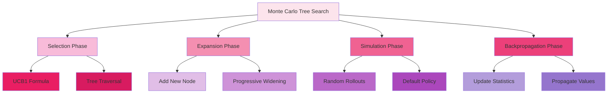
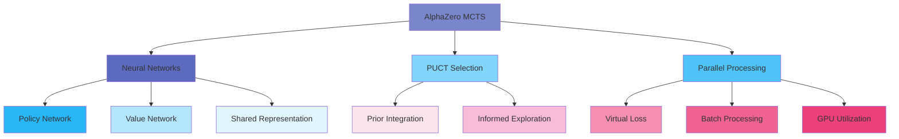
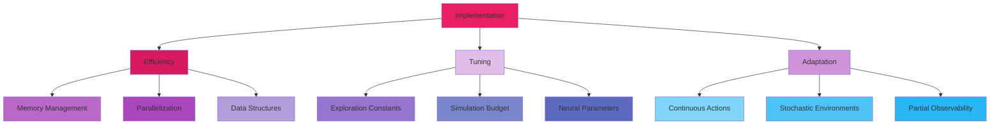
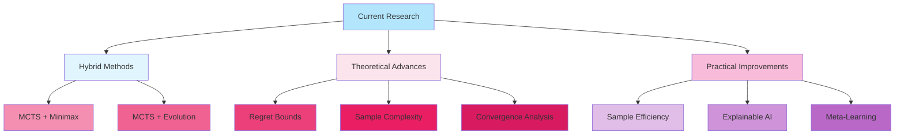

# C-2: Advanced Search Algorithms for Decision Making

1. Monte Carlo Tree Search (MCTS)
    - Core Principles and Algorithm Structure
    - The Four Phases: Selection, Expansion, Simulation, Backpropagation
    - UCB1 Formula and Exploration-Exploitation Balance
    - Applications and Advantages
2. AlphaZero's Enhanced MCTS
    - Neural Network Integration
    - Policy and Value Networks
    - Modified Selection Formula
    - Parallel Simulation Architecture
    - Comparison with Traditional MCTS
3. Implementation Considerations
    - Computational Efficiency
    - Hyperparameter Tuning
    - Adaptation to Different Domains
    - Current Research Directions

---

#### 1. Monte Carlo Tree Search (MCTS)

Monte Carlo Tree Search represents a revolutionary advancement in decision-making algorithms, fundamentally transforming
how artificial intelligence systems approach complex strategic problems. Unlike traditional search methods that require
extensive domain-specific knowledge and heuristics, MCTS combines statistical sampling with selective tree expansion to
create a remarkably general and powerful decision framework.

The algorithm's elegance lies in its ability to balance exploration of unknown possibilities with exploitation of proven
strategies, making it particularly effective in domains characterized by large state spaces, uncertain outcomes, and
long-term planning requirements. This balance is achieved through principled mathematical foundations rooted in
multi-armed bandit theory and statistical learning.

##### Core Principles and Algorithm Structure

MCTS operates on four fundamental principles that distinguish it from classical search algorithms and establish its
theoretical foundations:

**Selective Expansion**: Rather than exhaustively expanding all possible moves like traditional minimax algorithms, MCTS
grows its search tree asymmetrically, focusing computational resources on the most promising paths. This selective
approach enables the algorithm to handle exponentially large state spaces that would overwhelm exhaustive methods.

**Statistical Evaluation**: MCTS employs Monte Carlo sampling to estimate state values without requiring hand-crafted
evaluation functions. This statistical approach provides unbiased value estimates while maintaining generality across
different domains.

**Upper Confidence Bound Guidance**: The algorithm uses confidence bounds to guide exploration, ensuring that promising
areas receive more attention while maintaining guarantees about exploring less-visited regions. This principled approach
to exploration-exploitation balance provides theoretical convergence guarantees.

**Anytime Algorithm Property**: MCTS can provide meaningful decisions at any point during computation, with solution
quality improving monotonically as more computational resources are allocated. This property makes it suitable for
real-time applications with varying time constraints.

**Mathematical Foundations**: The algorithm operates on a decision tree where each node $n$ maintains statistics:

- $Q(n)$: average reward obtained from node $n$
- $N(n)$: number of times node $n$ has been visited
- Children representing available actions from the current state

The convergence properties of MCTS are grounded in the strong law of large numbers, which guarantees that as the number
of samples approaches infinity, the empirical average converges to the true expected value:

$$\large \lim_{N(n) \to \infty} Q(n) = \mathbb{E}[R | n]$$

This theoretical foundation ensures that given sufficient computational time, MCTS will identify optimal strategies in
any well-defined decision problem.

**Asymmetric Tree Growth**: The tree structure dynamically adapts to the problem landscape, creating deep branches in
promising areas while maintaining shallow exploration in less favorable regions. This asymmetric growth pattern
naturally emerges from the UCB-guided selection process, creating an efficient allocation of computational resources.

**Formal Algorithm Structure**:

```
Algorithm: Monte Carlo Tree Search
Input: Initial state s₀, computational budget B
Output: Optimal action a*

1: root ← CreateNode(s₀)
2: for i = 1 to B do
3:    selected_node ← TreePolicy(root)
4:    reward ← DefaultPolicy(selected_node.state)
5:    Backup(selected_node, reward)
6: end for
7: return BestChild(root)
```

The algorithm's modular structure allows for domain-specific customizations while maintaining the core statistical
guarantees that ensure convergence to optimal policies.

##### The Four Phases: Selection, Expansion, Simulation, Backpropagation

MCTS operates through four distinct phases that form a complete learning cycle, with each phase serving a specific
purpose in the overall decision-making process.

**Selection Phase**: The selection phase navigates from the root node through the existing tree using the Upper
Confidence Bound for Trees (UCT) policy. This phase balances exploitation of known good paths with exploration of
less-visited alternatives.

The UCT formula guides selection:
$$\large \text{UCT}(n) = \frac{Q(n)}{N(n)} + C \sqrt{\frac{\ln N(\text{parent}(n))}{N(n)}}$$

where:

- $\frac{Q(n)}{N(n)}$ represents the exploitation term (average reward)
- $C \sqrt{\frac{\ln N(\text{parent}(n))}{N(n)}}$ represents the exploration term
- $C$ is the exploration parameter balancing the two components

The selection continues until reaching a node that either:

1. Has unexpanded actions (children not yet created)
2. Represents a terminal state
3. Reaches a predetermined depth limit

**Mathematical Analysis of Selection**: The logarithmic exploration term ensures that all actions are tried infinitely
often, while the visit count in the denominator ensures that frequently chosen actions eventually receive smaller
exploration bonuses. This creates a natural progression from exploration to exploitation as confidence in value
estimates increases.

**Expansion Phase**: Upon reaching a selectable node with unexpanded children, the algorithm adds one new child node to
the tree. This incremental expansion strategy balances memory efficiency with information gathering.

**Expansion Strategies**:

- **Single Expansion**: Add exactly one child per iteration (most common)
- **Full Expansion**: Add all legal children when first visiting a node
- **Progressive Widening**: Gradually add children based on visit count: $|children| \leq k \cdot N(n)^{\alpha}$

The choice of expansion strategy affects memory usage and convergence properties. Single expansion provides memory
efficiency and focuses learning on promising directions, while full expansion ensures complete action coverage but may
waste memory on poor actions.

**Simulation Phase**: From the newly expanded node, MCTS performs a rollout using a default policy until reaching a
terminal state or depth limit. This simulation provides a noisy but unbiased estimate of the node's value.

**Default Policy Design**: The simplest default policy selects actions uniformly at random:
$$\large \pi_{\text{default}}(a|s) = \frac{1}{|A(s)|}$$

More sophisticated default policies can incorporate:

- **Domain Knowledge**: Lightweight heuristics that guide rollouts
- **Learned Policies**: Simple policies learned from previous experience
- **Progressive Policies**: Policies that adapt based on simulation depth

**Theoretical Properties of Simulation**: Random rollouts provide unbiased estimates of state values:
$$\mathbb{E}[\text{rollout\_reward}] = V^{\pi_{\text{default}}}(s)$$

While the variance may be high, the unbiased nature ensures convergence to correct values given sufficient samples.

**Backpropagation Phase**: The simulation result propagates back through all nodes on the selection path, updating visit
counts and reward statistics. This phase implements incremental averaging to maintain running estimates of node values.

**Update Equations**: For each node $n$ on the path: $$N(n) \leftarrow N(n) + 1$$
$$\large Q(n) \leftarrow Q(n) + \frac{\Delta - Q(n)}{N(n)}$$

where $\Delta$ is the simulation outcome. This incremental update maintains numerical stability while incorporating new
information.

**Convergence Analysis**: The backpropagation ensures that all nodes on promising paths receive regular updates,
creating a feedback mechanism that guides future selections toward high-value regions of the state space.

<div align="center">  <p style="color: #555;">Figure: MCTS algorithm phases illustration</p> </div>

##### UCB1 Formula and Exploration-Exploitation Balance

The Upper Confidence Bound formula represents the mathematical heart of MCTS, providing a principled solution to the
fundamental exploration-exploitation dilemma that characterizes all learning algorithms.

**Theoretical Foundation**: UCB1 derives from the multi-armed bandit literature, specifically addressing the problem of
selecting among multiple options when their true values are unknown. The formula is grounded in concentration
inequalities that bound the probability of large deviations from the true mean.

**Complete UCB1 Formulation**: $$\large \text{UCB1}(n) = \bar{X}_n + \sqrt{\frac{2 \ln t}{n}}$$

where:

- $\bar{X}_n$ is the sample mean reward for option $n$
- $t$ is the total number of trials
- $n$ is the number of times option $n$ has been selected

**Confidence Bound Interpretation**: The formula constructs an upper confidence bound for the true value of each option.
With high probability, the true value lies below this bound, making it a conservative estimate suitable for selection.

**Regret Minimization Properties**: UCB1 achieves logarithmic regret bounds:
$$\large \mathbb{E}[\text{Regret}*T] \leq \sum*{i: \mu_i < \mu^*} \frac{8 \ln T}{\Delta_i^2} + \left(1 + \frac{\pi^2}{3}\right) \sum_{i=1}^k \Delta_i$$

where $\Delta_i = \mu^* - \mu_i$ is the gap between the optimal arm and arm $i$. This logarithmic growth ensures that
regret grows slowly compared to linear growth of random selection.

**Parameter Analysis**: The exploration parameter $C$ in the UCT adaptation critically affects performance:

**Small $C$ (Conservative Exploration)**:

- Focuses quickly on apparently best actions
- Risk of premature convergence to suboptimal strategies
- Suitable when computational budget is large relative to action space

**Large $C$ (Aggressive Exploration)**:

- Maintains exploration longer
- Slower convergence but better coverage
- Suitable for complex environments with deceptive local optima

**Theoretical Optimal**: $C = \sqrt{2}$ provides theoretical guarantees for rewards bounded in $[0,1]$

**Practical Tuning**: Empirical tuning often yields better performance:

- Game domains: $C \in [0.5, 2.0]$
- Planning domains: $C \in [1.0, 5.0]$
- Optimization problems: $C \in [0.1, 1.0]$

**Adaptive UCB Variants**: Several extensions improve upon basic UCB1:

**UCB1-Tuned**: Incorporates variance information:
$$\large \text{UCB1-Tuned}(n) = \bar{X}_n + \sqrt{\frac{\ln t}{n} \min\left(\frac{1}{4}, V_n + \sqrt{\frac{2 \ln t}{n}}\right)}$$

where $V_n$ is the empirical variance of rewards for option $n$.

**UCB-V**: Explicitly balances mean and variance:
$$\large \text{UCB-V}(n) = \bar{X}_n + \sqrt{\frac{2V_n \ln t}{n}} + \frac{3 \ln t}{n}$$

**Thompson Sampling**: Uses Bayesian posterior sampling instead of confidence bounds:
$$\large \theta_n \sim \text{Posterior}(\text{data}_n)$$ $$\text{Select } n = \arg\max_i \theta_i$$

**Numerical Example of UCB1 Behavior**: Consider three actions with different reward profiles:

| Action | True Mean | Visits | Sample Mean | UCB1 Value         |
| ------ | --------- | ------ | ----------- | ------------------ |
| A      | 0.6       | 10     | 0.65        | 0.65 + 0.52 = 1.17 |
| B      | 0.7       | 5      | 0.60        | 0.60 + 0.74 = 1.34 |
| C      | 0.4       | 20     | 0.42        | 0.42 + 0.37 = 0.79 |

Despite Action B having a lower sample mean than Action A, its higher UCB1 value (due to fewer visits) makes it the
selected choice, demonstrating the algorithm's exploration behavior.

##### Applications and Advantages

MCTS has revolutionized numerous domains by providing a general-purpose decision-making framework that requires minimal
domain-specific knowledge while achieving state-of-the-art performance.

**Breakthrough Applications**:

**Board Games**: MCTS fundamentally transformed computer game playing:

- **Go**: Programs like MoGo and Crazy Stone achieved professional-level play
- **Chess**: Competitive with traditional alpha-beta engines despite no chess knowledge
- **General Game Playing**: Handles arbitrary rule sets without modification
- **Combinatorial Games**: Solves complex puzzles and strategic games

**Planning and Control**:

- **Robot Motion Planning**: Path planning in continuous spaces with obstacles
- **Autonomous Vehicle Navigation**: Real-time decision making in traffic
- **UAV Mission Planning**: Multi-objective optimization with constraints
- **Manufacturing Scheduling**: Resource allocation and timing optimization

**Optimization Problems**:

- **Feature Selection**: Choosing optimal subsets from large feature spaces
- **Portfolio Optimization**: Balancing risk and return in financial investments
- **Network Design**: Topology optimization for communication networks
- **Hyperparameter Tuning**: Optimizing machine learning model parameters

**Real-Time Systems**:

- **Video Game AI**: Non-player character behavior in real-time strategy games
- **Trading Systems**: Algorithmic trading with market uncertainty
- **Emergency Response**: Resource allocation during crisis situations
- **System Configuration**: Dynamic parameter adjustment in complex systems

**Key Advantages**:

**Domain Independence**: MCTS requires only:

- A forward model or simulator
- A way to determine terminal states
- A reward or objective function

This minimal requirement set makes MCTS applicable across vastly different domains without algorithmic modifications.

**Scalability Properties**:

- **Graceful Performance Degradation**: Solution quality decreases smoothly with reduced computational resources
- **Parallel Efficiency**: Natural parallelization opportunities at multiple levels
- **Memory Efficiency**: Grows tree only in promising directions
- **Anytime Behavior**: Provides best current answer when interrupted

**Theoretical Guarantees**:

- **Convergence**: Converges to optimal policy given infinite computation
- **Regret Bounds**: Logarithmic regret in multi-armed bandit setting
- **Consistency**: Unbiased value estimates from simulation
- **Robustness**: Handles stochastic environments naturally

**Practical Benefits**:

- **No Evaluation Function Required**: Eliminates need for hand-crafted heuristics
- **Handles Large Action Spaces**: Explores selectively rather than exhaustively
- **Uncertainty Management**: Naturally handles probabilistic environments
- **Progressive Improvement**: Continuously improves with additional computation

**Comparison with Traditional Methods**:

| Aspect               | MCTS       | Minimax                     | Heuristic Search             |
| -------------------- | ---------- | --------------------------- | ---------------------------- |
| **Domain Knowledge** | Minimal    | Evaluation function         | Heuristic function           |
| **Scalability**      | Excellent  | Limited by branching factor | Depends on heuristic quality |
| **Optimality**       | Asymptotic | Optimal with perfect eval   | Depends on admissibility     |
| **Flexibility**      | High       | Low                         | Medium                       |
| **Parallelization**  | Natural    | Difficult                   | Varies                       |

**Real-World Success Stories**:

**Computer Go**: MCTS enabled the first programs to defeat professional players on full-sized boards, demonstrating
superhuman performance in one of the most complex board games.

**General Game Playing**: MCTS-based systems won multiple General Game Playing competitions, demonstrating the
algorithm's ability to master arbitrary rule sets without human intervention.

**Planning Competitions**: MCTS variants achieved top performance in international planning competitions, handling
complex domains with hundreds of state variables.

**Industrial Applications**: Major technology companies have deployed MCTS-based systems for resource allocation,
scheduling, and optimization problems with demonstrated cost savings and efficiency improvements.

#### 2. AlphaZero's Enhanced MCTS

AlphaZero represents a paradigmatic breakthrough in artificial intelligence, demonstrating how deep neural networks can
be integrated with Monte Carlo Tree Search to achieve superhuman performance without human domain knowledge. This system
revolutionized not only game-playing AI but also our understanding of how learning and planning can be combined
effectively.

The key innovation lies in replacing the statistical components of traditional MCTS with learned neural network
functions, creating a symbiotic relationship where planning improves learning and learning improves planning. This
integration addresses fundamental limitations of both pure learning and pure search approaches.

##### Neural Network Integration

AlphaZero's neural network architecture represents a carefully designed fusion of representation learning and strategic
evaluation, creating a single network that simultaneously captures both positional understanding and move selection.

**Dual-Head Architecture**: The network employs a shared trunk with two specialized output heads:
$$\large f_\theta(s) = (p_\theta(s), v_\theta(s))$$

where:

- $f_\theta$ represents the neural network with parameters $\theta$
- $s$ is the input state representation
- $p_\theta(s)$ outputs a policy (probability distribution over actions)
- $v_\theta(s)$ outputs a scalar value estimate

**Shared Representation Learning**: The shared trunk creates a common internal representation that serves both policy
and value prediction. This architectural choice enables knowledge transfer between these related tasks, improving sample
efficiency and generalization.

The shared representation learns hierarchical features:

- **Low-level features**: Basic patterns like piece positions and local configurations
- **Mid-level features**: Tactical motifs and spatial relationships
- **High-level features**: Strategic concepts and positional evaluation

**Input Encoding**: States are encoded as multi-channel tensors preserving spatial structure:

- **Board representation**: Multiple binary planes for piece positions, colors, and types
- **Game state information**: Castling rights, en passant possibilities, move counters
- **Historical information**: Previous board positions to detect repetitions

For chess, this typically results in an 8×8×N tensor where N channels capture different aspects of the position.

**Convolutional Architecture Benefits**:

- **Translation Invariance**: Patterns learned in one board region apply to others
- **Parameter Efficiency**: Shared weights across spatial locations
- **Hierarchical Learning**: Progressive abstraction from local to global patterns
- **Spatial Relationship Preservation**: Maintains topological structure of the game board

**Network Training Dynamics**: The network is trained through self-play, creating a continuous improvement cycle:

1. **Generate Data**: Self-play games using current network
2. **Extract Targets**: MCTS search provides improved policy and value targets
3. **Train Network**: Update parameters to match MCTS outputs
4. **Iterate**: Repeat with improved network

This creates a bootstrapping process where the network learns from its own improved decisions, gradually building up
strategic understanding without external supervision.

##### Policy and Value Networks

The dual output heads of AlphaZero's network serve distinct but complementary functions in guiding the search process
and providing strategic evaluation.

**Policy Network Functionality**: The policy head outputs a probability distribution over legal actions:
$$\large p_\theta(a|s) = \frac{\exp(f_\theta^p(s)*a)}{\sum*{b \in \text{Legal}(s)} \exp(f_\theta^p(s)_b)}$$

where $f_\theta^p(s)_a$ represents the policy logit for action $a$ in state $s$.

**Policy Network Properties**:

- **Move Ordering**: Provides informed priors for search, focusing exploration on promising moves
- **Pattern Recognition**: Learns to identify tactical and strategic patterns
- **Opening Knowledge**: Develops understanding of opening principles and theory
- **Endgame Technique**: Masters technical endgame positions and procedures

**Policy Training Objective**: The policy is trained to match the improved policy from MCTS search:
$$\large \mathcal{L}*p = -\sum_a \pi*{\text{MCTS}}(a|s) \log p_\theta(a|s)$$

where $\pi_{\text{MCTS}}(a|s)$ represents the visit count distribution from MCTS, normalized by a temperature parameter.

**Value Network Functionality**: The value head outputs a scalar estimate of the expected outcome:
$$\large v_\theta(s) = \tanh(f_\theta^v(s))$$

The tanh activation ensures outputs remain in the range [-1, +1], corresponding to expected outcomes from the current
player's perspective.

**Value Network Learning**: The value function is trained to predict actual game outcomes:
$$\large \mathcal{L}*v = (z - v*\theta(s))^2$$

where $z \in {-1, +1}$ represents the actual game result.

**Value Function Properties**:

- **Position Evaluation**: Learns to assess static positions without search
- **Material Understanding**: Develops piece value concepts and trade-off evaluation
- **Positional Factors**: Captures king safety, pawn structure, piece activity
- **Temporal Consistency**: Maintains coherent evaluations across similar positions

**Synergistic Relationship**: The policy and value functions create a powerful synergy:

- **Policy guides search efficiency**: Focusing tree expansion on promising moves
- **Value enables search termination**: Providing evaluations at leaf nodes
- **Search improves both functions**: MCTS provides better targets for training
- **Shared features**: Common representation captures patterns relevant to both tasks

**Training Data Generation**: Both networks are trained on data from self-play games:

- **States**: Board positions encountered during games
- **Policy targets**: MCTS visit distributions (improved policies)
- **Value targets**: Final game outcomes (unbiased position evaluations)

This self-generated training data ensures the network learns from its own best decisions while maintaining unbiased
evaluation targets.

##### Modified Selection Formula

AlphaZero introduces the Predictor + UCB for Trees (PUCT) formula, which fundamentally changes how MCTS guides
exploration by incorporating neural network priors.

**PUCT Formula**:
$$\large U(s,a) = Q(s,a) + c_{\text{puct}} \cdot P(s,a) \cdot \frac{\sqrt{\sum_b N(s,b)}}{1 + N(s,a)}$$

where:

- $Q(s,a)$ is the mean action value (exploitation)
- $P(s,a) = p_\theta(a|s)$ is the policy network's prior probability
- $c_{\text{puct}}$ is an exploration constant
- $N(s,a)$ is the visit count for action $a$ from state $s$

**Key Differences from UCB1**:

**Prior Integration**: The exploration term is weighted by neural network priors $P(s,a)$, directing exploration toward
moves deemed promising by the network. This represents a fundamental shift from uniform exploration to informed
exploration.

**Square Root Scaling**: The exploration bonus scales with $\sqrt{\sum_b N(s,b)}$ rather than $\log(\sum_b N(s,b))$,
creating different exploration dynamics that align better with the finite-horizon nature of game playing.

**Multiplicative Priors**: Unlike additive bonuses, the multiplicative structure ensures that actions with very low
priors receive proportionally less exploration, efficiently pruning the search space.

**Mathematical Analysis**:

**Early Selection Behavior**: When visit counts are low, selection is dominated by priors:
$$\large U(s,a) \approx c_{\text{puct}} \cdot P(s,a) \cdot \sqrt{N_{\text{parent}}}$$

This ensures that search initially follows the neural network's recommendations.

**Late Selection Behavior**: As visit counts increase, empirical values dominate: $$\large U(s,a) \approx Q(s,a)$$

The exploration term diminishes as $\frac{1}{\sqrt{N(s,a)}}$, transitioning smoothly from exploration to exploitation.

**Convergence Properties**: PUCT maintains theoretical convergence guarantees while dramatically improving practical
performance through informed exploration.

**Exploration Constant Tuning**: The $c_{\text{puct}}$ parameter critically affects search behavior:

- **Low values** ($c_{\text{puct}} < 1$): More exploitative, trusts network evaluations heavily
- **High values** ($c_{\text{puct}} > 2$): More exploratory, maintains broader search
- **Typical range**: 1.0 to 5.0 depending on domain and network quality

**Adaptive Exploration**: Some implementations adjust $c_{\text{puct}}$ based on:

- Network confidence estimates
- Search tree depth
- Game phase (opening, middlegame, endgame)
- Time remaining in time-controlled games

**Example Selection Behavior**: Consider a position with three legal moves:

| Move | Q(s,a) | P(s,a) | N(s,a) | PUCT Value                      |
| ---- | ------ | ------ | ------ | ------------------------------- |
| A    | 0.1    | 0.7    | 10     | 0.1 + 1.0 × 0.7 × √30/11 = 0.46 |
| B    | 0.3    | 0.2    | 15     | 0.3 + 1.0 × 0.2 × √30/16 = 0.39 |
| C    | 0.0    | 0.1    | 5      | 0.0 + 1.0 × 0.1 × √30/6 = 0.09  |

Despite Move B having the highest Q-value, Move A is selected due to its higher prior probability and moderate visit
count, demonstrating the influence of neural priors on exploration.

##### Parallel Simulation Architecture

AlphaZero employs sophisticated parallelization strategies that enable efficient utilization of modern computing
hardware while maintaining the coherence of the search process.

**Virtual Loss Mechanism**: To prevent multiple threads from exploring identical paths, AlphaZero implements virtual
losses:

1. **Thread Selection**: When a thread selects an edge for exploration, it applies a temporary "virtual loss"
2. **Discouragement**: This virtual loss makes the edge appear worse to other threads
3. **Removal**: After completing simulation and backpropagation, the virtual loss is removed

**Virtual Loss Implementation**:
$$\large Q_{\text{virtual}}(s,a) = \frac{W(s,a) - L_{\text{virtual}}}{N(s,a) + N_{\text{virtual}}}$$

where:

- $W(s,a)$ is the accumulated wins
- $L_{\text{virtual}}$ is the virtual loss value (typically 1-3)
- $N_{\text{virtual}}$ is the count of threads currently exploring this edge

**Batch Processing Strategy**: Neural network evaluation is batched to maximize GPU utilization:

1. **Collection Phase**: Multiple MCTS threads traverse to leaf nodes
2. **Batching**: Leaf node states are collected into a single batch
3. **Neural Evaluation**: Single forward pass through the network for the entire batch
4. **Distribution**: Results are distributed back to waiting threads
5. **Continuation**: Threads continue with backpropagation

**Synchronization Points**: The architecture involves careful synchronization:

- **Tree Access**: Shared tree structure requires thread-safe updates
- **Batch Formation**: Coordination for efficient batch sizes
- **Load Balancing**: Ensuring even distribution of work across threads

**Performance Optimization**:

**GPU Utilization**: Batching maximizes GPU throughput:

- **Batch Size**: Typically 32-256 positions per batch
- **Latency vs. Throughput**: Larger batches improve throughput but increase latency
- **Memory Management**: Careful allocation to avoid GPU memory bottlenecks

**CPU Efficiency**: MCTS computation efficiently uses CPU cores:

- **Thread Pool**: Fixed number of worker threads to avoid context switching overhead
- **Lock-Free Operations**: Atomic operations for tree updates where possible
- **Memory Locality**: Cache-friendly data structures and access patterns

**Scaling Analysis**: Performance scaling depends on several factors:
$$\large \text{Effective Parallelism} = \min\left(\text{CPU Cores}, \frac{\text{GPU Latency}}{\text{CPU Work per Simulation}}\right)$$

Optimal configurations balance:

- Number of CPU threads for MCTS
- Batch size for neural network evaluation
- GPU utilization and memory constraints

**Distributed Training Architecture**: AlphaZero's training employs distributed computation:

**Self-Play Workers**: Generate training games using latest network **Training Workers**: Update network parameters
using recent game data **Evaluation Workers**: Compare network versions to determine improvements

This distributed approach enables scaling to hundreds of machines while maintaining training stability.

##### Comparison with Traditional MCTS

AlphaZero's enhancements address fundamental limitations of traditional MCTS while preserving its theoretical
foundations and general applicability.

**Value Estimation Comparison**:

**Traditional MCTS**:

- **Random Rollouts**: Unbiased but high-variance estimates
- **Computational Cost**: Expensive simulations consuming 90%+ of computation
- **Domain Independence**: No domain knowledge required
- **Variance Issues**: May require thousands of rollouts for stable estimates

**AlphaZero**:

- **Neural Evaluation**: Learned estimates capturing positional understanding
- **Computational Efficiency**: Single network forward pass per evaluation
- **Domain Adaptation**: Learns domain-specific evaluation patterns
- **Consistency**: Deterministic evaluations reduce variance

**Search Efficiency**:

**Traditional MCTS**:

- **Uniform Exploration**: Initial exploration treats all actions equally
- **Slow Convergence**: Many simulations needed to identify promising moves
- **Wasted Computation**: Significant effort on clearly inferior moves

**AlphaZero**:

- **Informed Exploration**: Neural priors focus search on promising moves
- **Rapid Convergence**: Fewer simulations needed for strong decisions
- **Efficient Resource Allocation**: Computation concentrates on viable candidates

**Learning Capabilities**:

**Traditional MCTS**:

- **Static Algorithm**: No learning between decisions or games
- **No Generalization**: Each position evaluated independently
- **Manual Enhancement**: Requires hand-coded improvements

**AlphaZero**:

- **Continuous Learning**: Improves through self-play experience
- **Pattern Recognition**: Generalizes knowledge across similar positions
- **Automatic Enhancement**: Discovers improvements through learning

**Performance Metrics Comparison**:

| Metric                   | Traditional MCTS | AlphaZero      | Improvement     |
| ------------------------ | ---------------- | -------------- | --------------- |
| **Simulations per Move** | 10,000-100,000   | 800-1,600      | 10-100× fewer   |
| **Time per Move**        | 1-60 seconds     | 0.1-1 seconds  | 10-60× faster   |
| **Training Required**    | None             | Extensive      | N/A             |
| **Domain Knowledge**     | Minimal          | None (learned) | Self-sufficient |
| **Peak Performance**     | Expert level     | Superhuman     | Significant     |

**Scalability Characteristics**:

**Traditional MCTS**:

- **Linear Scaling**: Performance improves linearly with simulation count
- **Diminishing Returns**: Returns decrease as simulation count increases
- **Parallelization Challenges**: Random rollouts difficult to parallelize efficiently

**AlphaZero**:

- **Exponential Improvement**: Network learning provides exponential gains over time
- **Plateau Effects**: Performance plateaus when network training saturates
- **Hardware Efficiency**: Better utilization of modern GPU architectures

**Applicability Scope**:

**Traditional MCTS**:

- **Broad Applicability**: Works with any domain having a simulator
- **Immediate Deployment**: No training phase required
- **Baseline Performance**: Provides reasonable performance out-of-the-box

**AlphaZero**:

- **Domain-Specific Excellence**: Achieves superior performance after training
- **Training Investment**: Requires significant computational resources for training
- **Cold Start Problem**: Poor performance before adequate training

The comparison reveals that AlphaZero represents a fundamental evolution rather than a simple enhancement, trading the
immediate applicability of traditional MCTS for dramatically superior performance after adequate training investment.

#### 3. Implementation Considerations

The practical implementation of advanced search algorithms involves numerous engineering challenges, optimization
opportunities, and design decisions that significantly impact real-world performance. Understanding these considerations
is crucial for building efficient and effective systems.

##### Computational Efficiency

Optimizing computational efficiency requires attention to multiple levels of the system architecture, from low-level
data structures to high-level algorithmic choices.

**Memory Management and Data Structures**:

**Node Representation Optimization**: Efficient node storage significantly impacts both memory usage and cache
performance. Modern implementations employ several optimization strategies:

**Packed Data Structures**: Minimizing memory footprint through careful data layout

- Use fixed-size arrays instead of dynamic collections where possible
- Pack boolean flags into bit fields
- Employ memory pools to reduce allocation overhead
- Implement object pooling for frequently created/destroyed nodes

**Cache-Conscious Design**: Organizing data to maximize cache efficiency

- **Spatial Locality**: Group frequently accessed fields together
- **Temporal Locality**: Order data access patterns to match typical usage
- **Cache Line Alignment**: Align critical data structures to cache boundaries
- **Prefetching**: Implement software prefetching for predictable access patterns

**State Representation Efficiency**: Game states often consume significant memory and copying overhead:

**Incremental State Updates**: Instead of copying entire game states:

```
Move forward:  state.apply_move(move)
Move backward: state.undo_move(move)
```

**Copy-on-Write States**: Share immutable portions between related states **Zobrist Hashing**: Use hash codes for fast
state equality checks and transposition table lookups **Bitboard Representations**: Compact representation for
grid-based games using bit manipulation **Shared State Components**: Identify immutable portions that can be shared
between states **Lazy State Generation**: Defer expensive state computations until actually needed

**Tree Management and Memory Reclamation**:

**Garbage Collection Strategies**: Managing tree memory becomes critical in long-running applications. As MCTS explores
the game tree, it creates thousands of nodes that may become irrelevant after certain moves are made. Effective memory
management strategies include:

**Reference Counting**: Track parent-child relationships to automatically reclaim unused subtrees. When a node's
reference count reaches zero, it and all its descendants can be safely deallocated.

**Generational Collection**: Implement age-based collection focusing on recently created nodes. Older nodes that have
survived multiple search iterations are more likely to remain valuable.

**Selective Pruning**: Remove low-value subtrees when memory pressure increases. This involves identifying nodes with
low visit counts or poor reward estimates for removal.

**Tree Reuse**: Maintain subtrees across multiple searches when possible. When the game state transitions from one
position to another, portions of the existing search tree may still be relevant for the new position.

**Memory Pool Management**: Instead of allocating and deallocating individual nodes, maintain pools of pre-allocated
memory blocks. This approach reduces allocation overhead and memory fragmentation while improving cache locality.

**Parallelization and Concurrency**:

**Lock-Free Data Structures**: Minimize synchronization overhead through atomic operations and compare-and-swap
instructions. This approach allows multiple threads to update tree statistics simultaneously without traditional locking
mechanisms.

**Work Stealing**: Balance computational load across threads by allowing idle threads to "steal" work from busy threads.
This dynamic load balancing ensures optimal utilization of available computational resources.

**GPU Acceleration**: Modern implementations leverage parallel hardware for neural network inference, which becomes
particularly important in AlphaZero-style systems where neural network evaluation represents a significant computational
bottleneck.

**Algorithmic Optimizations**:

**Transposition Tables**: Cache previously computed results to avoid redundant calculations. These hash tables store
position evaluations indexed by position hash codes, enabling rapid lookup of previously analyzed positions.

**Progressive Deepening**: Gradually increase search depth, using results from shallower searches to guide deeper
exploration. This approach provides improved move ordering and better time management.

**Move Ordering**: Improve search efficiency through intelligent action prioritization. Better move ordering means that
promising moves are explored first, leading to more efficient tree exploration and earlier discovery of optimal
strategies.

##### Hyperparameter Tuning

The performance of advanced search algorithms depends critically on hyperparameter settings, requiring systematic
approaches to navigate the complex parameter space and identify optimal configurations.

**Critical Parameters in MCTS**:

**Exploration Constant Analysis**: The exploration constant fundamentally affects the exploration-exploitation balance.
Consider its impact through numerical examples:

For a node with total visits $N = 100$:

- Action A: 60 visits, average reward 0.6
- Action B: 10 visits, average reward 0.8
- Action C: 30 visits, average reward 0.4

With different exploration constants:

**$C = 0.5$ (Conservative)**:

- UCB1(A) = $0.6 + 0.5\sqrt{\frac{\ln(100)}{60}} = 0.6 + 0.14 = 0.74$
- UCB1(B) = $0.8 + 0.5\sqrt{\frac{\ln(100)}{10}} = 0.8 + 0.34 = 1.14$
- UCB1(C) = $0.4 + 0.5\sqrt{\frac{\ln(100)}{30}} = 0.4 + 0.19 = 0.59$

**$C = 2.0$ (Aggressive)**:

- UCB1(A) = $0.6 + 2.0\sqrt{\frac{\ln(100)}{60}} = 0.6 + 0.55 = 1.15$
- UCB1(B) = $0.8 + 2.0\sqrt{\frac{\ln(100)}{10}} = 0.8 + 1.36 = 2.16$
- UCB1(C) = $0.4 + 2.0\sqrt{\frac{\ln(100)}{30}} = 0.4 + 0.78 = 1.18$

The aggressive exploration constant maintains stronger preferences for less-visited actions, while conservative settings
focus more quickly on apparently superior choices.

**Domain-Specific Parameter Tuning**: Different domains require different parameter ranges:

**Board Games**: Typically require $c_{\text{puct}} \in [1.0, 2.0]$ because the finite game length and discrete action
spaces create well-defined exploration boundaries.

**Planning Problems**: Often need $c_{\text{puct}} \in [2.0, 5.0]$ due to larger state spaces and more complex action
interactions requiring broader exploration.

**Optimization Tasks**: May need $c_{\text{puct}} \in [0.1, 1.0]$ when objective functions are smoother and local
exploration is more valuable than broad search.

**Simulation Budget Allocation**:

**Adaptive Budget Management**: The number of simulations directly impacts decision quality, but with diminishing
returns. Intelligent budget allocation considers multiple factors:

**Position Complexity**: Complex positions with many viable options benefit from additional simulations. Simple
positions with clear optimal moves can use fewer resources.

**Time Pressure**: In time-constrained scenarios, budget allocation must balance current decision quality with future
decision opportunities.

**Historical Performance**: Positions similar to those that previously required extensive search can be allocated
proportionally more resources.

Consider a practical example: In a chess game with 40 moves remaining and 10 minutes on the clock, the budget allocation
might follow:

- Opening positions (moves 1-10): 500 simulations per move
- Middlegame positions (moves 11-30): 1000-2000 simulations per move
- Endgame positions (moves 31+): 800 simulations per move

This allocation recognizes that middlegame positions typically have the highest complexity and greatest impact on game
outcomes.

**Neural Network Hyperparameters**:

**Architecture Parameters**: Network design significantly affects learning efficiency and final performance:

**Network Depth**: Deeper networks capture more complex patterns but risk overfitting and slower training. Typical
successful architectures use 10-20 residual blocks for board games.

**Network Width**: Wider networks increase representational capacity but require more computational resources. Channel
counts typically range from 128-512 in successful implementations.

**Residual Connections**: Skip connections help training stability in deep networks by providing gradient flow paths and
enabling the learning of identity mappings when beneficial.

**Training Hyperparameters**: Learning dynamics critically depend on training parameter choices:

**Learning Rate Scheduling**: Start with higher learning rates for rapid initial progress, then decrease to fine-tune
learned representations. Common schedules include exponential decay and step-wise reductions.

**Batch Size Effects**: Larger batches provide more stable gradient estimates but may reduce generalization. Typical
effective ranges span 32-1024 samples per batch.

**Regularization Balance**: Weight decay prevents overfitting while maintaining learning capacity. Values around
$10^{-4}$ to $10^{-3}$ typically work well for neural network guided search.

**Temperature Parameter**: The temperature parameter $\tau$ controls stochasticity in action selection:
$$\pi(a|s) = \frac{N(s,a)^{1/\tau}}{\sum_b N(s,b)^{1/\tau}}$$

**High Temperature ($\tau > 1$)**: Creates more uniform exploration, beneficial during early training or when facing
unfamiliar positions.

**Low Temperature ($\tau < 1$)**: Concentrates probability mass on frequently visited actions, useful for exploitation
during critical game moments.

**Temperature Scheduling**: Many implementations begin with $\tau = 1.0$ for the first 30 moves, then decay to
$\tau = 0.1$ for precise endgame play.

**Automated Hyperparameter Optimization**:

**Bayesian Optimization**: Uses probabilistic models to efficiently explore parameter spaces by balancing exploration of
uncertain regions with exploitation of promising areas.

The acquisition function guides parameter selection:
$$\text{Expected Improvement}(x) = \mathbb{E}[\max(f(x) - f(x^+), 0)]$$

where $f(x^+)$ represents the best observed performance and $f(x)$ is the uncertain performance at candidate parameters
$x$.

**Population-Based Training**: Evolves hyperparameters during training by maintaining multiple concurrent training runs
with different parameter settings. High-performing configurations propagate their parameters to underperforming ones,
creating an evolutionary optimization process.

##### Adaptation to Different Domains

MCTS and its variants can be adapted to diverse domains beyond traditional board games, requiring domain-specific
modifications while preserving the core algorithmic principles.

**Continuous Action Spaces**:

**Progressive Widening**: Gradually expand action sets based on visit counts to handle infinite action spaces. The
number of children grows as: $$|\text{children}| \leq k \cdot N(n)^{\alpha}$$

where $k$ controls the expansion rate and $\alpha$ determines how quickly new actions are added.

Consider a robotic arm control problem where joint angles can take any value in $[-180°, 180°]$. Progressive widening
might:

- Initially sample 1 action uniformly at random
- After 10 visits, sample 2 actions
- After 100 visits, sample 5 actions
- Continue expanding until covering the most promising regions

**Local Action Optimization**: Refine continuous actions through gradient-based methods. Once MCTS identifies promising
regions of the action space, local optimization can fine-tune the precise parameter values.

For a trajectory planning problem, MCTS might identify that moving "northeast" is optimal, while local optimization
determines the exact angle (e.g., 47.3° rather than 45°) for maximum performance.

**Stochastic Environments**:

**Chance Node Handling**: Explicitly model random events in the search tree by creating special nodes representing
stochastic outcomes.

In a weather-dependent planning problem:

- Decision nodes represent agent choices (e.g., "take umbrella" vs. "leave umbrella")
- Chance nodes represent environmental outcomes (e.g., "rain" vs. "no rain")
- Transitions between nodes include both deterministic consequences of actions and probabilistic environmental events

**Expected Value Computation**: Use probability-weighted averaging for chance nodes:
$$V(\text{chance node}) = \sum_i p_i \cdot V(\text{outcome}_i)$$

**Partial Observability**:

**Belief State MCTS**: Search over belief distributions rather than concrete states. The belief state represents
uncertainty about the true world state based on limited observations.

Consider a robot navigating with noisy sensors:

- Belief state: probability distribution over possible robot locations
- Actions: movement commands that affect both true location and belief certainty
- Observations: sensor readings that update belief distributions
- Rewards: based on reaching goal locations despite uncertainty

**Information Set Search**: For games with hidden information, search over information sets representing everything the
agent knows about the current situation.

In poker, an information set includes:

- The player's private cards
- All public cards revealed so far
- The sequence of betting actions by all players
- But not the opponents' private cards

**Multi-Objective Problems**:

**Vector-Valued Rewards**: Maintain separate statistics for each objective rather than combining them into a single
scalar value.

For a robot delivery problem with multiple objectives:

- Time efficiency: minimize delivery duration
- Energy consumption: minimize battery usage
- Safety: minimize collision risk
- Customer satisfaction: maximize service quality

Each node maintains separate reward estimates for each objective, enabling analysis of trade-offs and Pareto-optimal
solutions.

**Scalarization Techniques**: Convert multi-objective problems to scalar objectives using weighted combinations:
$$\text{Utility} = w_1 \cdot \text{Time} + w_2 \cdot \text{Energy} + w_3 \cdot \text{Safety} + w_4 \cdot \text{Satisfaction}$$

The weights $w_i$ can be adjusted to explore different regions of the Pareto frontier and find solutions matching
specific preferences.

**Long Horizon Problems**:

**Macro-Actions**: Use temporally extended actions to reduce effective horizon length. Instead of planning individual
low-level actions, plan sequences of high-level behaviors.

For autonomous vehicle navigation:

- Primitive actions: "accelerate," "brake," "turn left 5°"
- Macro-actions: "change lanes," "merge onto highway," "park in space"
- Planning horizon: reduced from hundreds of primitive actions to dozens of macro-actions

**Hierarchical MCTS**: Use multiple levels of planning at different temporal scales. High-level planning determines
strategic objectives while low-level planning handles tactical execution.

##### Current Research Directions

Advanced search algorithms continue evolving through active research across several frontier areas, addressing
fundamental limitations and exploring new application domains.

**Hybrid Approaches**:

**MCTS + Minimax**: Combine MCTS exploration with minimax precision for tactical calculations. This hybrid approach uses
minimax for short-term tactical analysis where precise calculation is crucial, while employing MCTS for long-term
strategic planning where intuition and broad exploration are more valuable.

In chess, this might involve:

- Using minimax for forced sequences (captures, checks, threats)
- Using MCTS for positional evaluation and strategic planning
- Seamlessly transitioning between approaches based on position characteristics

**MCTS + Evolutionary Algorithms**: Use evolutionary optimization to discover effective neural network architectures or
hyperparameter settings. Evolution provides global optimization capabilities that complement MCTS's local search
strengths.

**Sample Efficiency Improvements**:

**Transfer Learning**: Leverage knowledge from related domains to accelerate learning in new environments. A system
trained on chess might transfer strategic concepts to other board games, reducing the learning time required for new
domains.

**Meta-Learning**: Learn how to learn more efficiently by optimizing the learning process itself. Meta-learning
algorithms discover adaptation strategies that work across multiple tasks, enabling rapid specialization to new
problems.

**Few-Shot Learning**: Achieve strong performance with minimal training data by leveraging prior knowledge and efficient
learning algorithms. This capability is crucial for domains where generating training data is expensive or
time-consuming.

**Theoretical Advancements**:

**Regret Bound Analysis**: Develop tighter mathematical guarantees on MCTS performance relative to optimal policies.
Understanding these bounds helps predict algorithm behavior and design improvements.

The regret bound for UCB1 in multi-armed bandits is:
$$\mathbb{E}[\text{Regret}*T] \leq \sum*{i: \mu_i < \mu^*} \frac{8 \ln T}{\Delta_i^2} + \left(1 + \frac{\pi^2}{3}\right) \sum_{i=1}^k \Delta_i$$

Extending such analysis to tree search provides insights into convergence rates and optimal parameter settings.

**Sample Complexity Theory**: Understand how many samples are needed for near-optimal decisions under various
conditions. This analysis helps predict computational requirements and compare algorithmic alternatives.

**Convergence Conditions**: Identify precise conditions under which neural-guided search converges to optimal policies.
These theoretical foundations support algorithm design and parameter selection.

**Explainable AI Integration**:

**Decision Path Analysis**: Extract human-interpretable explanations from search trees by analyzing the most frequently
visited paths and their associated reasoning.

For medical diagnosis, this might produce explanations like: "The system recommends Treatment A because: (1) the
patient's symptoms strongly suggest Condition X (visited 847/1000 simulations), (2) Treatment A has 94% success rate for
Condition X, and (3) alternative treatments showed concerning side effects in 67% of simulations."

**Feature Attribution**: Understand which aspects of a position influence neural network evaluations through gradient
analysis and feature visualization techniques.

**Symbolic Rule Extraction**: Convert learned neural knowledge into symbolic rules that humans can understand and
verify, bridging the gap between powerful but opaque neural networks and interpretable decision systems.

**Meta-Learning and Self-Improvement**:

**Adaptive Algorithm Selection**: Learn to choose between different search strategies based on problem characteristics.
Different domains and even different positions within the same domain may benefit from different algorithmic approaches.

**Self-Modifying Architectures**: Develop systems that can modify their own neural network architectures based on
performance feedback, potentially discovering more efficient representations than human-designed networks.

**Curriculum Generation**: Automatically generate training curricula that efficiently guide learning from simple to
complex problems, optimizing the learning trajectory rather than relying on random or human-designed training sequences.

**MCTS Core Components:**



**AlphaZero Enhancements:**



**Implementation Considerations:**



**Research Frontiers:**



The implementation of advanced search algorithms continues benefiting from the convergence of theoretical insights and
practical engineering considerations. As computational resources expand and algorithms improve, these approaches will
likely find applications in increasingly complex real-world decision problems beyond their original gaming domains.

The synthesis of deep learning with structured search represents one of the most promising directions in artificial
intelligence, combining pattern recognition capabilities with planning abilities. This integration enables systems to
both learn from experience and reason about potential futures, addressing fundamental challenges in decision-making
under uncertainty while maintaining the interpretability and theoretical guarantees that make these approaches valuable
for critical applications.
