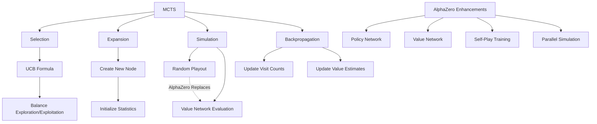

# C-2: Advanced Search Algorithms for Decision Making

1. Monte Carlo Tree Search (MCTS)

    - Core Principles and Algorithm Structure
    - The Four Phases: Selection, Expansion, Simulation, Backpropagation
    - UCB1 Formula and Exploration-Exploitation Balance
    - Applications and Advantages

2. AlphaZero's Enhanced MCTS

    - Neural Network Integration
    - Policy and Value Networks
    - Modified Selection Formula
    - Parallel Simulation Architecture
    - Comparison with Traditional MCTS

3. Implementation Considerations
    - Computational Efficiency
    - Hyperparameter Tuning
    - Adaptation to Different Domains
    - Current Research Directions

#### Monte Carlo Tree Search (MCTS)

Monte Carlo Tree Search (MCTS) represents a heuristic search algorithm that has revolutionized decision-making in
domains characterized by large state spaces and complex decision sequences. Its foundational principle lies in combining
structured tree search with stochastic sampling, creating a powerful approach that balances exploration of promising
areas with exploitation of known good strategies.

The algorithmic structure of MCTS follows a four-phase iterative process:

1. **Selection**: Beginning at the root node representing the current state, the algorithm traverses the existing tree
   by selecting child nodes according to a tree policy. The canonical implementation utilizes the Upper Confidence Bound
   for Trees (UCT) formula:

$$UCB1 = \bar{X}_i + C\sqrt{\frac{\ln(N)}{n_i}}$$

Where:

- $\bar{X}_i$ represents the empirical mean reward from node $i$
- $N$ denotes the visit count of the parent node
- $n_i$ indicates the visit count of child node $i$
- $C$ is an exploration constant that balances exploitation (first term) with exploration (second term)

This selection process continues recursively until reaching a node that has unexpanded children.

1. **Expansion**: Upon reaching a node with unexplored actions, the algorithm expands the tree by adding one or more
   child nodes corresponding to these unexplored actions. This incremental growth of the search tree allows for
   efficient memory utilization while focusing computational resources on promising regions of the state space.
2. **Simulation**: From the newly expanded node, the algorithm performs a simulation (also called a rollout or playout)
   following some default policy until reaching a terminal state. In the simplest implementation, this default policy
   selects actions uniformly at random, though domain-specific heuristics can significantly enhance performance.
3. **Backpropagation**: After simulation concludes, the algorithm updates statistics for all nodes traversed during the
   selection phase. These updates typically include incrementing visit counts and adjusting value estimates based on the
   simulation outcome.

<div align="center">  <p style="color: #555;">Figure: MCTS algorithm phases illustration</p> </div>

The mathematical formulation of MCTS can be expressed through the following pseudocode:

```
function MCTS(state):
    create root node v_0 with state s_0
    while within computational budget:
        v_l ← TreePolicy(v_0)
        Δ ← DefaultPolicy(state(v_l))
        Backup(v_l, Δ)
    return a(BestChild(v_0))
```

Where TreePolicy handles selection and expansion, DefaultPolicy performs simulation, and Backup implements
backpropagation.

MCTS demonstrates several key advantages that distinguish it from alternative search methodologies:

1. **Domain-agnosticism**: Unlike algorithms requiring extensive domain knowledge or heuristics, MCTS can operate
   effectively with minimal prior information about the state space.
2. **Anytime property**: The algorithm provides valid results after any number of iterations, with solution quality
   improving as computational resources increase.
3. **Asymmetric tree growth**: MCTS automatically focuses exploration on promising branches, creating an asymmetric
   search tree that efficiently allocates computational resources.
4. **Balanced exploration-exploitation**: The UCB formula provides a principled approach to balancing exploration of
   uncertain actions with exploitation of promising ones.

These advantages have enabled MCTS to achieve remarkable success across diverse domains, including board games
(particularly Go, where it revolutionized computer play before the advent of neural network guidance), planning
problems, scheduling tasks, and various optimization scenarios.

#### AlphaZero's Enhanced MCTS

AlphaZero represents a paradigm shift in artificial intelligence that fundamentally transformed MCTS by integrating deep
neural networks into the search process. This integration eliminated the need for domain-specific knowledge and random
playouts, replacing them with learned neural representations that guide both action selection and position evaluation.

The primary architectural innovation of AlphaZero lies in its dual neural network structure:

1. **Policy Network** ($p_θ$): Maps board positions to probability distributions over possible moves, effectively
   guiding the selection and expansion phases
2. **Value Network** ($v_θ$): Estimates the expected outcome from a given position, replacing random rollouts with
   learned evaluation

These networks are typically implemented as a single neural network with two output heads sharing convolutional layers
for feature extraction, trained through self-play reinforcement learning.

The modified selection formula in AlphaZero combines neural network outputs with visitation statistics:

$$U(s,a) = Q(s,a) + c \cdot p_θ(s,a) \cdot \frac{\sqrt{N(s)}}{1 + N(s,a)}$$

Where:

- $Q(s,a)$ represents the empirical mean action value from previous visits
- $p_θ(s,a)$ is the policy network's predicted probability for action $a$ in state $s$
- $N(s)$ denotes the parent node's visit count
- $N(s,a)$ indicates the child node's visit count
- $c$ is an exploration constant

This formula elegantly balances three key considerations:

- Exploitation of actions with high empirical returns ($Q$ term)
- Prior knowledge from the policy network ($p_θ$ term)
- Uncertainty reduction through exploration (square root term)

<div align="center">  <p style="color: #555;">Figure: AlphaZero's neural network guided search</p> </div>

A critical departure from traditional MCTS involves the elimination of random playouts. While conventional MCTS relies
on Monte Carlo sampling to estimate node values, AlphaZero directly evaluates positions using its value network:

$$V(s_L) = v_θ(s_L)$$

This replacement offers several advantages:

- Reduced variance in evaluation compared to stochastic rollouts
- Ability to capture subtle positional factors beyond tactical calculations
- Significantly improved computational efficiency per simulation

The parallel simulation architecture represents another key innovation in AlphaZero. Multiple MCTS simulations run
concurrently using optimized tensor operations on GPUs, with results aggregated to improve learning efficiency. This
parallelization enables AlphaZero to perform thousands of simulations per second, vastly outpacing traditional MCTS
implementations.

The training process for AlphaZero follows a self-play reinforcement learning paradigm:

1. Neural networks guide MCTS to generate self-play games
2. Game outcomes provide training targets for the value network
3. MCTS visit counts (proportional to action strength) provide targets for the policy network
4. Updated networks generate new self-play games, creating a positive feedback loop of improvement

This process can be formalized as minimizing the loss function:

$$L = (z - v_θ(s))^2 - π^T \log p_θ(s) + c|θ|^2$$

Where:

- $z$ represents the game outcome from self-play
- $π$ denotes the improved policy derived from MCTS visit statistics
- The final term implements L2 regularization to prevent overfitting

The comparative advantages of AlphaZero's approach over traditional MCTS include:

1. **Superior evaluation**: Neural evaluation captures complex patterns beyond the reach of random simulations
2. **Improved action selection**: Policy priors focus search on promising moves immediately
3. **Transfer learning**: Knowledge generalizes across similar positions
4. **Reduced search depth**: Positional understanding reduces the need for deep lookahead

These innovations enabled AlphaZero to achieve superhuman performance in chess, shogi, and Go after mere hours of
self-play training, demonstrating the power of combining structured search with deep learning.

#### Implementation Considerations

The practical implementation of advanced search algorithms like MCTS and AlphaZero presents numerous engineering
challenges and optimization opportunities. Computational efficiency considerations dominate implementation decisions,
particularly for real-time applications or resource-constrained environments.

Several key optimizations enhance MCTS performance:

1. **Node representation**: Lightweight node structures minimize memory overhead while storing essential statistics

2. **Tree reuse**: Preserving relevant subtrees between searches reduces redundant computation

3. Parallelization strategies

    :

    - Root parallelization (multiple independent trees)
    - Leaf parallelization (concurrent simulations from leaf nodes)
    - Tree parallelization (shared tree with mutex locks)

4. **Vectorized operations**: Batch processing of simulations enables GPU acceleration

The mathematical expression for efficient backpropagation can be formulated as:

$$Q(s,a) \leftarrow \frac{N(s,a) \cdot Q(s,a) + z}{N(s,a) + 1}$$ $$N(s,a) \leftarrow N(s,a) + 1$$

This incremental update avoids storing full reward histories while maintaining accurate mean estimates.

Hyperparameter tuning represents another critical implementation consideration. Key hyperparameters include:

1. **Exploration constant** ($C$): Controls exploration-exploitation balance in UCB formula
2. **Simulation budget**: Determines search depth and quality
3. **Virtual loss**: In parallel implementations, prevents multiple threads from exploring the same path
4. **Temperature parameter** ($τ$): Controls randomness in action selection:

$$\pi(a|s) = \frac{N(s,a)^{1/τ}}{\sum_b N(s,b)^{1/τ}}$$

Domain adaptation requires tailoring search algorithms to specific application characteristics. Considerations include:

1. **State representation**: Efficient encoding preserving essential information
2. **Action space handling**: Techniques for large or variable action spaces
3. **Reward design**: Shaping intermediate rewards to guide search
4. **Terminal condition specification**: Defining episode boundaries and outcomes

Current research directions in advanced search algorithms include:

1. **Hybrid approaches**: Combining MCTS with other techniques like minimax search
2. **Adaptive exploration**: Dynamically adjusting exploration parameters based on search progress
3. **Meta-learning**: Learning to search by optimizing search hyperparameters
4. **Sample efficiency improvements**: Reducing simulation requirements through better value estimation
5. **Theory-guided enhancements**: Incorporating theoretical guarantees into practical implementations



The implementation of these advanced search algorithms continues to evolve, with ongoing research addressing challenges
in computational efficiency, theoretical understanding, and domain adaptation. The remarkable successes of MCTS and
AlphaZero across diverse domains underscore their importance in the broader landscape of artificial intelligence and
decision-making systems.
