# A-1: Agentic AI: Protocols, Frameworks, and the Future of Intelligent Systems

1. Understanding AI Agents and Autonomous Systems
    - What Are AI Agents and How They Differ from Chatbots
    - Core Capabilities and Real-World Applications
    - The Challenge of Connecting Agents to External Systems
    - From Isolated Models to Connected Intelligence
2. Model Context Protocol (MCP): The Universal Bridge
    - MCP Architecture and Core Components
    - How MCP Solves the Integration Problem
    - MCP Capabilities: Tools, Resources, and Prompts
    - Authentication and Security in MCP
    - Building MCP Servers and Clients
    - Code Examples and Implementation Patterns
3. OpenAI's Approach: Function Calling and MCP Adoption
    - Evolution from Function Calling to MCP
    - OpenAI's MCP Integration Strategy
    - Comparing Function Calling vs MCP Standards
    - OpenAI Agents SDK and MCP Support
4. Microsoft's Multi-Protocol Strategy: Semantic Kernel Framework
    - Semantic Kernel as the Universal AI Framework
    - Copilot Studio and Enterprise Integration
    - Microsoft's Open Standards Approach
    - Supporting Both MCP and A2A Protocols
5. Google's Agent-to-Agent Protocol (A2A): Multi-Agent Coordination
    - A2A Architecture and Agent Communication
    - Capability Cards and Agent Discovery
    - A2A vs MCP: Complementary Not Competing
    - Multi-Agent Workflows and Collaboration Patterns
6. Protocol Landscape and Future Directions
    - Comparing All Major Protocols: MCP, A2A, Function Calling
    - Industry Adoption and Ecosystem Development
    - Best Practices for Protocol Selection
    - The Future of Agentic AI Standards

---

#### Understanding AI Agents and Autonomous Systems

###### What Are AI Agents and How They Differ from Chatbots

AI agents represent a fundamental evolution beyond traditional chatbots, embodying autonomous entities capable of
reasoning, planning, and executing complex tasks in real-world environments. While chatbots primarily function as
reactive conversation partners, AI agents operate as proactive digital workers that can understand objectives, develop
strategies, and take concrete actions to achieve specific goals.

The distinction lies in the agent's capacity for autonomous decision-making and environmental interaction. Traditional
chatbots excel at processing natural language inputs and generating appropriate textual responses, but they remain
constrained within conversational boundaries. They cannot access external systems, modify databases, send emails, or
interact with APIs without explicit human intervention at each step.

AI agents, by contrast, possess the capability to break down complex objectives into executable sub-tasks, maintain
context across extended interactions, and interface with external systems to accomplish real-world outcomes. They
demonstrate persistence in pursuing goals, adaptability when encountering obstacles, and the ability to learn from their
interactions to improve future performance.

Consider the difference between asking a chatbot "What's the weather like?" versus instructing an AI agent "Plan my day
based on the weather and my calendar." The chatbot would require you to provide weather information or acknowledge its
inability to access current data. An AI agent would autonomously connect to weather services, access your calendar,
analyze the information, and propose a structured plan that accounts for both factors.

This autonomy extends to tool usage, where agents can discover, evaluate, and employ appropriate tools for specific
tasks. They can chain multiple operations together, handle error conditions, and even negotiate with other agents to
accomplish objectives that require collaboration or specialized expertise.

###### Core Capabilities and Real-World Applications

Modern AI agents demonstrate remarkable versatility across diverse domains, showcasing capabilities that extend far
beyond traditional language model applications. These systems function as intelligent coordinators that bridge the gap
between human intent and digital execution, transforming abstract goals into concrete outcomes.

**Autonomous Workflow Execution**: Agents excel at orchestrating complex, multi-step processes that span different
systems and timeframes. They can manage entire business workflows, from customer service ticket resolution to supply
chain optimization, making decisions at each step based on current conditions and predefined objectives. Unlike static
automation, agents adapt their approach based on context, exceptions, and evolving requirements.

**Dynamic Data Integration and Analysis**: Sophisticated agents connect to multiple data sources simultaneously,
performing real-time analysis that incorporates information from databases, APIs, documents, and external services. They
can identify patterns, generate insights, and present findings in formats tailored to specific audiences, all while
maintaining data governance and security protocols.

**Contextual Decision Making**: Agents maintain rich context across interactions, enabling them to make informed
decisions that consider historical information, user preferences, organizational policies, and current environmental
factors. This contextual awareness allows them to provide personalized recommendations and execute actions that align
with broader objectives.

**Collaborative Intelligence**: Advanced agents work effectively with both humans and other agents, understanding when
to escalate decisions, request clarification, or delegate tasks to more specialized systems. They can participate in
complex workflows where multiple intelligent entities contribute their unique capabilities toward common goals.

Real-world implementations demonstrate the transformative potential of these capabilities. Customer service agents
handle complex inquiries by accessing multiple backend systems, analyzing account histories, and coordinating with
specialized teams to provide comprehensive resolutions. Research agents synthesize information from academic databases,
industry reports, and current events to generate comprehensive briefings on complex topics. Project management agents
coordinate resources across organizations, automatically adjusting schedules, reallocating tasks, and communicating
status updates to stakeholders.

###### The Challenge of Connecting Agents to External Systems

Despite their impressive reasoning capabilities, AI agents face a fundamental limitation that constrains their practical
utility: isolation from the data and tools necessary for real-world operation. Even the most sophisticated language
models remain bounded by their training data and cannot access dynamic information or execute actions without proper
integration mechanisms.

**The Integration Complexity Problem**: Traditional approaches to agent-tool integration require custom development for
each data source or API. This creates an exponential scaling challenge where M agents requiring access to N tools
necessitate M × N individual integrations, each with unique authentication protocols, data formats, and error handling
mechanisms. As organizations deploy more agents and connect to more systems, this complexity becomes unmanageable.

**Data Silos and Legacy Systems**: Enterprise environments typically contain heterogeneous systems developed over
decades, using different protocols, authentication methods, and data schemas. Agents must navigate this complexity while
maintaining security boundaries and compliance requirements. Legacy systems often lack modern APIs, requiring custom
adapters and middleware solutions that are expensive to develop and maintain.

**Dynamic Context Requirements**: Effective agents need access to real-time information that changes rapidly, such as
inventory levels, market conditions, or user preferences. Traditional batch processing approaches fail to provide the
immediacy required for intelligent decision-making. Agents must access current data while also understanding historical
context and trends.

**Security and Access Control**: Granting agents access to sensitive systems requires sophisticated permission
management that balances functionality with security. Each integration point becomes a potential vulnerability that must
be carefully managed and monitored. Organizations need granular control over what agents can access, when they can
access it, and under what conditions.

The fragmented landscape of custom integrations leads to brittle systems that are difficult to maintain, scale, or
modify as business requirements evolve. This fundamental challenge has driven the development of standardized protocols
that promise to transform agent-system interactions from custom implementations to universal standards.

###### From Isolated Models to Connected Intelligence

The evolution from isolated language models to connected intelligent agents represents one of the most significant
developments in modern AI. This transformation enables the creation of truly autonomous systems that can operate
effectively in complex, dynamic environments while maintaining the reliability and security required for enterprise
deployment.

**Contextual Grounding in Real-Time Data**: Connected agents ground their responses in current, accurate information
rather than relying solely on training data that may be outdated. This real-time grounding dramatically improves the
relevance and accuracy of agent responses while enabling them to make decisions based on current conditions rather than
historical patterns.

**Emergent Capabilities Through Tool Composition**: When agents gain access to diverse tools and data sources, they
exhibit emergent behaviors that transcend the sum of their individual components. The combination of reasoning
capabilities with real-world connectivity creates opportunities for novel problem-solving approaches that weren't
explicitly programmed or anticipated during development.

**Ecosystem Intelligence**: Connected agents contribute to larger intelligent ecosystems where multiple specialized
agents collaborate to accomplish complex objectives. This distributed intelligence model mirrors human organizational
structures while operating at digital speeds, enabling coordination and collaboration that amplifies individual agent
capabilities.

**Adaptive Learning from Action Outcomes**: Agents with system access can observe the results of their actions and
adjust their strategies based on empirical feedback. This creates a continuous improvement loop where agents become more
effective over time through direct experience with their environment.

The transition to connected intelligence fundamentally changes the role of AI from a consultative tool to an active
participant in digital workflows. This shift requires robust protocols that ensure reliable, secure, and scalable
connections between intelligent agents and the systems they serve. The development of standardized protocols represents
a critical enabler for this transformation, providing the foundation for a new generation of AI applications that can
truly automate complex business processes.

---

#### Model Context Protocol (MCP): The Universal Bridge

###### MCP Architecture and Core Components

The Model Context Protocol establishes a standardized architecture designed to bridge the gap between AI models and
external systems through a universal interface. MCP functions as the "USB-C for AI applications," providing a consistent
way for any AI agent to connect with any compatible tool or data source, regardless of the underlying implementation
details.

 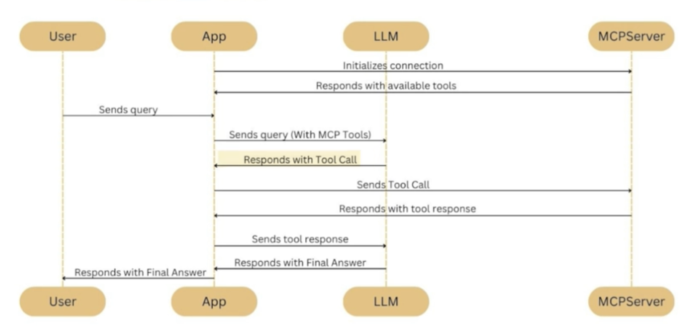 
Figure: MCP Protocol Communication Flow
 

The protocol architecture consists of four fundamental components working in concert to enable seamless agent-tool
integration. The **User** initiates requests through an **App** (the host application), which coordinates with an
**LLM** (the AI agent) to process queries and determine when external tools are needed. When tool access is required,
the system communicates with **MCP Servers** that expose specific capabilities through standardized interfaces.

This architecture ensures that the complexity of different systems remains hidden from the AI agent, which simply needs
to understand the standard MCP protocol. The agent can discover available tools, understand their capabilities, and
invoke them without needing custom integration code for each system.

**MCP Client**: The client component resides within the AI application and serves as the interface between the language
model and external resources. It manages connection establishment, request formatting, and response processing while
abstracting the underlying protocol complexity from the AI system. The client handles authentication, maintains
connection state, and provides error recovery mechanisms.

**MCP Host**: The host application provides the runtime environment where the MCP client operates. This could be AI
assistants like Claude Desktop, development environments, or custom enterprise applications. The host orchestrates
interactions between users, AI models, and MCP servers, managing the overall workflow and user experience.

**MCP Server**: These are lightweight connectors that expose specific data sources, tools, or services through
standardized MCP interfaces. Each server focuses on a particular domain or functionality, such as database access, email
services, or file management. Servers handle authentication, data transformation, and error management for their
respective domains while presenting a uniform interface to clients.

**Transport Layer**: MCP supports multiple transport mechanisms including standard input/output (stdio), Server-Sent
Events (SSE), and HTTP-based connections. This flexibility allows deployment in various environments from local
development to cloud-scale production systems, accommodating different security requirements and performance
characteristics.

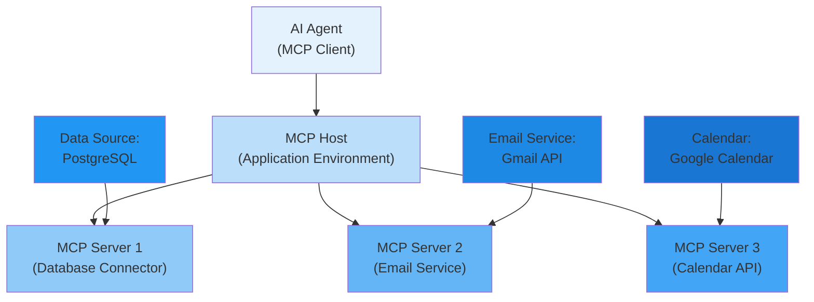

###### How MCP Solves the Integration Problem

MCP addresses the fundamental M × N integration complexity by transforming it into a more manageable M + N problem.
Instead of requiring unique integrations between each agent and tool combination, MCP enables standardized connections
that work universally across the ecosystem.

**Universal Interface Standardization**: By defining common patterns for tool discovery, invocation, and data exchange,
MCP eliminates the need for custom integration code. Any MCP-compliant client can interact with any MCP-compliant
server, regardless of the underlying implementation details. This standardization reduces development time, improves
reliability, and enables rapid scaling of agent capabilities.

**Abstraction of Complexity**: MCP servers encapsulate the intricacies of their respective systems, presenting uniform
interfaces to clients. This abstraction shields AI agents from authentication protocols, data format variations, and
API-specific quirks while maintaining full functionality. Agents can focus on reasoning and decision-making rather than
dealing with integration complexity.

**Composable Architecture**: The protocol's modular design enables agents to combine multiple tools seamlessly. An agent
can simultaneously access database information, send emails, and update calendars without requiring knowledge of the
underlying systems' implementation details. This composability allows for sophisticated workflows that span multiple
systems and domains.

**Ecosystem Scaling**: As new tools and data sources adopt MCP, they become immediately available to all existing MCP
clients. This network effect accelerates ecosystem growth and reduces the barrier to entry for new integrations. Tool
providers can build once and serve all MCP-compatible agents, while agent developers gain access to an expanding
universe of capabilities.

The transformation from custom integrations to standardized protocols creates significant economic and technical
advantages. Development teams can focus on business logic rather than integration plumbing, while users benefit from
more reliable and feature-rich agent capabilities. Organizations can avoid vendor lock-in while maximizing the utility
of their existing tool investments.

###### MCP Capabilities: Tools, Resources, and Prompts

MCP defines three distinct capability types that servers can expose to clients, each serving specific use cases and
interaction patterns. This taxonomy provides clarity and structure for both server implementers and client developers
while ensuring comprehensive coverage of agent needs.

**Tools: Action-Oriented Capabilities**

Tools represent functions that agents can invoke to perform actions or computations with potential side effects. These
capabilities enable agents to modify their environment and produce tangible outcomes beyond information retrieval. Tools
typically involve operations that change system state, trigger external processes, or initiate workflows.

Examples include database write operations, email sending, file modifications, API calls that change remote systems, and
integration with business process automation platforms. Tools can accept parameters, return results, and provide status
information about operation completion or failure.

The tool interface includes comprehensive metadata that describes parameters, expected inputs and outputs, error
conditions, and usage constraints. This metadata enables agents to understand when and how to use specific tools,
improving the accuracy and effectiveness of tool selection and invocation.

**Resources: Information Access Capabilities**

Resources provide read-only access to data and contextual information that agents can use for decision-making and
response generation. These capabilities focus on information retrieval without side effects, enabling agents to gather
the context necessary for informed decision-making.

Resources encompass file content access, database queries, configuration data, real-time metrics, and historical
information. They provide the contextual foundation that enables agents to make informed decisions and generate accurate
responses. Resources can include both static information and dynamic data that changes over time.

The resource interface supports filtering, pagination, and query optimization to ensure efficient data access. Resources
can also include metadata about data freshness, accuracy, and provenance, helping agents understand the reliability and
currency of the information they're accessing.

**Prompts: Template and Workflow Capabilities**

Prompts define reusable templates and structured workflows that can be invoked with parameters. These capabilities
enable standardization of complex reasoning patterns and domain-specific expertise, allowing organizations to encode
best practices and institutional knowledge into reusable components.

Prompts facilitate knowledge sharing across teams and enable non-technical users to leverage sophisticated AI
capabilities through predefined workflows. They encapsulate domain expertise and ensure consistent outputs across
different use cases and users.

Advanced prompt capabilities can include conditional logic, variable substitution, and integration with other MCP
capabilities. This enables the creation of sophisticated workflows that combine reasoning templates with dynamic data
access and action execution.

###### Authentication and Security in MCP

 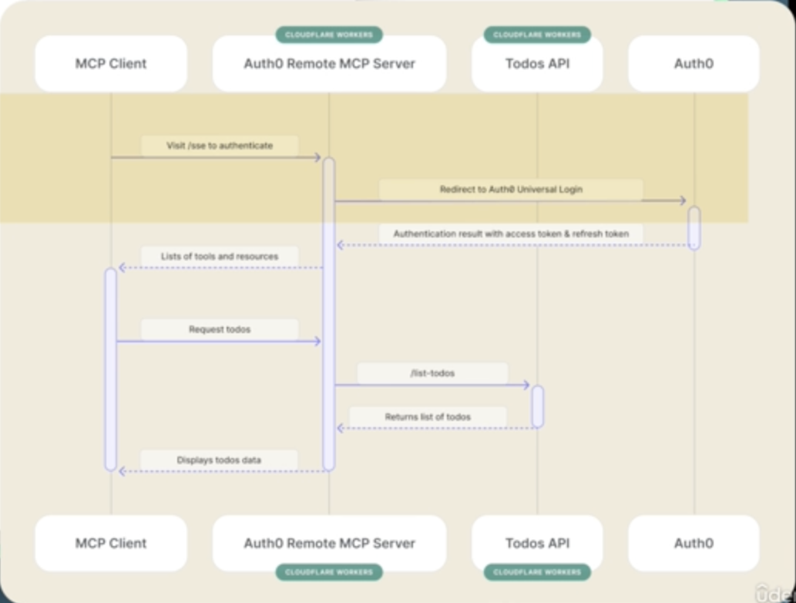 
Figure: MCP Authentication Architecture with Auth0
 

Security forms a fundamental pillar of MCP design, with comprehensive mechanisms for authentication, authorization, and
secure communication. The protocol accommodates diverse security requirements while maintaining usability and
performance, ensuring that agents can access necessary resources without compromising organizational security postures.

**Authentication Mechanisms**

MCP supports multiple authentication patterns to accommodate different deployment scenarios and security requirements.
The protocol can integrate with enterprise identity providers, OAuth 2.0 systems, API key management, and custom
authentication schemes. This flexibility ensures compatibility with existing security infrastructure while providing
options for different trust and risk levels.

The authentication system supports both user-based and service-based authentication, enabling agents to operate on
behalf of specific users or as autonomous service entities. This distinction is crucial for maintaining proper audit
trails and ensuring that agent actions are properly attributed and authorized.

**Authorization and Access Control**

Fine-grained permission systems ensure that agents can only access resources and invoke tools appropriate to their
context and user permissions. The authorization model supports role-based access control, attribute-based policies, and
dynamic permission evaluation based on context and conditions.

Permission management includes temporal constraints, allowing access to be granted for specific time periods or under
certain conditions. This enables scenarios like temporary elevated access for specific workflows or conditional access
based on approval workflows.

**Secure Communication Patterns**

MCP mandates encrypted communication channels and provides mechanisms for secure credential management. All
network-based MCP communication must use TLS encryption to protect data in transit, while credential management systems
ensure secure storage and rotation of API keys, tokens, and other sensitive authentication materials.

The security model includes comprehensive audit logging of all MCP interactions for security monitoring and compliance
requirements. Rate limiting mechanisms prevent abuse and ensure fair resource allocation, while intrusion detection
capabilities identify suspicious patterns or unauthorized access attempts.

**Enterprise Security Integration**

 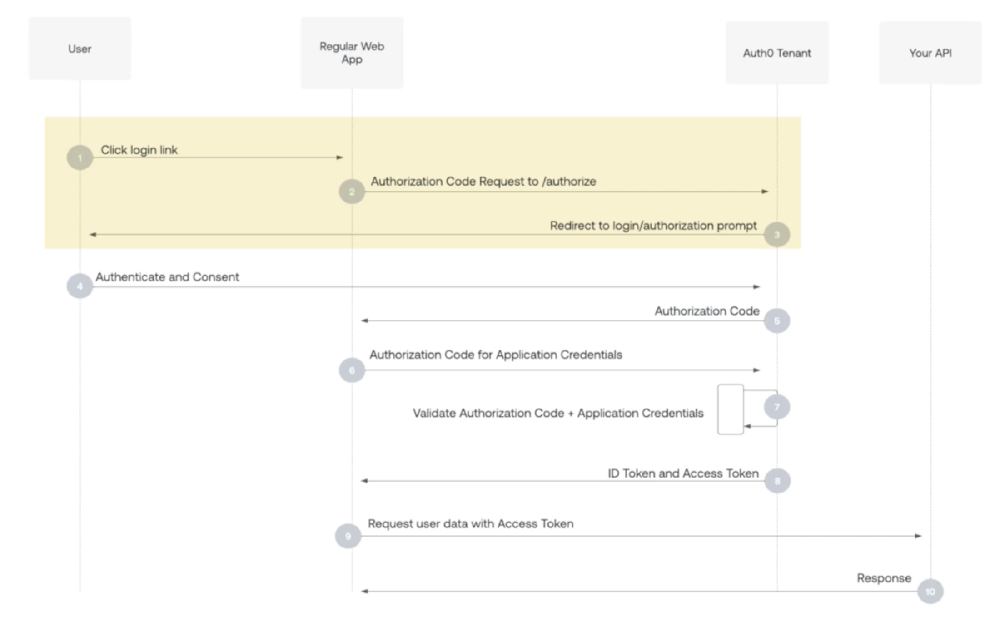 
Figure: OAuth 2.0 Authentication Flow
 

MCP's security architecture integrates seamlessly with enterprise security frameworks, supporting standards like OAuth
2.0, SAML, and OpenID Connect. The protocol can participate in single sign-on environments, conditional access policies,
and zero-trust security models.

Enterprise integrations include support for data loss prevention (DLP) policies, ensuring that sensitive information is
properly protected throughout the agent interaction lifecycle. The security model also accommodates compliance
requirements like GDPR, HIPAA, and SOX through appropriate controls and audit mechanisms.

###### Building MCP Servers and Clients

 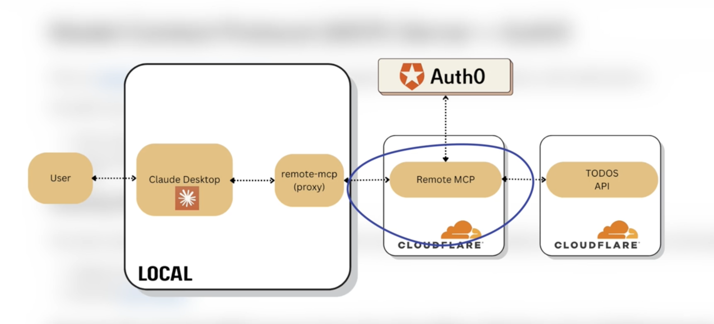 
Figure: Local and Cloud-based MCP Architecture
 

Developing MCP-compliant servers and clients requires understanding the protocol specifications and implementing the
core communication patterns. The architecture supports both local development scenarios and cloud-scale deployments,
providing flexibility for different organizational needs and technical requirements.

**Local Development and Testing**

The local architecture enables developers to build and test MCP integrations in their development environment. Local MCP
servers can connect to development databases, test APIs, and sandbox environments, allowing for safe experimentation and
iterative development. The local setup supports rapid prototyping and debugging without requiring complex cloud
infrastructure.

Local development benefits from simplified authentication and reduced latency, enabling faster development cycles and
easier troubleshooting. Developers can use local servers to test agent behavior, validate tool implementations, and
ensure proper error handling before deploying to production environments.

**Cloud-Scale Production Deployment**

Production deployments leverage cloud infrastructure to provide scalability, reliability, and enterprise-grade security.
Cloud-based MCP servers can handle thousands of concurrent connections, implement sophisticated caching strategies, and
provide high availability through redundancy and failover mechanisms.

The cloud architecture supports enterprise requirements like data residency, compliance monitoring, and integration with
cloud-native security services. Organizations can deploy MCP servers in their preferred cloud environments while
maintaining control over data and access policies.

**Implementation Best Practices**

Successful MCP implementations follow established patterns for error handling, performance optimization, and security.
Servers should implement comprehensive logging, monitoring, and alerting to ensure reliable operation and rapid issue
resolution. Caching strategies improve performance while reducing load on backend systems.

Client implementations benefit from connection pooling, retry logic, and graceful degradation when servers are
unavailable. Proper error handling ensures that agent workflows can continue even when individual tools are temporarily
inaccessible, improving overall system resilience.

**Development Tools and Frameworks**

The MCP ecosystem includes development tools, SDKs, and frameworks that simplify the creation of compliant servers and
clients. These tools provide scaffolding for common patterns, validation utilities for protocol compliance, and testing
frameworks for ensuring reliability and compatibility.

Community-contributed libraries and examples accelerate development by providing proven implementations for common use
cases. The ecosystem also includes debugging tools, performance profilers, and integration testing utilities that help
developers build robust, production-ready MCP implementations.

---

#### OpenAI's Approach: Function Calling and MCP Adoption

###### Evolution from Function Calling to MCP

OpenAI's journey from proprietary function calling mechanisms to MCP adoption represents a significant shift toward
standardization in the AI agent ecosystem. This evolution reflects broader industry recognition that interoperability
and standardization are essential for scaling AI agent capabilities across diverse environments while avoiding the
fragmentation that typically accompanies rapid technological advancement.

Function calling emerged as OpenAI's initial solution to extend GPT models beyond text generation, enabling basic tool
integration and action execution. This approach used JSON schemas to define function signatures and relied on the
model's reasoning capabilities to determine when and how to invoke specific functions. While functional, this approach
created several limitations that hindered broader adoption and ecosystem development.

The proprietary nature of function calling created vendor lock-in, where functions defined for OpenAI's format were
incompatible with other AI providers. This fragmentation required developers to maintain separate implementations for
different platforms, increasing development costs and limiting flexibility. Additionally, tools had to be predefined and
couldn't be discovered dynamically at runtime, constraining the adaptability of agent systems.

Static tool definitions meant that agents needed to be reinitialized whenever new APIs were added or schemas changed,
preventing truly dynamic discovery and composition. Authentication complexity required custom security management for
each tool integration, creating additional overhead and potential security vulnerabilities.

OpenAI's recognition of these limitations led to their strategic decision to support MCP, acknowledging that
ecosystem-wide standards would ultimately benefit all participants, including OpenAI itself. This shift demonstrates how
major AI providers can lead through standardization rather than fragmentation, fostering ecosystem growth while
maintaining competitive advantages through execution excellence.

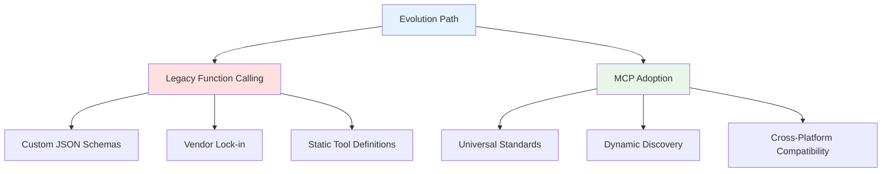

###### OpenAI's MCP Integration Strategy

OpenAI's adoption of MCP represents a carefully orchestrated strategy to maintain their market position while embracing
open standards. This approach balances competitive advantages with ecosystem participation, demonstrating how major AI
providers can lead through standardization rather than fragmentation.

**Gradual Integration Timeline**: Rather than replacing function calling immediately, OpenAI has implemented a phased
approach that allows existing users to migrate at their own pace while new users can adopt MCP-based patterns from the
start. This migration strategy minimizes disruption while encouraging adoption of the new standard.

The phased approach includes backward compatibility mechanisms that allow existing function calling implementations to
coexist with MCP integrations. This compatibility layer provides a migration path that reduces the risk and cost of
adopting the new standard, encouraging broader ecosystem participation.

**Enhanced Agent SDK Integration**: OpenAI's Agents SDK incorporates MCP support as a first-class feature, demonstrating
the company's commitment to the standard. The SDK provides sophisticated abstractions that make MCP integration seamless
for developers while adding value through superior developer experience and enterprise features.

The SDK includes intelligent caching, connection pooling, and error recovery mechanisms that improve the reliability and
performance of MCP integrations. These enhancements demonstrate how platform providers can embrace standards while
differentiating through superior implementation and developer experience.

**Enterprise-Grade Features**: OpenAI's MCP implementation includes enterprise-grade features that address
organizational requirements for security, compliance, and governance. These features include centralized tool
management, comprehensive audit logging, and integration with enterprise identity providers.

Enterprise integration capabilities enable organizations to deploy MCP-based agents at scale while maintaining the
security and compliance postures required for production environments. The enterprise features demonstrate OpenAI's
commitment to serving organizational customers who require sophisticated governance and control mechanisms.

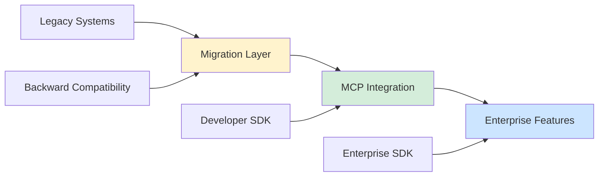

###### Comparing Function Calling vs MCP Standards

The transition from proprietary function calling to standardized MCP protocols involves fundamental architectural and
philosophical differences that impact both developers and end users. Understanding these differences is crucial for
organizations making technology decisions and developers building agent systems.

**Architecture Comparison**

| Aspect               | Function Calling  | MCP Protocol       |
| -------------------- | ----------------- | ------------------ |
| **Discovery**        | Static definition | Dynamic discovery  |
| **Composition**      | Limited           | Full composability |
| **Interoperability** | Vendor-specific   | Universal standard |
| **Authentication**   | Per-function      | Standardized       |
| **Error Handling**   | Basic             | Comprehensive      |
| **Caching**          | Manual            | Built-in           |
| **Versioning**       | Ad-hoc            | Systematic         |
| **Documentation**    | Varies            | Standardized       |

**Development Experience Differences**

Function calling requires developers to predefine all tools at agent creation time, creating a static relationship
between agents and their capabilities. This approach limits flexibility and requires agent reinitialization when new
tools are added or existing tools are modified. The static nature also prevents agents from discovering and utilizing
tools that become available after deployment.

MCP enables dynamic tool discovery, where agents can find and utilize tools at runtime based on current needs and
availability. This dynamic approach allows for more flexible and adaptive agent systems that can evolve and expand their
capabilities without requiring code changes or redeployment.

**Scalability and Maintenance Implications**

MCP's standardized approach significantly reduces maintenance overhead as organizations scale their AI agent
deployments. Tool reusability across different AI providers and frameworks reduces development costs and improves
consistency. Standardized versioning and compatibility mechanisms simplify upgrade processes and reduce the risk of
breaking changes.

The protocol's modular design enables clear separation between agent logic and tool implementations, improving code
maintainability and enabling specialized teams to focus on their areas of expertise. This separation also facilitates
testing and validation, as tools can be tested independently of the agents that use them.

###### OpenAI Agents SDK and MCP Support

OpenAI's Agents SDK represents a comprehensive platform for building sophisticated AI agents with native MCP support.
The SDK abstracts complexity while providing extensive customization options for enterprise deployments, demonstrating
how platform providers can embrace standards while adding significant value through superior implementation.

**Agent Lifecycle Management**

The SDK provides sophisticated lifecycle management capabilities that handle agent initialization, operation, and
shutdown gracefully. MCP server connections are managed automatically, with intelligent retry logic, connection pooling,
and failover mechanisms that ensure reliable operation in production environments.

The lifecycle management includes health monitoring for all connected MCP servers, automatic recovery from temporary
failures, and graceful degradation when services are unavailable. These features ensure that agent systems remain
operational even when individual components experience issues.

**Advanced MCP Features**

OpenAI's SDK implementation includes advanced features that extend beyond the basic MCP specification. These include
intelligent caching, request batching, and performance optimization mechanisms that improve the efficiency and
responsiveness of agent systems.

The SDK provides sophisticated error handling and retry logic that can distinguish between temporary and permanent
failures, implementing appropriate recovery strategies for each scenario. This intelligence reduces the likelihood of
agent failures and improves overall system reliability.

**Enterprise Integration Capabilities**

The SDK includes comprehensive enterprise integration features that address organizational requirements for security,
compliance, and governance. These features enable seamless integration with enterprise identity providers, audit
systems, and monitoring infrastructure.

Enterprise capabilities include role-based access control, comprehensive audit logging, and integration with enterprise
security frameworks. The SDK also provides deployment tools and monitoring capabilities that simplify the management of
large-scale agent deployments.

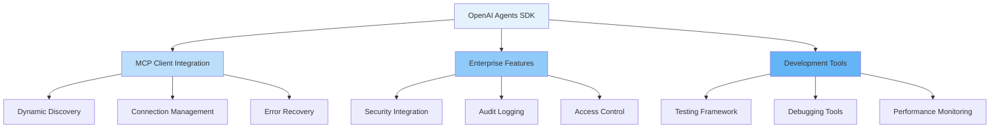

The OpenAI Agents SDK's MCP integration demonstrates how major AI providers can embrace standardization while adding
value through superior developer experience, enterprise features, and seamless integration with existing workflows. This
approach positions OpenAI as a platform that enables rather than constrains, fostering ecosystem growth while
maintaining competitive advantages through execution excellence.

---

#### Microsoft's Multi-Protocol Strategy: Semantic Kernel Framework

###### Semantic Kernel as the Universal AI Framework

Microsoft's Semantic Kernel represents a fundamentally different approach to AI agent development, positioning itself as
a universal orchestration layer that abstracts away protocol-specific implementations while supporting multiple
standards simultaneously. This strategy reflects Microsoft's broader philosophy of providing developer-friendly
platforms that integrate seamlessly with diverse ecosystems while avoiding vendor lock-in.

Semantic Kernel functions as a lightweight, open-source development kit designed to democratize AI agent creation across
multiple programming languages and deployment scenarios. Unlike protocol-specific solutions, Semantic Kernel provides a
unified programming model that adapts to different underlying communication standards, making it an ideal choice for
organizations that want to maximize flexibility while minimizing technical debt.

**Universal Abstraction Layer**: The framework employs a modular architecture that separates concerns into distinct
layers, enabling developers to work with a consistent API regardless of the underlying protocols or AI providers. This
abstraction shields developers from protocol complexity while preserving access to advanced features and capabilities.

The abstraction layer includes intelligent routing that can automatically select the most appropriate protocol for
specific tasks based on performance, availability, and capability requirements. This intelligent routing ensures optimal
performance while maintaining protocol independence.

**Multi-Provider Support**: Semantic Kernel supports multiple AI providers simultaneously, enabling organizations to
leverage the best features of different platforms without being locked into a single vendor. This multi-provider
approach provides flexibility, reduces risk, and enables cost optimization through intelligent workload distribution.

The framework handles provider-specific differences transparently, normalizing inputs and outputs across different AI
services. This normalization enables seamless switching between providers and supports hybrid deployments that leverage
multiple providers for different use cases.

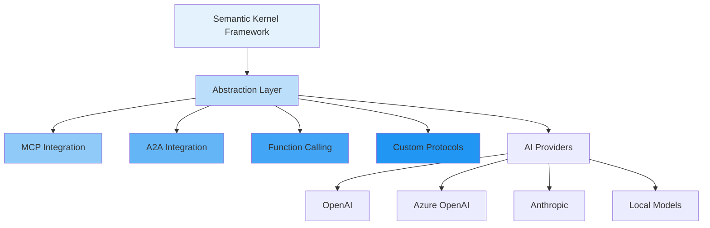

###### Copilot Studio and Enterprise Integration

Microsoft Copilot Studio represents the culmination of the company's low-code/no-code AI strategy, providing
enterprise-grade agent development capabilities that seamlessly integrate with the broader Microsoft ecosystem. The
platform demonstrates how sophisticated AI agent functionality can be made accessible to business users while
maintaining the flexibility required for complex enterprise scenarios.

**Low-Code Agent Development**: Copilot Studio enables business analysts and citizen developers to create sophisticated
agents without traditional programming requirements. The platform provides visual design tools, pre-built templates, and
guided workflows that simplify the agent creation process while ensuring professional-quality results.

The low-code approach includes drag-and-drop interfaces for workflow design, visual integration tools for connecting to
data sources, and template-based deployment mechanisms that reduce the complexity of agent development. These tools
enable domain experts to create agents that embody their specialized knowledge without requiring extensive technical
expertise.

**Microsoft 365 Ecosystem Integration**: One of Copilot Studio's key advantages is native integration with the Microsoft
365 ecosystem, providing seamless access to email, calendar, documents, teams, and other productivity tools. This
integration enables agents to operate within the existing workflows and data contexts that organizations already use.

The ecosystem integration includes intelligent data connectors that can access SharePoint documents, Exchange emails,
Teams conversations, and Power Platform data sources. These connectors understand Microsoft 365 permissions and security
models, ensuring that agents respect existing access controls and data governance policies.

**Enterprise Security and Compliance**: Copilot Studio incorporates enterprise-grade security features that address
organizational requirements for data protection, compliance, and governance. The platform integrates with Azure Active
Directory for identity management and supports conditional access policies that ensure appropriate security controls.

Compliance features include data loss prevention (DLP) integration, audit logging, and retention policies that align
with organizational governance requirements. The platform also supports data residency requirements and can operate in
compliance with regulations like GDPR, HIPAA, and SOX.

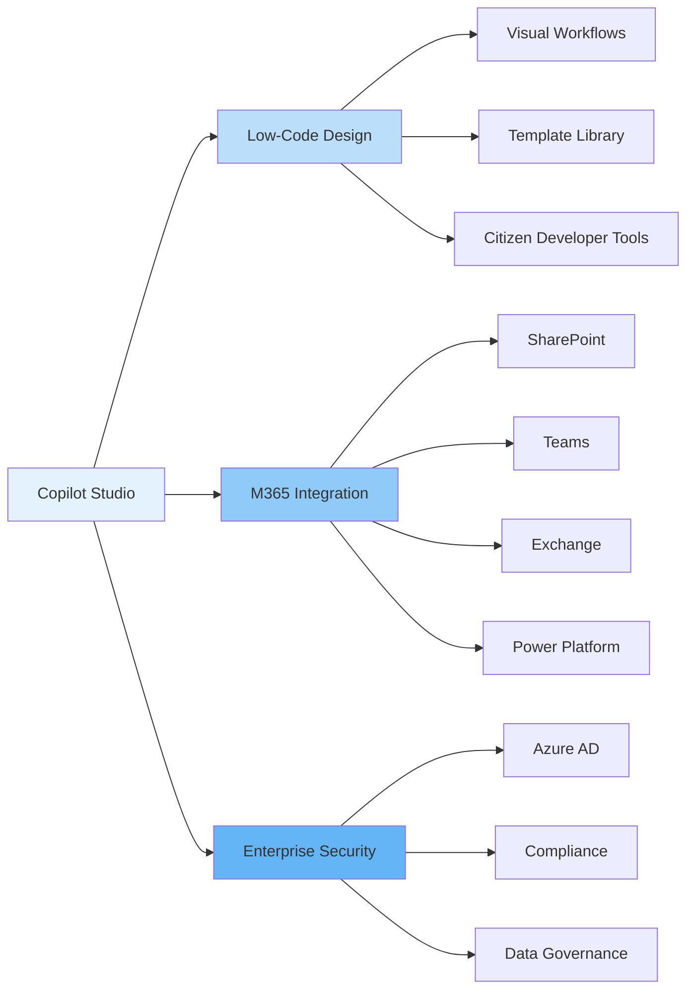

###### Microsoft's Open Standards Approach

Microsoft's commitment to open standards represents a strategic shift from historical platform lock-in strategies to
ecosystem leadership through interoperability. This approach recognizes that the future of AI lies in collaborative
ecosystems rather than proprietary silos, and that organizations benefit most from platforms that embrace rather than
restrict choice.

**Multi-Protocol Simultaneity**: Microsoft's embrace of multiple protocols simultaneously demonstrates their commitment
to developer choice and ecosystem health. Rather than forcing developers to choose a single protocol, Microsoft enables
organizations to use the most appropriate protocol for each specific use case while maintaining a unified development
experience.

The multi-protocol approach includes intelligent protocol selection mechanisms that can automatically choose the most
appropriate communication method based on task requirements, performance characteristics, and availability. This
intelligent selection ensures optimal performance while abstracting protocol complexity from developers and end users.

**Ecosystem Contributions and Leadership**: Microsoft's approach to open standards extends beyond adoption to active
contribution and leadership in the development of these protocols. The company contributes code, documentation, and
expertise to protocol development efforts while also providing feedback based on real-world enterprise deployments.

These contributions include enterprise-focused extensions that address scalability, security, and compliance
requirements that emerge in large-scale organizational deployments. Microsoft's enterprise experience helps ensure that
open protocols can meet the demanding requirements of production environments.

**Strategic Platform Positioning**: By supporting multiple protocols simultaneously, Microsoft positions itself as the
platform that enables rather than constrains organizational choice. This approach builds trust with enterprise customers
who want to avoid vendor lock-in while leveraging Microsoft's integration expertise and ecosystem relationships.

The platform positioning includes comprehensive migration tools and compatibility layers that enable organizations to
adopt new protocols gradually without disrupting existing workflows. This migration support reduces the risk and cost of
protocol adoption while encouraging innovation and standardization.

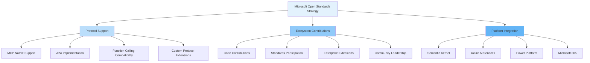

###### Supporting Both MCP and A2A Protocols

Microsoft's simultaneous support for both MCP and A2A protocols demonstrates a sophisticated understanding of how these
standards complement rather than compete with each other. This approach enables organizations to leverage the strengths
of each protocol while maintaining a unified development experience that abstracts protocol complexity.

**Protocol Orchestration and Intelligence**: Microsoft's implementation includes intelligent orchestration capabilities
that can automatically determine when to use MCP for tool access versus A2A for agent collaboration. This orchestration
layer analyzes task requirements, available resources, and performance characteristics to select the optimal
communication approach.

The orchestration system can seamlessly combine protocols within a single workflow, using MCP to access data and tools
while simultaneously coordinating with other agents via A2A. This hybrid approach enables sophisticated workflows that
leverage the unique strengths of each protocol while maintaining simplicity for developers and users.

**Unified Development Experience**: Despite supporting multiple protocols, Microsoft provides a unified development
experience through Semantic Kernel's abstraction layer. Developers can build agents that use both protocols without
needing to understand the underlying technical differences or manage protocol-specific implementations.

The unified experience includes common patterns for error handling, security management, and performance optimization
that work consistently across protocols. This consistency reduces learning curves and enables developers to focus on
business logic rather than protocol specifics.

**Enterprise Workflow Integration**: Microsoft's multi-protocol support enables sophisticated enterprise workflows that
span multiple systems and organizational boundaries. Agents can use MCP to access internal systems and data while using
A2A to collaborate with external partners or specialized service providers.

The enterprise integration includes comprehensive governance and monitoring capabilities that provide visibility into
protocol usage, performance, and security across complex multi-protocol deployments. These capabilities enable
organizations to optimize performance, ensure compliance, and maintain security across diverse protocol implementations.

**Best Practices and Patterns**: Microsoft has developed comprehensive best practices and design patterns for
multi-protocol development that help organizations maximize the benefits of both MCP and A2A while avoiding common
pitfalls and anti-patterns.

These patterns include guidance on when to use each protocol, how to handle errors and failures across protocol
boundaries, and how to design workflows that leverage the unique strengths of different communication approaches. The
patterns are based on real-world enterprise deployments and continue to evolve based on community feedback and
experience.

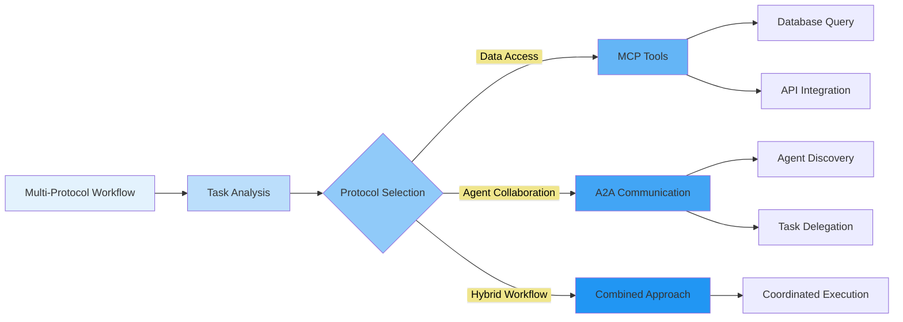

Microsoft's multi-protocol strategy demonstrates how organizations can embrace open standards while adding significant
value through superior integration, enterprise features, and developer experience. This approach positions Microsoft as
a platform that enables rather than constrains, fostering ecosystem growth while maintaining competitive advantages
through execution excellence and deep integration with enterprise workflows.

---

#### Google's Agent-to-Agent Protocol (A2A): Multi-Agent Coordination

###### A2A Architecture and Agent Communication

Google's Agent-to-Agent (A2A) protocol represents a paradigm shift from tool-centric integration to agent-centric
collaboration. While MCP focuses on connecting agents to external systems, A2A addresses the fundamental challenge of
enabling autonomous agents to discover, communicate, and collaborate with each other across organizational and
technological boundaries.

The A2A architecture embodies a peer-to-peer communication model that treats each agent as an autonomous entity capable
of advertising its capabilities, negotiating tasks, and coordinating complex workflows. This approach reflects Google's
experience with large-scale distributed systems and their understanding of how intelligent agents can work together to
solve problems that exceed the capabilities of individual agents.

**Peer-to-Peer Agent Networks**: A2A establishes networks of autonomous agents that can discover and communicate with
each other without requiring centralized coordination. Each agent maintains its own identity, capabilities, and
availability status while participating in a larger ecosystem of collaborative intelligence.

The peer-to-peer model enables dynamic formation of agent teams based on current requirements and availability. Agents
can join and leave the network as needed, creating flexible and resilient systems that adapt to changing conditions and
requirements.

**Agent Capability Advertisement**: Agents use standardized capability cards to advertise their skills, availability,
and performance characteristics to other agents in the network. These capability cards function as dynamic profiles that
enable intelligent matching between agent needs and available capabilities.

The capability advertisement system supports rich metadata about agent performance, specialization areas, and
operational constraints. This metadata enables sophisticated matching algorithms that consider factors like workload,
response time, and success rates when forming agent collaborations.

**Task Negotiation and Delegation**: A2A includes sophisticated mechanisms for task negotiation, where agents can
propose tasks, negotiate requirements, and establish agreements for collaborative work. This negotiation process ensures
that tasks are assigned to agents with appropriate capabilities and availability.

The delegation system supports complex task hierarchies, where high-level objectives can be decomposed into subtasks
that are distributed across multiple specialized agents. This hierarchical approach enables sophisticated workflows that
leverage diverse expertise while maintaining coordination and accountability.

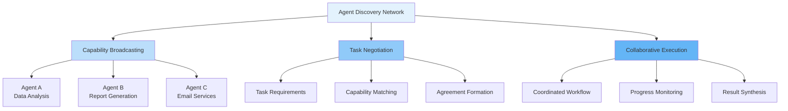

###### Capability Cards and Agent Discovery

The capability card system represents one of A2A's most innovative features, providing a standardized way for agents to
advertise their abilities and for other agents to discover suitable collaborators. This system enables dynamic, runtime
composition of agent teams based on current capabilities and availability.

**Comprehensive Capability Profiles**: Capability cards contain detailed information about agent abilities, including
specific skills, performance metrics, availability schedules, and operational constraints. These profiles enable
intelligent matching that considers both functional requirements and non-functional characteristics like response time
and reliability.

The profiles include historical performance data that enables reputation-based selection, where agents with proven track
records in specific domains are preferred for similar tasks. This reputation system improves the quality of agent
collaborations over time.

**Dynamic Discovery Mechanisms**: A2A supports multiple discovery mechanisms, from centralized directories to
distributed discovery protocols that don't require central coordination. This flexibility enables deployment in
different organizational contexts while maintaining interoperability across discovery approaches.

The discovery system includes real-time capability updates that reflect changing agent status, workload, and
availability. This dynamic updating ensures that agent matching is based on current rather than stale information,
improving the reliability of collaborative workflows.

**Intelligent Matching Algorithms**: The protocol supports sophisticated matching algorithms that consider multiple
factors when pairing agents with tasks. These algorithms can optimize for different objectives like speed, cost,
quality, or reliability depending on task requirements and organizational priorities.

Advanced matching includes predictive capabilities that can anticipate agent availability and performance based on
historical patterns and current conditions. This predictive matching enables proactive team formation and resource
planning for complex workflows.

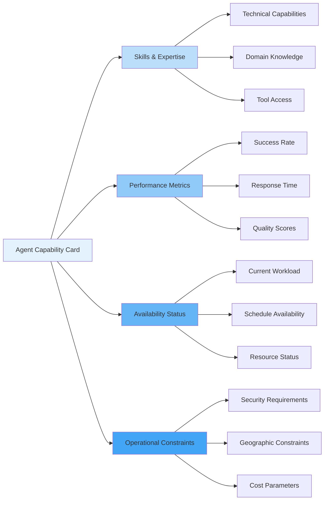

###### A2A vs MCP: Complementary Not Competing

The relationship between A2A and MCP represents one of the most important aspects of the modern AI agent ecosystem.
Rather than competing standards, these protocols address fundamentally different challenges and are designed to work
together in sophisticated agent architectures.

**Distinct Problem Domains**: MCP addresses the challenge of connecting agents to tools and data sources, providing a
standardized way for agents to access external systems and capabilities. A2A focuses on agent-to-agent communication and
coordination, enabling multiple autonomous agents to collaborate on complex tasks that require diverse expertise.

This distinction means that most sophisticated agent systems will use both protocols, employing MCP for tool integration
and A2A for multi-agent coordination. The protocols operate at different layers of the agent architecture and complement
rather than conflict with each other.

**Architectural Synergy**: A2A and MCP work together to create comprehensive agent ecosystems where agents can both
access external tools and collaborate with other agents. This combination enables sophisticated workflows that leverage
the unique strengths of both human-designed tools and agent intelligence.

The synergy is particularly evident in complex workflows where agents use MCP to gather data and execute actions while
using A2A to coordinate their efforts and share results. This hybrid approach maximizes the capabilities available to
agent systems while maintaining clear separation of concerns.

**Combined Workflow Patterns**: Successful agent systems often employ patterns that combine MCP tool access with A2A
coordination. For example, a research workflow might use A2A to coordinate between research, analysis, and writing
agents, while each agent uses MCP to access databases, analysis tools, and document management systems.

These combined patterns demonstrate the power of protocol composition, where the whole becomes greater than the sum of
its parts. Organizations can build sophisticated agent systems that leverage both standardized tool access and
intelligent collaboration.

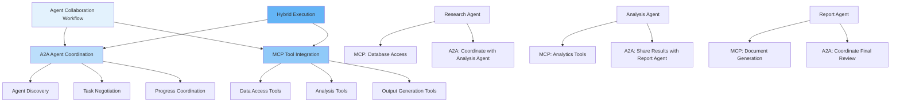

###### Multi-Agent Workflows and Collaboration Patterns

Advanced A2A implementations enable sophisticated collaboration patterns that mirror human organizational structures
while leveraging the unique advantages of AI agents. These patterns provide templates for solving complex problems that
require diverse expertise and coordinated execution.

**Hierarchical Delegation Patterns**: A2A supports hierarchical workflows where high-level coordinator agents delegate
specialized tasks to domain expert agents. This pattern mirrors human organizational structures while enabling rapid
scaling and parallel execution that exceeds human capabilities.

Hierarchical patterns include sophisticated progress monitoring and error recovery mechanisms that ensure reliable
execution even when individual agents encounter problems. The hierarchy can dynamically reconfigure itself based on
agent availability and performance, maintaining workflow continuity.

**Peer-to-Peer Collaboration**: A2A enables peer-to-peer collaboration patterns where agents of equal status work
together without hierarchical coordination. This pattern is particularly effective for creative tasks, problem-solving
scenarios, and situations where diverse perspectives add value.

Peer collaboration includes consensus-building mechanisms that enable agents to reach agreements on approaches, validate
results, and resolve conflicts that arise during collaborative work. These mechanisms ensure that collaborative outputs
reflect the best collective intelligence of participating agents.

**Specialized Expert Networks**: A2A facilitates the formation of expert networks where highly specialized agents
collaborate on complex problems that require deep domain expertise. These networks can form dynamically based on problem
requirements and expert availability.

Expert networks include knowledge sharing mechanisms that enable agents to learn from each other and improve their
capabilities over time. This collective learning creates network effects where the entire expert community becomes more
capable through collaboration.

**Dynamic Team Formation**: A2A supports dynamic team formation where agent teams are assembled in real-time based on
current requirements, agent availability, and performance characteristics. This dynamic approach enables optimal
resource utilization and rapid response to changing conditions.

Dynamic teams include automatic load balancing and resource optimization that ensures efficient utilization of agent
capabilities. The system can automatically scale teams up or down based on workload and performance requirements,
maintaining optimal efficiency.

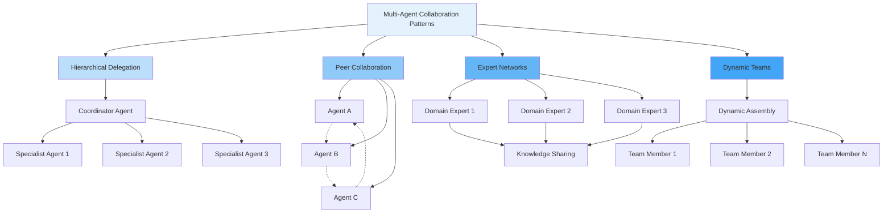

Google's A2A protocol demonstrates how intelligent agents can collaborate effectively across organizational and
technological boundaries, enabling sophisticated workflows that leverage collective intelligence while maintaining the
autonomy and specialization that make individual agents valuable. The protocol's peer-to-peer architecture and
sophisticated coordination mechanisms provide a foundation for the next generation of collaborative AI systems.

---

#### Protocol Landscape and Future Directions

###### Comparing All Major Protocols: MCP, A2A, Function Calling

The current landscape of AI agent protocols represents different philosophical approaches to enabling intelligent
automation, each optimized for specific use cases while collectively providing comprehensive coverage of agent
integration needs. Understanding the comparative strengths and appropriate applications of each protocol is essential
for making informed technology decisions.

**Protocol Scope and Purpose Comparison**

| Protocol             | Primary Focus                | Architecture      | Discovery | Standardization Level | Enterprise Readiness |
| -------------------- | ---------------------------- | ----------------- | --------- | --------------------- | -------------------- |
| **MCP**              | Agent-to-Tool Integration    | Client-Server     | Dynamic   | High                  | Production Ready     |
| **A2A**              | Agent-to-Agent Collaboration | Peer-to-Peer      | Dynamic   | Emerging              | Early Adoption       |
| **Function Calling** | Simple Tool Access           | Direct Invocation | Static    | Provider-Specific     | Mature               |

**Technical Architecture Differences**

Function Calling represents the simplest approach, providing direct invocation mechanisms that enable agents to call
predefined functions with structured parameters. This approach offers immediate functionality with minimal setup
overhead but lacks the flexibility and standardization needed for complex or evolving agent systems.

MCP introduces a standardized client-server architecture that abstracts tool complexity while enabling dynamic discovery
and composition. This approach provides the flexibility and interoperability needed for enterprise deployments while
maintaining reasonable implementation complexity.

A2A establishes peer-to-peer networks that enable sophisticated agent collaboration and coordination. This approach
addresses the most complex scenarios where multiple autonomous agents must work together to accomplish objectives that
exceed individual agent capabilities.

**Use Case Optimization**

Each protocol excels in different scenarios based on complexity, scale, and integration requirements. Function Calling
is optimal for simple, single-agent scenarios with well-defined tool requirements. MCP is ideal for complex agent
systems that need access to diverse tools and data sources. A2A becomes essential when workflows require coordination
between multiple specialized agents.

The protocols are complementary rather than competitive, with sophisticated agent systems often employing multiple
protocols simultaneously. Organizations can start with simpler approaches and gradually adopt more sophisticated
protocols as their agent systems mature and requirements evolve.

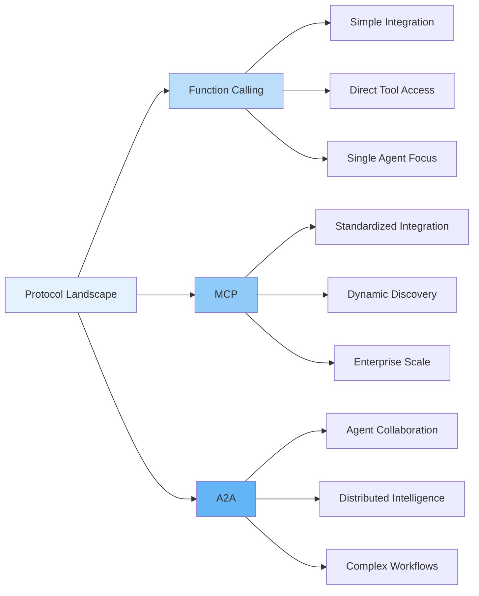

###### Industry Adoption and Ecosystem Development

The adoption patterns of AI agent protocols reflect broader industry trends toward standardization, interoperability,
and ecosystem development. Understanding these adoption patterns provides insight into the future direction of agent
technology and helps organizations make strategic technology decisions.

**Adoption Timeline and Milestones**

Function Calling achieved rapid initial adoption due to its simplicity and immediate availability from major AI
providers. However, adoption growth has plateaued as organizations encounter scalability and interoperability
limitations that require more sophisticated solutions.

MCP is experiencing rapid adoption across the industry, with major AI providers including OpenAI, Anthropic, and
Microsoft announcing support and implementation. The protocol's balance of standardization and practical utility has
resonated with enterprise customers who need reliable, scalable solutions.

A2A represents the newest entry in the protocol landscape, with adoption currently concentrated among organizations with
complex, multi-agent requirements. As the protocol matures and tooling improves, broader adoption is expected across
industries that require sophisticated agent collaboration.

**Ecosystem Health Indicators**

The health of protocol ecosystems can be measured through multiple indicators including community engagement, tool
availability, documentation quality, and enterprise adoption. MCP shows strong ecosystem health with active community
contributions, comprehensive tooling, and growing enterprise deployments.

A2A demonstrates early but promising ecosystem development with strong backing from Google and increasing interest from
enterprise customers. The protocol's success will depend on the development of comprehensive tooling and successful
reference implementations.

Function Calling maintains a stable but limited ecosystem, with most innovation occurring in higher-level abstractions
rather than the core protocol. This pattern suggests maturity but also limited future growth potential.

**Industry Segment Adoption Patterns**

Different industry segments show varying adoption patterns based on their specific requirements and technical
sophistication. Technology companies and startups tend to adopt newer protocols earlier, while traditional enterprises
prefer proven, stable solutions with comprehensive vendor support.

Financial services and healthcare show strong interest in MCP due to security and compliance requirements that align
with the protocol's enterprise-focused design. Manufacturing and logistics industries are exploring A2A for complex
coordination scenarios that require multiple specialized agents.

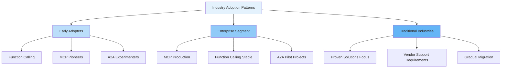

###### Best Practices for Protocol Selection

Selecting the appropriate protocol or combination of protocols requires careful consideration of current requirements,
future growth plans, and organizational capabilities. Successful protocol selection balances immediate needs with
long-term strategic objectives while considering ecosystem maturity and vendor support.

**Requirements Analysis Framework**

Organizations should begin protocol selection with comprehensive requirements analysis that considers functional needs,
non-functional requirements, and ecosystem factors. Functional requirements include the types of integrations needed,
complexity of workflows, and scalability requirements.

Non-functional requirements encompass security, compliance, performance, and reliability needs that vary significantly
across industries and use cases. Organizations with stringent security requirements may prefer protocols with mature
security frameworks and enterprise vendor support.

Ecosystem factors include vendor support, community health, tooling availability, and long-term viability. Organizations
should evaluate the sustainability and growth potential of protocol ecosystems to avoid future migration costs.

**Decision Matrix and Evaluation Criteria**

| Criterion                | Weight | Function Calling | MCP    | A2A    |
| ------------------------ | ------ | ---------------- | ------ | ------ |
| **Implementation Speed** | 20%    | High             | Medium | Low    |
| **Scalability**          | 25%    | Low              | High   | High   |
| **Interoperability**     | 20%    | Low              | High   | Medium |
| **Ecosystem Maturity**   | 15%    | High             | Medium | Low    |
| **Enterprise Features**  | 20%    | Medium           | High   | High   |

**Migration Strategy Considerations**

Organizations often need to support multiple protocols during transition periods, requiring careful planning to minimize
disruption while maximizing benefits. Successful migration strategies include phased adoption, compatibility layers, and
comprehensive testing frameworks.

Migration planning should consider the total cost of ownership, including development, deployment, training, and ongoing
maintenance costs. Organizations should also evaluate vendor lock-in risks and ensure that protocol choices align with
long-term strategic objectives.

**Risk Mitigation Approaches**

Protocol selection involves multiple risks including technology obsolescence, vendor dependency, and integration
complexity. Organizations can mitigate these risks through diversified approaches, vendor-agnostic implementations, and
comprehensive monitoring and evaluation frameworks.

Risk mitigation strategies include maintaining protocol flexibility, investing in abstraction layers, and developing
internal expertise across multiple protocols. Organizations should also establish clear success criteria and regular
review processes to ensure that protocol choices continue to meet evolving needs.

###### The Future of Agentic AI Standards

The future of agentic AI standards will be shaped by the convergence of multiple technological trends, including
improved AI capabilities, evolving enterprise requirements, and the maturation of standardization efforts. Understanding
these trends provides insight into the long-term direction of agent technology and helps organizations prepare for
future developments.

**Convergence and Interoperability Trends**

The future likely includes increased convergence between protocols, with standardized interoperability mechanisms that
enable seamless communication across different protocol implementations. This convergence will reduce the complexity of
multi-protocol deployments while preserving the unique strengths of different approaches.

Interoperability standards may emerge that provide translation layers between protocols, enabling organizations to use
the best protocol for each specific use case while maintaining overall system cohesion. These standards would reduce
vendor lock-in risks and increase organizational flexibility.

**Enterprise Requirements Evolution**

Enterprise requirements continue to evolve toward more sophisticated governance, security, and compliance capabilities.
Future protocols will need to address these requirements while maintaining the simplicity and performance that enable
widespread adoption.

Emerging requirements include sophisticated audit trails, real-time compliance monitoring, and integration with
enterprise governance frameworks. Protocols that can address these requirements while maintaining developer productivity
will have significant competitive advantages.

**Technology Integration Opportunities**

Future agent standards will likely integrate with emerging technologies including blockchain for trust and verification,
quantum computing for complex optimization, and edge computing for improved performance and privacy. These integrations
will enable new capabilities while addressing current limitations.

Integration opportunities also include improved AI capabilities such as multimodal reasoning, enhanced planning, and
better human-AI collaboration. Standards that can accommodate these advancing capabilities while maintaining backward
compatibility will be positioned for long-term success.

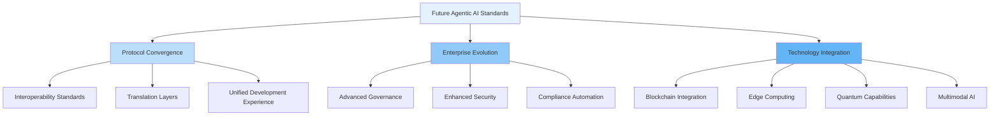

The future of agentic AI standards will be characterized by increased sophistication, better interoperability, and
comprehensive support for enterprise requirements. Organizations that understand these trends and prepare accordingly
will be positioned to leverage the full potential of intelligent agent systems while avoiding the pitfalls of technology
lock-in and premature standardization. The key to success lies in maintaining flexibility while building on stable
foundations that can evolve with advancing technology and changing requirements.
