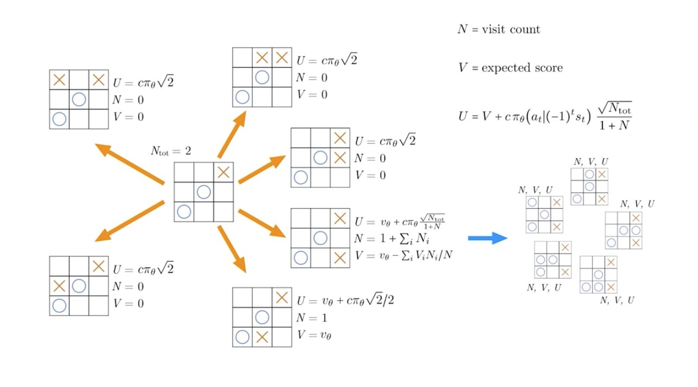

# Multi-Agent Reinforcement Learning

Multi-Agent Reinforcement Learning (MARL) is an extension of traditional reinforcement learning where multiple agents learn to interact with an environment and with each other simultaneously. Each agent must learn optimal policies while considering the actions and strategies of other agents in the system.

 

 

## Key Concepts

- **Multiple Agents**: Two or more autonomous agents that can perceive, decide, and act independently
- **Joint Action Space**: The combined action space of all agents in the system
- **Partial Observability**: Agents may have limited information about the environment and other agents
- **Emergent Behavior**: Complex system behaviors that arise from the interactions between agents

## Common Challenges

1. **Non-stationarity**: The environment becomes dynamic as all agents learn simultaneously
2. **Scalability**: Exponential growth in complexity with increasing number of agents
3. **Credit Assignment**: Determining each agent's contribution to team success
4. **Communication**: Coordinating actions between agents effectively

## Popular MARL Algorithms

- Independent Q-Learning (IQL)
- Multi-Agent Deep Deterministic Policy Gradient (MADDPG)
- Counterfactual Multi-Agent Policy Gradients (COMA)
- Multi-Agent Proximal Policy Optimization (MAPPO)

## Applications

- Autonomous vehicles coordination
- Robot swarm control
- Game AI and strategy games
- Smart grid management
- Network routing optimization

## Zero Sum Games

A zero-sum game is a situation where one participant's gain is exactly equal to another participant's loss, making the net change in wealth or benefit zero. For example, in poker, the money won by one player is exactly equal to the money lost by other players, and in chess, when one player wins (+1), the other must lose (-1), making the sum zero. This concept is fundamental in game theory and is often seen in financial markets during trading (particularly in derivatives and futures contracts) where for every profitable trade made by one party, there must be a corresponding loss incurred by another party, though real markets are typically not perfectly zero-sum due to factors like transaction costs, market maker spreads, and value creation through long-term investing.

# Monte Carlo Tree Search (MCTS)

Monte Carlo Tree Search is a heuristic search algorithm for decision-making processes that combines tree search with random sampling. It's particularly effective for problems with large decision spaces, like board games or planning problems.

## How It Works

1. **Selection**: 
   - Start from root node
   - Select most promising child nodes using UCB1 formula
   - Continue until reaching an unexpanded node

2. **Expansion**:
   - Create one or more child nodes
   - Add them to the tree

3. **Simulation**:
   - From the new node, perform a random playout
   - Follow random moves until reaching terminal state

4. **Backpropagation**:
   - Update node statistics (visits and wins)
   - Propagate results back up the tree

## Key Advantages

- Works without domain knowledge
- Handles large search spaces efficiently
- Provides anytime results
- Naturally balances exploration vs exploitation

## Applications

- Game AI (Chess, Go, etc.)
- Planning and scheduling
- Optimization problems
- Decision support systems

## Formula

The UCB1 formula used for node selection:

UCB1 = \bar{X_i} + C\sqrt{\frac{\ln(N)}{n_i}}

Where:
- X̄ᵢ is the average reward
- C is exploration constant
- N is total parent visits
- nᵢ is child node visits

 

 

# MCTS Summary

Initialize top-node for current state, loop over actions for some Nₜₒₜ:

1. Start from the top-node, repeatedly pick the child-node with the largest U
2. If N = 0 for the node, play a random game.
   Else, expand node, play a random game from a randomly selected child
3. Update statistics, back-propagate and update N and U as needed

Select move with highest visit counts

# AlphaZero Guided Tree Search

AlphaZero enhances the MCTS algorithm by using neural networks to guide the search:

## Key Modifications to MCTS

1. **Neural Network Guidance**:
   - Instead of random playouts, uses a value network (v) to evaluate positions
   - Uses a policy network (p) to guide node selection and expansion
   - U is calculated using both UCB and policy network predictions

2. **Selection Formula**:
   U(s,a) = Q(s,a) + c * p(s,a) * √(N(s))/(1 + N(s,a))
   Where:
   - Q(s,a): Average value from previous visits
   - p(s,a): Policy network's predicted probability
   - N(s): Parent node visits
   - N(s,a): Child node visits
   - c: Exploration constant

3. **No Random Playouts**:
   - Traditional MCTS: Random games until terminal state
   - AlphaZero: Neural network evaluates position directly

4. **Parallel Simulations**:
   - Multiple MCTS searches run in parallel
   - Results aggregated to improve learning efficiency

 

 
