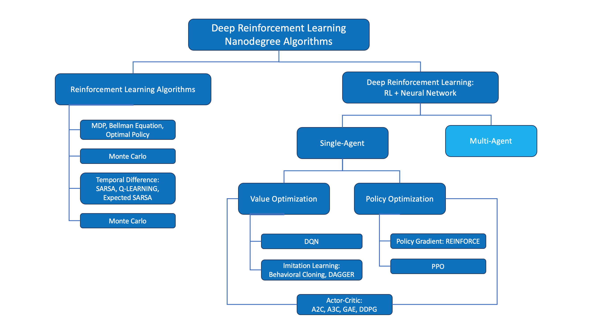

# Multi-Agent Reinforcement Learning

Multi-Agent Reinforcement Learning (MARL) is an extension of traditional reinforcement learning where multiple agents learn to interact with an environment and with each other simultaneously. Each agent must learn optimal policies while considering the actions and strategies of other agents in the system.

 

 

## Key Concepts

- **Multiple Agents**: Two or more autonomous agents that can perceive, decide, and act independently
- **Joint Action Space**: The combined action space of all agents in the system
- **Partial Observability**: Agents may have limited information about the environment and other agents
- **Emergent Behavior**: Complex system behaviors that arise from the interactions between agents

## Common Challenges

1. **Non-stationarity**: The environment becomes dynamic as all agents learn simultaneously
2. **Scalability**: Exponential growth in complexity with increasing number of agents
3. **Credit Assignment**: Determining each agent's contribution to team success
4. **Communication**: Coordinating actions between agents effectively

## Popular MARL Algorithms

- Independent Q-Learning (IQL)
- Multi-Agent Deep Deterministic Policy Gradient (MADDPG)
- Counterfactual Multi-Agent Policy Gradients (COMA)
- Multi-Agent Proximal Policy Optimization (MAPPO)

## Applications

- Autonomous vehicles coordination
- Robot swarm control
- Game AI and strategy games
- Smart grid management
- Network routing optimization

––––––––––––––––––––––––––––––––––

 

 