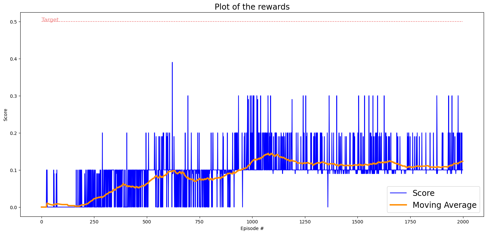
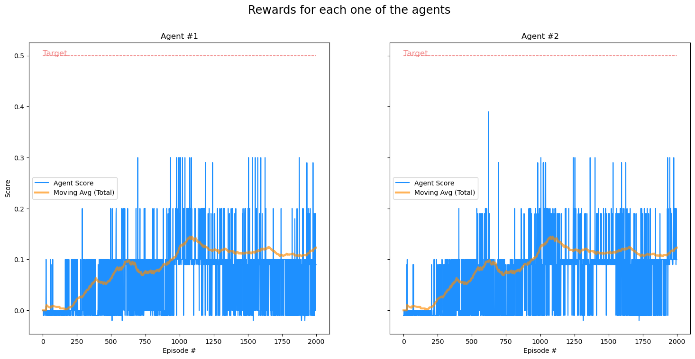

# Deep Reinforcement Learning Project Report: Tennis

## Algorithm Selection and Architecture

### Multi-Agent DDPG
We implemented Multi-Agent Deep Deterministic Policy Gradient (MADDPG) for this project because:
1. It handles continuous action spaces effectively
2. Supports multiple agents with centralized training
3. Maintains stable learning through experience replay and target networks
4. Allows decentralized execution with local observations

### Network Architecture

#### Actor Network
```
Input (24) → FC1 (64) → ReLU → FC2 (64) → ReLU → Output (2) → Tanh
```
- Processes state observations to continuous actions
- Tanh activation bounds actions to [-1, 1]
- Batch normalization after first layer

#### Critic Network
```
Input (48) → FC1 (64) → ReLU → FC2 (64) → ReLU → Output (1)
```
- Evaluates state-action pairs
- Actions concatenated after first layer
- Outputs Q-value estimates

## Hyperparameters

### Final Values
```python
# Network Parameters
actor_layers = [64, 64]
critic_layers = [64, 64]
actor_lr = 3e-3
critic_lr = 4e-4
batch_normalization = True

# Training Parameters
buffer_size = int(1e6)
batch_size = 64
gamma = 0.99
tau = 8e-3

# Exploration
noise_theta = 0.9
noise_sigma = 0.01

# Learning Rate Scheduling
lr_sched_step = 1
lr_sched_gamma = 0.2
```

### Key Adjustments
1. Learning rates tuned for stability
2. Batch normalization added for faster convergence
3. Noise parameters adjusted for better exploration
4. Learning rate scheduling implemented for fine-tuning


## Results

### Training Performance
The training ran for 2000 episodes with the following observations:

1. **Learning Progression**:
   - Initial phase (0-500 episodes): Very low scores, averaging around 0.06
   - Middle phase (500-1000 episodes): Gradual improvement, reaching 0.123
   - Final phase (1000-2000 episodes): Stabilized performance around 0.11-0.14

2. **Key Metrics**:
   - Best moving average: 0.140 (around episode 1100)
   - Final moving average: 0.123
   - Highest single episode score: ~0.39 (around episode 700)

3. **Learning Rate Adjustment**:
   - First decrease triggered at episode 935
   - Moving average at trigger: 0.098

### Performance Analysis


<br>



<br>

The graph shows:
- Blue line: Raw episode scores showing high variance
- Orange line: Moving average over 100 episodes
- Red dotted line: Target score (0.5)

### Challenges
1. Did not reach target score of 0.5
2. High variance in episode scores
3. Performance plateau after learning rate adjustment
4. Initial slow learning phase


## Future Improvements

### Potential Enhancements
1. **Network Architecture**
   - Try different layer sizes
   - Experiment with additional layers
   - Test different activation functions

2. **Training Process**
   - Implement prioritized experience replay
   - Test different exploration strategies
   - Try curriculum learning approaches

3. **Algorithm Variations**
   - Implement TD3 for improved stability
   - Test SAC for better exploration
   - Try PPO for more robust learning

4. **Hyperparameter Optimization**
   - Use automated hyperparameter tuning
   - Test different learning rate schedules
   - Optimize buffer and batch sizes

---
